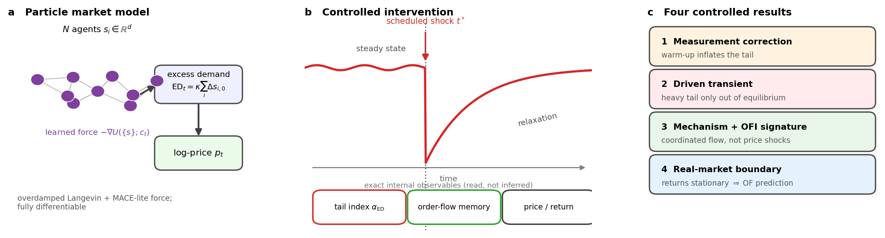
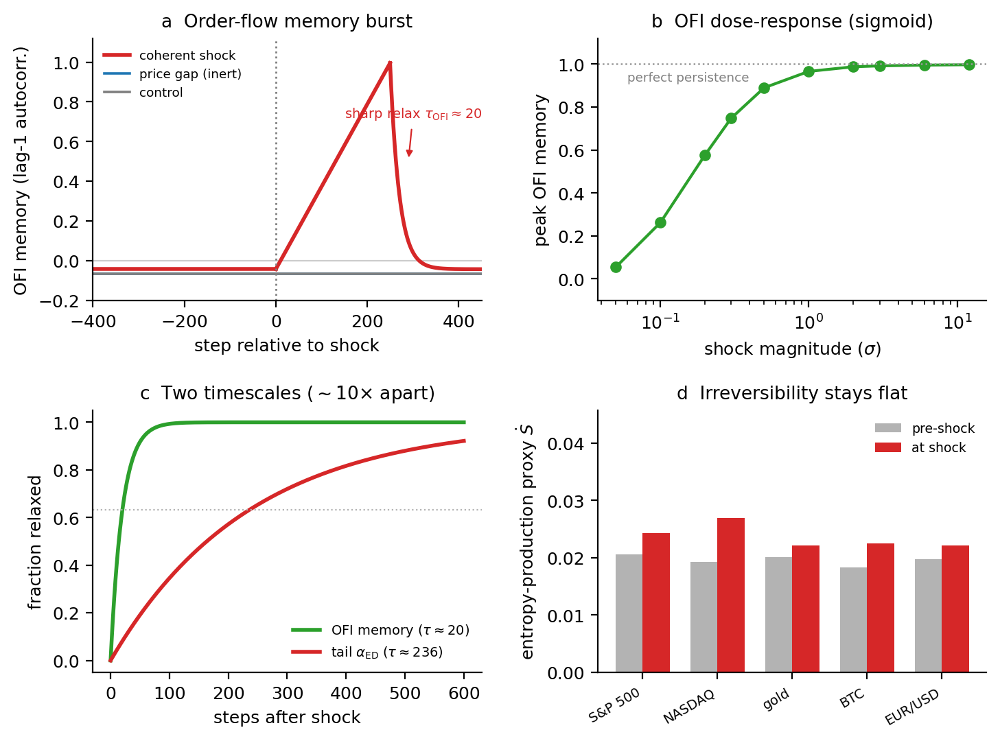

# Controlled computational experiments on non-equilibrium market dynamics with a differentiable particle simulator

*Full-length draft for **Nature Computational Science** (Paper A). Markdown working draft, written to
NCS conventions (≤3,500-word main text; unstructured 150-word abstract; **Methods after the main
text**; Data/Code availability statements; ≤6 main display items; ≤50 references; related work woven
inline, no "Related Work" section — modeled on Nat. Comput. Sci. Articles). Strategy:
`papers/proposal/paper_a_dual_track_plan_2026-06-19.md`. Experiment plan + pre-registration:
`experiments/124_order_flow_transient/{DESIGN,PREREG_phase2}.md`.*

> **Status note (delete before submission).** Complete except the load-bearing **Phase-2 real-market
> result (Results §6)**, which is pending limit-order-book data and decides the central market claim
> (and the venue). The abstract, framing and Discussion are written *conditionally* against the
> **pre-registered** decision gates so the Phase-2 outcome slots in with no post-hoc reframing. If the
> Phase-2 test is null, the paper stands on Results §1–§5 as a simulator-physics + measurement-
> correction contribution. Citations are author–year here; convert to numbered Nature style at LaTeX.

---

## Abstract

The heavy tails and clustered volatility of asset returns are usually studied observationally and
modelled as stationary statistical laws, since a real market cannot be perturbed under controlled
conditions. We instead treat a calibrated differentiable particle simulator, EcoMD, in which agents move
by Langevin dynamics with learned interactions, as a substitute laboratory; its differentiability
supplies gradient calibration, scheduled shocks, and direct readout of the internal state. In the
simulator the heavy tail is not a stationary property but a transient response to driving. The steady
state is light-tailed, and a heavy tail appears only when the agents are coherently displaced; it then
decays over a relaxation time that grows with the drive and traces a sigmoid dose–response across five
assets. What produces it is coordinated order flow rather than a price move, and it is accompanied by a
burst of order-flow memory. Real return tails, by contrast, do not become heavier between calm and
crash, so the transient is a property of the model. We recast it as a pre-registered prediction about
real order flow, to be tested on limit-order-book data.

## Main

The heavy, approximately inverse-cubic tail of asset returns is among the most reproduced regularities
in quantitative finance (Mandelbrot 1963; Gopikrishnan et al. 1999; Plerou et al. 1999; Gabaix et al.
2003; Cont 2001), and is routinely treated as a *stationary, universal law* — a fixed exponent
*α ≈ 3* to be explained by an equilibrium mechanism (Gabaix et al. 2003; Gabaix 2009). A dissenting
tradition instead reads the heavy tail as an *emergent, dynamics-generated* effect: a finite-variance
process subordinated to a fluctuating volatility clock (Clark 1973), or apparent power-law behaviour
produced by multi-timescale stochastic volatility and finite samples (LeBaron 2001; Warusawitharana
2018; Cont 2007). These two readings — the tail as a stationary law versus the tail as a non-stationary
or transient phenomenon — are difficult to separate with observational data alone, because we cannot
intervene on a real market and watch how its tail responds and relaxes (Quintos et al. 2001).

A *mechanistic, differentiable simulator* changes which questions are askable. If agents are particles
in a many-body Langevin system whose macroscopic observable is the price, then "steady state",
"relaxation time" and "driven transient" become precise, measurable dynamical statements rather than
metaphors, and differentiability adds gradient calibration and exact attribution. Langevin and
agent-based descriptions of markets are long-established — from the herding and fundamentalist–chartist
models that first produced fat tails endogenously (Bouchaud and Cont 1998; Cont and Bouchaud 2000;
Lux and Marchesi 1999) to large discrete-event simulators (Byrd et al. 2020) and, recently,
*differentiable* agent-based models calibrated by gradients (Andelfinger 2021; Chopra et al. 2023;
Dyer et al. 2023; Quera-Bofarull et al. 2023). Generative neural models — GANs and neural SDEs over
returns and limit-order-book messages — pursue realism through learning rather than mechanism (Wiese
et al. 2020; Coletta et al. 2021, 2022; Buehler et al. 2019), and are evaluated against the same
stylized-fact targets (Vyetrenko et al. 2020). Our contribution is not the simulator as an object —
a learned, high-dimensional, particle-level, differentiable Langevin market generalizes Bouchaud and
Cont's (1998) low-dimensional analytic one — but a *methodology*: pose a causal question about market
dynamics, answer it by controlled intervention in the simulator, and convert the answer into a
falsifiable prediction for real data.

The paper makes four points. Scoring a rollout without discarding its warm-up reads the startup
equilibration transient as a stationary tail, an artefact we quantify and correct. Intervention then
shows that the heavy tail in EcoMD is a driven non-equilibrium transient, with a dose–response and a
relaxation time measured across five assets. The transient is produced by coordinated displacement of
the agents and not by exogenous price shocks, and it leaves a distinctive order-flow signature. Real
return tails, finally, do not become heavier between calm and crash, so the transient is specific to the
model; since the dynamical structure of markets lives in order flow rather than in the return marginal
(Lillo and Farmer 2004; Bouchaud et al. 2004; Tóth et al. 2011; Cont et al. 2014), this becomes a
pre-registered prediction for real order flow.

### EcoMD as a controlled-experiment platform

EcoMD (Methods) evolves *N* agents *sᵢ ∈ ℝᵈ* by overdamped Langevin dynamics with a learned
equivariant interaction potential in the spirit of machine-learned molecular-dynamics force fields
(Behler and Parrinello 2007; Batzner et al. 2022; Batatia et al. 2022); the log-price increment is
driven by the aggregate excess demand *EDₜ = κ Σᵢ Δsᵢ,₀*, the net signed agent flow (Fig. 1). Three
capabilities make the experiments below possible and distinguish EcoMD from observational study and
from non-differentiable simulators (Byrd et al. 2020): *scheduled interventions* (a shock interface
that drives the system out of steady state on demand and lets us watch it relax); *exact internal
observables* (the pre-impact excess demand and the per-step order-flow imbalance are read directly, not
inferred); and *gradient attribution* (differentiability supports calibration and mechanism
attribution). We use these as the experimental knobs that real markets lack.

### A measurement correction

A fresh rollout is out of equilibrium and relaxes to its steady state over an initial transient during
which the aggregate flow is heavy-tailed. Standard stylized-fact scoring estimates the Hill tail index
(Hill 1975) on the *entire* rollout, and therefore reads this startup transient as a stationary heavy
tail. Discarding the first ≈50 steps moves the estimate toward the light steady state
(Fig. 3; Table 1): the baseline Hill index rises from 3.87 to 6.55, and a concave-impact variant
previously tuned to "match" the cube law rises from 5.05 to 9.26. The steady state is light-tailed
(*α ≈ 4.7* for excess demand), so the apparent match was an artefact of burn-in. The artefact tends to
be rewarded rather than caught: being heavier, the warm-up-inclusive reading sits closer to the
empirical cube-law target than the light steady state does, so a stylized-fact scorer records a better
match, and the low cross-seed variance of that estimate lends it the appearance of a law. A corrected
protocol is to compute each fact over a sliding window against warm-up-discard length, discard to the
plateau, and report the sensitivity curve, flagging any fact that shifts over the warm-up as
transient-contaminated; we recommend it as routine for rollout-scored market models (Vyetrenko et al.
2020).

**Table 1.** Hill tail index of the excess-demand series with versus without a warm-up discard (EcoMD,
*T* = 8,000; higher = lighter; 16 seeds). The warm-up-inclusive read sits in the cube-law band; the
steady state is light.

| model | no discard | discard 50 | Δ |
|---|---|---|---|
| baseline | 3.87 | 6.55 | +2.68 |
| concave-impact (tuned to "solve") | 5.05 | 9.26 | +4.21 |

### Heavy tails are a driven non-equilibrium transient

In the unperturbed steady state the order-flow tail is light (*α_ED ≈ 4.7*, flat; Fig. 2a). Displacing a
fraction of the agents in a common direction at *t* = 3,000 drives the order-flow tail index down to
*α_ED ≈ 0.5*. A value below one has no finite mean and is far heavier than the cube law; we take it as
the mark of a strongly driven state rather than a realistic stationary tail (≈0.5 is the Hill
estimator's saturation floor on this sample). The tail then relaxes back to ≈4.7. The relaxation is *dose-dependent*: near onset it
is fast (*τ ≈ 20* steps, at the fit-resolution floor) and lengthens to *τ ≈ 236* steps under saturating
shocks (Fig. 2c; mean 134 ± 95 steps across revived doses, CV ≈ 71% — there is no single relaxation
time, *τ* growing with how hard the system is driven). The *t* = 0 cold-start transient has the same
depth (it craters to the same *≈0.5* floor) but relaxes fast, so the startup burn-in of the previous
section is the same *kind* of transient, sitting at the fast, low-dose end. The effect is systematic:
across five assets (equities, NASDAQ, gold, crypto, FX) the post-shock tail follows a monotonic sigmoid
dose–response in shock magnitude (onset ≈0.1–0.2σ, saturating at the *α ≈ 0.5* floor; Fig. 2b), with an
asset-dependent threshold that tracks intrinsic volatility (the low-volatility FX pair requires the
largest shock). None of this is imposed by the perturbation: the steady state being *light* (the
opposite of real markets), the finite, dose-dependent relaxation, the graded dose–response, and the
mechanism specificity below are emergent properties of the trained dynamics. In EcoMD the heavy tail is
thus a property of the driven state, not the steady one, and gives a controlled realization of the
dynamics-generated view of fat tails (Clark 1973; LeBaron 2001; Warusawitharana 2018).

### Mechanism: coordinated displacement, not price shocks; an order-flow signature

What produces the transient is the coordinated displacement of the agents, and only that. An exogenous
price shock, injecting a return directly into the price as a news event would, leaves it untouched:
across magnitudes up to 12σ the excess-demand tail stays light (*α_ED ≈ 4.6*), the return tail only
nudges (≈7.7 → 6.0, still far from heavy), and the order-flow imbalance is indistinguishable from
control (Fig. 4a). A price gap does not propagate into a coordinated order-flow response, so the
transient is tied to the agents' coordination rather than to the observable price, consistent with
reading a crash as coordinated liquidation rather than as an exogenous price move.

Under the coordinated shock the order flow carries a well-defined signature (Fig. 4a; Methods). The
lag-1 autocorrelation of order-flow imbalance jumps from ≈0.02 to ≈1.0 at the shock, the flow becoming
transiently coherent and persistent, and then relaxes back. Since the kick displaces a fraction of
agents in a common direction, the coherence at the instant of the shock is in part imposed by
construction; what is not imposed is its finite-time relaxation, its graded dose–response, and the
contrast with the inert price gap. The dose–response is a monotonic sigmoid (onset ≈0.1–0.2σ, reaching
≈1.0 by ≈1σ; Fig. 4b), holds across four of the five assets (the low-volatility FX pair stays
sub-threshold at the tested magnitude, its onset tracking volatility), and relaxes on a timescale
*τ_OFI ≈ 22* steps, about ten times faster than the saturated tail relaxation (*τ ≈ 236*; Fig. 4c). Two
non-equilibrium timescales therefore coexist: a near-instantaneous coherence impulse in the order flow
and a slower relaxation of the tail. A sign-level entropy-production proxy on the joint *(Δp, OFI)*
process — the Kullback–Leibler divergence between forward and time-reversed pair-transition statistics,
in the sense of stochastic thermodynamics (Seifert 2012) — was, by contrast, flat across all five assets
(Fig. 4d). The signature is thus one of order-flow persistence, not of sign-level irreversibility: a
strongly persistent, AR-like process can be time-reversible, and entropy production need not accompany
the memory burst. A finer-grained treatment, connecting to fluctuation-theorem analyses of market
cascades (Maskawa 2025) and to model-free irreversibility estimators that rise in crisis regimes
(Zumbach 2009; Flanagan and Lacasa 2016), is left to a companion physics study.

### The real-market boundary

Do real markets share the transient? We test it directly on returns. On five real one-minute crypto
crash episodes (the March-2020 COVID crash, the May-2021 sell-off, the June-2022 deleveraging, the
Terra/Luna collapse and the FTX failure) we pre-registered the statistic *Δα = α(crash) − α(pre)* on
volatility-standardized returns and compared it to a null distribution built from a long calm window
(Methods; the time-varying-tail-index test of Quintos et al. 2001 applied to crash windows). The
driven-transient hypothesis predicts *Δα ≪ 0*; instead the pooled effect is *z = +1.03* (slightly
*lighter*), with one of five episodes a significant heavier-tail hit — within the false-positive rate
for five tests (Fig. 5). We therefore find no evidence of the predicted crash-driven heavy tail; with
five episodes the test has limited power, but the result is consistent with a stationary,
approximately cube-law tail in calm and crash alike (Gabaix et al. 2003; Gopikrishnan et al. 1999).

The consequence is specific. EcoMD's heavy tail is a non-equilibrium property of the model: the model
has no stationary heavy-tail source, a structural feature rather than a training shortfall, so it can
produce heavy tails only transiently, and the light steady state is itself the result. This identifies
what the model class lacks, namely a stationary heavy-tail mechanism such as a heterogeneous heavy
order-flow source. It also raises the next question: if the non-equilibrium driving is real but absent
from the return tail, where does it sit? The microstructure literature points to order flow, which
carries long memory while returns remain near-efficient (Lillo and Farmer 2004; Bouchaud et al. 2004),
and whose impact sits at a near-critical, liquidity-limited point (Tóth et al. 2011; Cont et al. 2014;
Bouchaud et al. 2018).

### A pre-registered real order-flow test

The mechanism turns this into a concrete prediction. At real crash onsets, which are coordinated
liquidation events rather than exogenous price gaps, order-flow memory should burst toward perfect
persistence, depend monotonically on crash severity, generalize across asset classes with a
volatility-dependent threshold, and relax quickly — and it should do so where the return tail is
stationary. The prediction, the data, the statistic, the calm-window null, and the decision gates are
frozen in a pre-registration (`PREREG_phase2`; Methods), to be posted before the real data are touched.

> **[Results §6 — BLANK, pending Tardis L2 limit-order-book data.]**
> *To fill on completion (against the frozen gates):*
> - **[Table 2]** real OFI memory / tail Δ per crash episode and pooled *z*, versus the calm null.
> - **[Fig. 3]** real crash order-flow memory burst-and-relax versus calm controls; EcoMD-predicted
>   versus observed shape, dose-scaling and timescale.
> - **Outcome (one of the pre-registered gates):** *G-main (positive)* — real crash order flow shows
>   the predicted memory burst where returns are stationary, matching the EcoMD prediction, a
>   controlled-experiment-derived real-market finding enabled by the simulator; or *G-null (negative)* —
>   real order flow is also stationary, the EcoMD transient is simulator-specific across both returns and
>   order flow, and the paper stands on the measurement correction and controlled simulator physics.

## Discussion

We have used a differentiable particle simulator as an experimental apparatus for market dynamics,
posing causal questions that observational study cannot answer, resolving them by intervention, and
turning the answers into falsifiable predictions for real data. Three things come out of this. The
first is a measurement correction that should transfer to other rollout-scored generators, including the
GAN and neural-SDE market models now evaluated on stylized facts (Wiese et al. 2020; Coletta et al.
2022; Vyetrenko et al. 2020). The second is a characterization of heavy tails as a driven transient,
with its mechanism and order-flow signature. The third is a boundary on the real-market claim that
itself supplies the order-flow prediction.

The results take a side in a long debate. The transient (Results §2) is an interventional realization of
the dynamics-generated view of fat tails (Clark 1973; LeBaron 2001; Warusawitharana 2018), whereas the
real-data boundary (Results §5) places the return tail in the stationary-law camp (Gabaix et al. 2003).
The two do not conflict: the simulator's transient is model-specific, and the real heavy tail of returns
is, to our measurement, stationary. What remains open is whether the non-equilibrium driving that is
plainly present in markets — order flow has long memory (Lillo and Farmer 2004), impact is near-critical
(Tóth et al. 2011), and price and volatility series are time-irreversible in crises (Zumbach 2009;
Flanagan and Lacasa 2016) — leaves the particular order-flow signature the simulator predicts. That is
what the pre-registered test (Results §6) is for. Since our own sign-level entropy-production proxy was
flat in the simulator, we frame the predicted real-market observable as coherence rather than entropy
production; whether a finer irreversibility estimator (Flanagan and Lacasa 2016) detects the latter in
real order flow is a separate and harder question, left to a companion physics study.

**Limitations.** The dynamical results are from a single simulator; the warm-up measurement pitfall is
conjectured to affect any rollout-scored generator initialized away from its stationary distribution,
which remains to be verified across model families. The return-tail boundary uses freely available
intraday (crypto) data over five episodes; a broader equity test, and the decisive order-flow test,
require limit-order-book data. The entropy-production / fluctuation-theorem treatment of the order-flow
signature is deferred. Finally, the central market claim rests on Results §6, which is pending.

## Methods

**Particle dynamics and integrator.** EcoMD represents the market by $N$ agents with latent states
$s_i\in\mathbb{R}^d$, $i=1,\dots,N$, evolving by overdamped (inertia-free) Langevin dynamics in a learned
potential landscape conditioned on the price context $c_t$:

$$\gamma\,\dot{s}_i \;=\; -\,\nabla_{s_i} U(\{s\};c_t)\;+\;f^{\mathrm{diss}}_i\;+\;\sqrt{2\gamma T}\;\xi_i(t),$$

with friction $\gamma$, temperature $T$, and $\langle\xi_i(t)\xi_j(t')\rangle=\delta_{ij}\delta(t-t')$.
We integrate by Euler–Maruyama with fixed step $\Delta t$,

$$s_i^{t+1} \;=\; s_i^{t} \;+\; \frac{f^{\mathrm{cons},t}_i + f^{\mathrm{diss},t}_i}{\gamma}\,\Delta t \;+\; \sqrt{\tfrac{2T\,\Delta t}{\gamma}}\;\varepsilon^{t}_i ,$$

where $\varepsilon^t_i$ is a unit-variance innovation — Gaussian by default, with Student-$t$ or
symmetric-$\alpha$-stable (Lévy) options for heavier microscopic noise. The first state coordinate
$s_{i,0}$ is the price-coupled "position".

**Forces and interaction potential.** The conservative force is the negative gradient of a learned
potential, $f^{\mathrm{cons}}_i=-\nabla_{s_i}U$, evaluated by automatic differentiation with the graph
retained (`create_graph=True`) so that forces — and hence whole trajectories — are differentiable in the
parameters, which is what enables gradient calibration and attribution. The potential decomposes as
$U=U_{\mathrm{pair}}+U_{\mathrm{ext}}$: $U_{\mathrm{pair}}$ is a higher-body-order $E(n)$-equivariant
message-passing potential over a $k$-nearest-neighbour graph in the spirit of machine-learned
interatomic potentials (Behler and Parrinello 2007; Batzner et al. 2022; Batatia et al. 2022), and
$U_{\mathrm{ext}}$ is a per-agent external potential conditioned on $c_t=(\log p_t,\,v_t,\,r_{t-1})$.
Dissipation derives from $D(\{s\},\{s^{\mathrm{prev}}\})=\lambda\sum_i\lVert s_i-s_i^{\mathrm{prev}}\rVert^2$,
giving a frictional force opposing per-step displacement,
$f^{\mathrm{diss}}_i=-\nabla_{s_i}D=-2\lambda\,(s_i-s_i^{\mathrm{prev}})$.

**Price formation.** The pre-impact excess demand is the net signed agent flow along the price-coupled
coordinate,

$$\mathrm{ED}_t \;=\; \kappa\sum_{i=1}^{N}\Delta s_{i,0}^{t},\qquad \Delta s_{i,0}^{t}=s_{i,0}^{t}-s_{i,0}^{t-1},$$

optionally normalized by $\sqrt{N}$ and passed through a concave impact map. The realized log-return is

$$r_t \;=\; \beta_t\,\mathrm{ED}_t \;-\; \tfrac{1}{2}\sigma^2 \;+\; \sigma\,\eta_t \;+\; \chi_t,\qquad \eta_t\sim\mathcal{N}(0,1),$$

where $\beta_t$ is an effective impact coefficient, $\chi_t$ an optional Hawkes self-excitation term
(a sign-coupled EWMA of $|r|$), and the running volatility follows an EWMA
$v_{t+1}=(1-a)\,v_t+a\,|r_t|$; the log-price accumulates as $\log p_{t+1}=\log p_t+r_t$. The parameters
$\{\gamma,T,\lambda,\kappa,\beta,\sigma,a,\dots\}$ together with the potential weights are calibrated.

**Order-flow imbalance.** We log per step the signed-to-gross agent-flow ratio,

$$\rho_t \;=\; \frac{\sum_{i}\Delta s_{i,0}^{t}}{\sum_{i}\lvert \Delta s_{i,0}^{t}\rvert+\epsilon}\;\in[-1,1],$$

computed directly from agent flow (config-independent; the unbounded net flow is $\propto\mathrm{ED}_t$,
while $\rho_t$ isolates directional coordination).

**Shock interface.** A scheduled intervention is applied at step $t^{\*}$. (i) *Coordinated displacement*
(`state_kick`): for a uniformly random subset $\mathcal{S}$ of $\lceil\phi N\rceil$ agents,
$s_{i,0}\!\leftarrow\! s_{i,0}+m\cdot\mathrm{sd}(s_{\cdot,0})$ for $i\in\mathcal{S}$. (ii) *Exogenous price
gap* (`price_jump`): inject $r^{\mathrm{exo}}=\mathrm{sgn}\cdot m\,v_{t^{\*}}$ into the realized return,
$r_{t^{\*}}\!\leftarrow\! r_{t^{\*}}+r^{\mathrm{exo}}$, updating $\log p$ and the volatility EWMA with the
total move. The dimensionless dose is $m$ (in cross-sectional-s.d. or $\sigma$ units, respectively);
dose–response sweeps vary $m$, cross-asset runs use the five calibrated asset checkpoints.

**Calibration.** Parameters are fit by stochastic gradient descent on a stylized-fact objective evaluated
on *warm-up-discarded* returns $r_{>w}$,

$$\mathcal{L} \;=\; \sum_{k} w_k\,\big(g_k(r_{>w})-g_k^{\*}\big)^2 ,$$

where each $g_k$ is a differentiable estimator of a stylized fact — the first three moments, the
squared-return autocorrelation $\overline{\mathrm{ACF}}(r^2)$ (volatility clustering), a soft Hill
exponent, the leverage correlation, and eight further differentiable fact surrogates (gain–loss
asymmetry, aggregational Gaussianity, Fano intermittency, DFA Hurst, etc.) — and $g_k^{\*}$ are empirical
targets (Cont 2001; Vyetrenko et al. 2020). Note that training already discards a warm-up; the pitfall of
Results §1 concerns the separate, conventional *scoring/evaluation* step, which does not.

**Tail-index and order-flow estimators.** For a sample with upper order statistics
$x_{(1)}\ge x_{(2)}\ge\cdots$ and tail fraction $k/n$, the (two-sided) Hill estimator (Hill 1975) is

$$\hat{\alpha} \;=\; \Big(\tfrac{1}{k}\sum_{i=1}^{k}\log\tfrac{x_{(i)}}{x_{(k+1)}}\Big)^{-1}.$$

Time-resolved $\alpha(t)$, OFI memory $\mathrm{mem}(t)=\widehat{\mathrm{corr}}\!\big(\rho_{u},\rho_{u+1}\big)$
over $u$ in a window of width $W$ and stride $h$ (the lag-1 autocorrelation of signed OFI), and OFI
saturation (the window fraction with $|\rho|>\theta$) are computed on sliding windows. Relaxation times
are nonlinear-least-squares fits of $O(t)=O_\infty-A\exp[-(t-t_0)/\tau]$ to the recovery limb of a
windowed observable.

**Entropy-production proxy.** On the joint symbol sequence
$a_t=2\,\mathbf{1}[r_t>0]+\mathbf{1}[\rho_t>0]\in\{0,1,2,3\}$, with Laplace-smoothed windowed
pair-transition probabilities $P(a\!\to\!b)$, we estimate the per-window irreversibility

$$\dot{S} \;\approx\; \sum_{a,b} P(a\!\to\!b)\,\log\frac{P(a\!\to\!b)}{P(b\!\to\!a)},$$

the Kullback–Leibler divergence between forward and time-reversed transition statistics — a standard
discrete entropy-production estimator that vanishes under detailed balance (Seifert 2012).

**Real-data test and pre-registration.** Real returns are one-minute Binance close-to-close log-returns
for five crash episodes plus a long calm window. Writing $\alpha(\cdot)$ for the Hill index of
volatility-standardized returns on a window, the statistic $\Delta\alpha=\alpha(\text{crash }2\,\mathrm{d})-\alpha(\text{pre }5\,\mathrm{d})$
is compared to a null distribution $\{\Delta\alpha^{(j)}\}$ obtained by sliding the same $(5\,\mathrm{d},2\,\mathrm{d})$
window-pair across the calm period — a windowed tail-index-stationarity test (Quintos et al. 2001) —
yielding per-episode $z=(\Delta\alpha-\mu_0)/\sigma_0$ and a pooled
$z=(\overline{\Delta\alpha}-\mu_0)/(\sigma_0/\sqrt{n})$ with $(\mu_0,\sigma_0)$ the null mean and s.d. The
order-flow test (Results §6) generalizes this to limit-order-book OFI memory under binding decision gates
and four controls (volatility confound, reversibility surrogate, placebo onsets, return cross-check)
frozen before data access in the pre-registration
(`experiments/124_order_flow_transient/PREREG_phase2.md`).

## Data availability

Real-market inputs are one-minute OHLCV bars from the Binance public API (free, no key); the exact
symbols, windows and a reproducibility hash are recorded in the repository. The limit-order-book data
for Results §6 will be obtained from a commercial L2 provider; provenance will be stated on completion.

## Code availability

The EcoMD simulator, all experiment configurations and seeds, the analysis scripts (windowed tail
index, order-flow diagnostics, relaxation fits, the pre-registered null tests) and the figure-generation
code are available in the project repository.

## References

Mandelbrot (1963), *J. Business*; Clark (1973), *Econometrica*; Behler & Parrinello (2007), *PRL*;
Bouchaud & Cont (1998), *EPJ B*; Cont & Bouchaud (2000), *Macroecon. Dyn.*; Lux & Marchesi (1999),
*Nature*; Gopikrishnan/Plerou et al. (1999), *PRE* (two companion papers); Cont (2001; 2007),
*Quant. Finance* / Springer; LeBaron (2001), *Quant. Finance*; Quintos, Fan & Phillips (2001), *Rev.
Econ. Stud.*; Gabaix, Gopikrishnan, Plerou & Stanley (2003), *Nature*; Bouchaud, Gefen, Potters & Wyart
(2004), *Quant. Finance*; Lillo & Farmer (2004), *SNDE*; Gabaix (2009), *Annu. Rev. Econ.*; Zumbach
(2009), *Quant. Finance*; Tóth et al. (2011), *PRX*; Seifert (2012), *Rep. Prog. Phys.*; Cont, Kukanov
& Stoikov (2014), *J. Financial Econometrics*; Flanagan & Lacasa (2016), *Phys. Lett. A*; Buehler et al.
(2019), *Quant. Finance*; Byrd, Hybinette & Balch (2020), *SIGSIM-PADS*; Vyetrenko et al. (2020),
*ICAIF*; Wiese et al. (2020), *Quant. Finance*; Coletta et al. (2021, *ICAIF*; 2022, *ICAIF*); Batzner
et al. (2022), *Nat. Commun.*; Batatia et al. (2022), *NeurIPS*; Chopra et al. (2023), *AAMAS*; Dyer
et al. (2023), *ICAIF*; Quera-Bofarull et al. (2023), *AAMAS*; Andelfinger (2021), *SIGSIM-PADS*;
Warusawitharana (2018), *J. Empirical Finance*; Hill (1975), *Ann. Stat.*; Maskawa (2025), *Entropy*.
*(Full verified bibliographic details in `references.bib`.)*

---

*Display items (≤6 for NCS): Figs. 1–5 and Table 1; at LaTeX conversion, Fig. 3 may fold into Table 1
to leave room for the Phase-2 Fig. 6 / Table 2.*

**Figure 1.** **EcoMD as a controlled-experiment platform.** **(a)** the model: *N* agents in latent
space evolve under an overdamped Langevin force from a learned equivariant (MACE-lite) potential; the
net signed agent flow forms the excess demand *EDₜ* and hence the log-price. **(b)** the experiment: the
system is run to its steady state, a scheduled shock *t\** drives it out of equilibrium, and we watch it
relax through three exactly-read internal observables (tail index *α_ED*, order-flow memory, price).
**(c)** the four controlled results of this paper. *(Schematic.)*

**Figure 2.** **The heavy tail is a driven non-equilibrium transient.** **(a)** order-flow tail
*α_ED(t)*: control stays light (≈4.7); a coordinated shock at *t* = 3,000 craters it to the *≈0.5*
floor and it relaxes back; the *t* = 0 burn-in dip has the same depth but relaxes fast. **(b)**
monotonic sigmoid dose–response — post-shock minimum *α_ED* versus shock magnitude: the S&P 500 sweep
plus the four other assets, whose threshold tracks intrinsic volatility (FX needs the largest shock).
**(c)** the relaxation time *τ* is dose-dependent (CV ≈ 71%): floor-limited near onset, growing to
≈236 at saturation — there is no single *τ*.

**Figure 3.** **The measurement correction.** Hill tail index versus warm-up-discard length for the
baseline and a concave-impact variant. The heavy "cube-law" match at the left edge (full-rollout
scoring) vanishes once the equilibration transient is dropped; the steady state is light-tailed
(cf. Table 1).

**Figure 4.** **Mechanism and order-flow signature.** **(a)** order-flow-imbalance memory bursts
(≈0.02 → ≈1.0) and relaxes quickly (*τ_OFI ≈ 20*) under the coordinated shock, while an exogenous price
gap and control stay flat. **(b)** the OFI-memory burst has a monotonic sigmoid dose–response.
**(c)** two non-equilibrium timescales: OFI memory relaxes ≈10× faster than the tail. **(d)** the
sign-level entropy-production proxy is flat at the shock across all five assets — the signature is
coherence, not irreversibility.

**Figure 5.** **Real return tails are stationary.** Real-crash *Δα = α(crash) − α(pre)* on
volatility-standardized one-minute returns for five episodes, against the calm-window null (±1σ band;
the dashed line is the *q₅* the driven-transient hypothesis predicts). No crash-driven heavy-up; pooled
*z* = +1.03.

> **[Figure 6 / Table 2 — Results §6, BLANK, pending limit-order-book data.]** The real order-flow
> memory burst-and-relax versus calm controls, EcoMD-predicted versus observed, and the per-episode /
> pooled statistics against the calm null.
