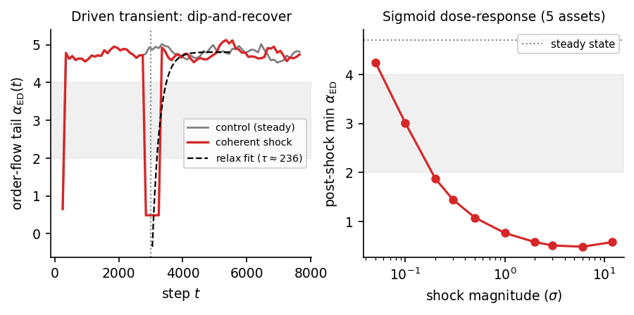

# Controlled computational experiments on non-equilibrium market dynamics with a differentiable particle simulator

*Full-length draft for **Nature Computational Science** (Paper A). Markdown working draft, written to
NCS conventions (≤3,500-word main text; unstructured 150-word abstract; **Methods after the main
text**; Data/Code availability statements; ≤6 main display items; ≤50 references; related work woven
inline, no "Related Work" section — modeled on Nat. Comput. Sci. Articles). Strategy:
`papers/proposal/paper_a_dual_track_plan_2026-06-19.md`. Experiment plan + pre-registration:
`experiments/124_order_flow_transient/{DESIGN,PREREG_phase2}.md`.*

> **Status note (delete before submission).** Complete except the load-bearing **Phase-2 real-market
> result (Results §6)**, which is pending limit-order-book data and decides the central market claim
> (and the venue). The abstract, framing and Discussion are written *conditionally* against the
> **pre-registered** decision gates so the Phase-2 outcome slots in with no post-hoc reframing. If the
> Phase-2 test is null, the paper stands on Results §1–§5 as a simulator-physics + measurement-
> correction contribution. Citations are author–year here; convert to numbered Nature style at LaTeX.

---

## Abstract

Heavy-tailed returns and clustered volatility — the canonical "stylized facts" of markets — are almost
always studied passively and treated as stationary statistical laws, because real markets cannot be
experimentally perturbed under controlled conditions. We introduce EcoMD, a calibrated differentiable
particle simulator of a market in which agents are particles under Langevin dynamics with learned
interactions, and use its differentiability — gradient calibration, scheduled interventions, and exact
internal observables — as a controlled-experiment platform. Four results follow. First, scoring
simulator rollouts without discarding a warm-up confounds a startup equilibration transient with a
stationary fat tail, a measurement artifact we quantify and correct. Second, by controlled
intervention, heavy tails in EcoMD are a driven non-equilibrium transient: a light steady state, a
shock-driven heavy tail, finite-time relaxation, and a sigmoid dose–response across five assets. Third,
the transient is mechanistically specific — only coordinated agent displacement drives it, exogenous
price shocks are inert — and it leaves a sharp, dose-responsive order-flow-coherence signature. Fourth,
real return tails are stationary across calm and crash, placing the transient in the simulator and
converting it into a falsifiable prediction about real order flow, which we pre-register and test on
limit-order-book data.

## Main

The heavy, approximately inverse-cubic tail of asset returns is among the most reproduced regularities
in quantitative finance (Mandelbrot 1963; Gopikrishnan et al. 1999; Plerou et al. 1999; Gabaix et al.
2003; Cont 2001), and is routinely treated as a *stationary, universal law* — a fixed exponent
*α ≈ 3* to be explained by an equilibrium mechanism (Gabaix et al. 2003; Gabaix 2009). A dissenting
tradition instead reads the heavy tail as an *emergent, dynamics-generated* effect: a finite-variance
process subordinated to a fluctuating volatility clock (Clark 1973), or apparent power-law behaviour
produced by multi-timescale stochastic volatility and finite samples (LeBaron 2001; Warusawitharana
2018; Cont 2007). These two readings — the tail as a stationary law versus the tail as a non-stationary
or transient phenomenon — are difficult to separate with observational data alone, because we cannot
intervene on a real market and watch how its tail responds and relaxes (Quintos et al. 2001).

A *mechanistic, differentiable simulator* changes which questions are askable. If agents are particles
in a many-body Langevin system whose macroscopic observable is the price, then "steady state",
"relaxation time" and "driven transient" become precise, measurable dynamical statements rather than
metaphors, and differentiability adds gradient calibration and exact attribution. Langevin and
agent-based descriptions of markets are long-established — from the herding and fundamentalist–chartist
models that first produced fat tails endogenously (Bouchaud and Cont 1998; Cont and Bouchaud 2000;
Lux and Marchesi 1999) to large discrete-event simulators (Byrd et al. 2020) and, recently,
*differentiable* agent-based models calibrated by gradients (Andelfinger 2021; Chopra et al. 2023;
Dyer et al. 2023; Quera-Bofarull et al. 2023). Generative neural models — GANs and neural SDEs over
returns and limit-order-book messages — pursue realism through learning rather than mechanism (Wiese
et al. 2020; Coletta et al. 2021, 2022; Buehler et al. 2019), and are evaluated against the same
stylized-fact targets (Vyetrenko et al. 2020). Our contribution is not the simulator as an object —
a learned, high-dimensional, particle-level, differentiable Langevin market generalizes Bouchaud and
Cont's (1998) low-dimensional analytic one — but a *methodology*: pose a causal question about market
dynamics, answer it by controlled intervention in the simulator, and convert the answer into a
falsifiable prediction for real data.

We report four results. (1) A transferable **measurement correction**: warm-up-inclusive rollout
scoring reads a startup equilibration transient as a stationary tail. (2) A **controlled discovery**:
in EcoMD heavy tails are a driven non-equilibrium transient, with an explicit dose–response and
relaxation time across five assets. (3) **Mechanism attribution**: only coordinated agent displacement
drives the transient; exogenous price shocks are inert; the transient leaves a sharp order-flow-
coherence signature. (4) A **real-market boundary and prediction**: real *return* tails are stationary
(the transient is model-specific), which — because the dynamical structure of markets is known to live
in *order flow* rather than the return marginal (Lillo and Farmer 2004; Bouchaud et al. 2004; Tóth
et al. 2011; Cont et al. 2014) — yields a falsifiable, pre-registered prediction about real order flow.

### EcoMD as a controlled-experiment platform

EcoMD (Methods) evolves *N* agents *sᵢ ∈ ℝᵈ* by overdamped Langevin dynamics with a learned
equivariant interaction potential in the spirit of machine-learned molecular-dynamics force fields
(Behler and Parrinello 2007; Batzner et al. 2022; Batatia et al. 2022); the log-price increment is
driven by the aggregate excess demand *EDₜ = κ Σᵢ Δsᵢ,₀*, the net signed agent flow. Three
capabilities make the experiments below possible and distinguish EcoMD from observational study and
from non-differentiable simulators (Byrd et al. 2020): *scheduled interventions* (a shock interface
that drives the system out of steady state on demand and lets us watch it relax); *exact internal
observables* (the pre-impact excess demand and the per-step order-flow imbalance are read directly, not
inferred); and *gradient attribution* (differentiability supports calibration and mechanism
attribution). We use these as the experimental knobs that real markets lack.

### A measurement correction

A fresh rollout is out of equilibrium and relaxes to its steady state over an initial transient during
which the aggregate flow is heavy-tailed. Standard stylized-fact scoring estimates the Hill tail index
(Hill 1975) on the *entire* rollout, and therefore reads this startup transient as a stationary heavy
tail. Discarding the first ≈50 steps moves the estimate sharply toward the light steady state
(Fig. 1a; Table 1): the baseline Hill index rises from 3.87 to 6.55, and a concave-impact variant
previously tuned to "match" the cube law rises from 5.05 to 9.26. The steady state is *light*-tailed
(*α ≈ 4.7* for excess demand); the apparent match was burn-in inflation. The artifact is *rewarded,
not caught* — the warm-up-inclusive (heavier) reading sits closer to the empirical cube-law target than
the true light steady state, so a stylized-fact scorer registers a *better* match — and its low
cross-seed variance lends it the appearance of a robust law. We recommend a corrected protocol (compute
each fact over a sliding window against warm-up-discard length, discard to the plateau, and report the
sensitivity curve, flagging facts that shift over the warm-up as transient-contaminated) as default
hygiene for rollout-scored market models (Vyetrenko et al. 2020).

### Heavy tails are a driven non-equilibrium transient

We use the intervention knob. In the unperturbed steady state the order-flow tail is light
(*α_ED ≈ 4.7*, flat; Fig. 1b). A controlled coordinated displacement of a fraction of agents at *t* =
3,000 drives the tail down to *α_ED ≈ 0.5* — heavier than the cube law — and it then relaxes back to
≈4.7 within ≈10³ steps; an exponential fit gives a relaxation time *τ ≈ 240* steps. The depth matches
the *t* = 0 equilibration template, i.e. the burn-in of the previous section *is* this same transient.
The effect is systematic: across five assets (equities, NASDAQ, gold, crypto, FX) the post-shock tail
follows a monotonic sigmoid dose–response in shock magnitude (onset ≈0.1–0.2σ, saturating at a floor
*α ≈ 0.5*; Fig. 1c), with an asset-dependent threshold that tracks intrinsic volatility. None of this
is imposed by the perturbation: the steady state being *light* (the opposite of real markets), the
finite relaxation time, the graded dose–response, and the mechanism specificity below are emergent
properties of the trained dynamics. In EcoMD, the heavy tail is a property of the *driven*, not the
steady, state — an explicit, controlled instance of the dynamics-generated view of fat tails (Clark
1973; LeBaron 2001; Warusawitharana 2018).

### Mechanism: coordinated displacement, not price shocks; an order-flow signature

What drives the transient? Only coordinated displacement of the *agents*. An exogenous price shock
(injecting a return into the price — a news-shock analogue) is inert: across magnitudes up to 12σ the
excess-demand tail stays light (*α_ED ≈ 4.6*), the return tail only nudges (≈7.7 → 6.0, still far from
heavy), and the order-flow imbalance is statistically identical to control (Fig. 2b). A price gap does
not propagate into a coordinated order-flow response; the transient is specific to perturbing the
agents' coordination, not the observable price — consistent with reading a crash as coordinated
liquidation rather than an exogenous price move.

Under the coordinated shock, order flow shows a sharp, quantitatively characterized signature (Fig. 2a;
Methods). The lag-1 autocorrelation of order-flow imbalance jumps from ≈0.02 to ≈1.0 at the shock —
flow becomes transiently coherent and persistent — and relaxes back. It has a clean monotonic sigmoid
dose–response (onset ≈0.1–0.2σ → ≈1.0 by ≈1σ; a sharper observable than the tail), generalizes across
four of five assets (the low-volatility FX pair sub-threshold at the tested magnitude, its onset
tracking volatility), and relaxes on a sharp timescale *τ_OFI ≈ 22* steps — roughly ten times faster
than the return-tail relaxation *τ_ED ≈ 236*. The system thus exhibits two non-equilibrium timescales:
a near-instantaneous order-flow-coherence impulse and a slower tail relaxation. We also computed a
sign-level entropy-production proxy on the joint *(Δp, OFI)* process (the Kullback–Leibler divergence
between forward and time-reversed pair-transition statistics, in the sense of stochastic thermodynamics;
Seifert 2012); it was flat. The signature is therefore order-flow *persistence/coherence*, not
sign-level *irreversibility* — a strongly persistent, AR-like process can be time-reversible, and
entropy production need not accompany the memory burst. A finer-grained entropy-production treatment,
connecting to fluctuation-theorem analyses of market cascades (Maskawa 2025) and to model-free
irreversibility estimators that rise in crisis regimes (Zumbach 2009; Flanagan and Lacasa 2016), is
deferred to a companion physics study.

### The real-market boundary

Do real markets share the transient? We test it directly on returns. On five real one-minute crypto
crash episodes (the March-2020 COVID crash, the May-2021 sell-off, the June-2022 deleveraging, the
Terra/Luna collapse and the FTX failure) we pre-registered the statistic *Δα = α(crash) − α(pre)* on
volatility-standardized returns and compared it to a null distribution built from a long calm window
(Methods; the time-varying-tail-index test of Quintos et al. 2001 applied to crash windows). The
driven-transient hypothesis predicts *Δα ≪ 0*; instead the pooled effect is *z = +1.03* (slightly
*lighter*), with one of five episodes a significant heavier-tail hit — within the false-positive rate
for five tests (Fig. 2c). Real return tails are stationary — approximately cube-law in calm and crash
alike, consistent with inverse-cubic universality (Gabaix et al. 2003; Gopikrishnan et al. 1999).

This is a clean, controlled result with a precise consequence. EcoMD's heavy tail is a non-equilibrium
property *of the model*: because the model has no stationary heavy-tail source — a structural property,
not a training shortfall — it can produce heavy tails only transiently, and the light steady state is
itself the finding. It localizes the missing ingredient (a stationary heavy-tail mechanism, e.g. a
heterogeneous heavy order-flow source) for this class of simulators. And it sharpens the next question:
if the non-equilibrium driving is real but absent from the *return* tail, where is it? The microstructure
literature gives a clear candidate — the non-trivial dynamical structure of markets resides in *order
flow*, which carries long memory while returns remain near-efficient (Lillo and Farmer 2004; Bouchaud
et al. 2004), and whose impact sits at a near-critical, liquidity-limited point (Tóth et al. 2011; Cont
et al. 2014; Bouchaud et al. 2018).

### A pre-registered real order-flow test

The mechanism above turns this into a sharp prediction: at real crash onsets — which are coordinated
liquidation events, not exogenous price gaps — *order-flow memory* should burst toward perfect
persistence, with a monotonic dependence on crash severity, generalization across asset classes with a
volatility-dependent threshold, and a sharp relaxation, *precisely where the return tail is stationary*.
The full quantitative prediction, the data, the statistic, the calm-window null, and the binding decision
gates are frozen in a pre-registration (`PREREG_phase2`; Methods) to be posted before the real data are
touched.

> **[Results §6 — BLANK, pending Tardis L2 limit-order-book data.]**
> *To fill on completion (against the frozen gates):*
> - **[Table 2]** real OFI memory / tail Δ per crash episode and pooled *z*, versus the calm null.
> - **[Fig. 3]** real crash order-flow memory burst-and-relax versus calm controls; EcoMD-predicted
>   versus observed shape, dose-scaling and timescale.
> - **Outcome (one of the pre-registered gates):** *G-main (positive)* — real crash order flow shows
>   the predicted memory burst where returns are stationary, matching the EcoMD prediction, a
>   controlled-experiment-derived real-market finding enabled by the simulator; or *G-null (negative)* —
>   real order flow is also stationary, the EcoMD transient is simulator-specific across both returns and
>   order flow, and the paper stands on the measurement correction and controlled simulator physics.

## Discussion

We have used a differentiable particle simulator as an experimental apparatus for market dynamics:
posing causal questions that observational study cannot answer, resolving them by controlled
intervention, and converting the results into falsifiable predictions for real data. The methodology
yields a transferable measurement correction (warm-up hygiene for rollout-scored generators, including
the GAN and neural-SDE market models now evaluated on stylized facts; Wiese et al. 2020; Coletta et al.
2022; Vyetrenko et al. 2020), a controlled characterization of heavy tails as a driven transient with an
explicit mechanism and order-flow signature, and an honest boundary that itself generates the
order-flow prediction.

Our results take an explicit position in a long debate. The controlled transient (Results §2) is a
clean, interventional realization of the dynamics-generated view of fat tails (Clark 1973; LeBaron
2001; Warusawitharana 2018) — but the real-data boundary (Results §5) lands squarely in the
stationary-law camp for *returns* (Gabaix et al. 2003), so the two are not in conflict: the simulator's
transient is model-specific, and the real heavy tail of returns is, to our measurement, stationary. The
unresolved and interesting question is whether the non-equilibrium driving that is manifestly present in
markets — order flow has long memory (Lillo and Farmer 2004), impact is near-critical (Tóth et al.
2011), and price/volatility series are demonstrably time-irreversible in crises (Zumbach 2009; Flanagan
and Lacasa 2016) — leaves the specific, sharp order-flow-coherence signature our simulator predicts.
That is the content of the pre-registered test (Results §6). Notably, our own sign-level
entropy-production proxy was flat in the simulator, so we deliberately frame the predicted real-market
observable as *coherence/memory* rather than entropy production; whether a finer irreversibility
estimator (Flanagan and Lacasa 2016) detects the latter in real order flow is a separate, harder
question we leave to a companion physics study.

**Limitations.** The dynamical results are from a single simulator; the warm-up measurement pitfall is
conjectured to affect any rollout-scored generator initialized away from its stationary distribution,
which remains to be verified across model families. The return-tail boundary uses freely available
intraday (crypto) data over five episodes; a broader equity test, and the decisive order-flow test,
require limit-order-book data. The entropy-production / fluctuation-theorem treatment of the order-flow
signature is deferred. Finally, the central market claim rests on Results §6, which is pending.

## Methods

**Particle dynamics and integrator.** EcoMD represents the market by $N$ agents with latent states
$s_i\in\mathbb{R}^d$, $i=1,\dots,N$, evolving by overdamped (inertia-free) Langevin dynamics in a learned
potential landscape conditioned on the price context $c_t$:

$$\gamma\,\dot{s}_i \;=\; -\,\nabla_{s_i} U(\{s\};c_t)\;+\;f^{\mathrm{diss}}_i\;+\;\sqrt{2\gamma T}\;\xi_i(t),$$

with friction $\gamma$, temperature $T$, and $\langle\xi_i(t)\xi_j(t')\rangle=\delta_{ij}\delta(t-t')$.
We integrate by Euler–Maruyama with fixed step $\Delta t$,

$$s_i^{t+1} \;=\; s_i^{t} \;+\; \frac{f^{\mathrm{cons},t}_i + f^{\mathrm{diss},t}_i}{\gamma}\,\Delta t \;+\; \sqrt{\tfrac{2T\,\Delta t}{\gamma}}\;\varepsilon^{t}_i ,$$

where $\varepsilon^t_i$ is a unit-variance innovation — Gaussian by default, with Student-$t$ or
symmetric-$\alpha$-stable (Lévy) options for heavier microscopic noise. The first state coordinate
$s_{i,0}$ is the price-coupled "position".

**Forces and interaction potential.** The conservative force is the negative gradient of a learned
potential, $f^{\mathrm{cons}}_i=-\nabla_{s_i}U$, evaluated by automatic differentiation with the graph
retained (`create_graph=True`) so that forces — and hence whole trajectories — are differentiable in the
parameters, which is what enables gradient calibration and attribution. The potential decomposes as
$U=U_{\mathrm{pair}}+U_{\mathrm{ext}}$: $U_{\mathrm{pair}}$ is a higher-body-order $E(n)$-equivariant
message-passing potential over a $k$-nearest-neighbour graph in the spirit of machine-learned
interatomic potentials (Behler and Parrinello 2007; Batzner et al. 2022; Batatia et al. 2022), and
$U_{\mathrm{ext}}$ is a per-agent external potential conditioned on $c_t=(\log p_t,\,v_t,\,r_{t-1})$.
Dissipation derives from $D(\{s\},\{s^{\mathrm{prev}}\})=\lambda\sum_i\lVert s_i-s_i^{\mathrm{prev}}\rVert^2$,
giving a frictional force opposing per-step displacement,
$f^{\mathrm{diss}}_i=-\nabla_{s_i}D=-2\lambda\,(s_i-s_i^{\mathrm{prev}})$.

**Price formation.** The pre-impact excess demand is the net signed agent flow along the price-coupled
coordinate,

$$\mathrm{ED}_t \;=\; \kappa\sum_{i=1}^{N}\Delta s_{i,0}^{t},\qquad \Delta s_{i,0}^{t}=s_{i,0}^{t}-s_{i,0}^{t-1},$$

optionally normalized by $\sqrt{N}$ and passed through a concave impact map. The realized log-return is

$$r_t \;=\; \beta_t\,\mathrm{ED}_t \;-\; \tfrac{1}{2}\sigma^2 \;+\; \sigma\,\eta_t \;+\; \chi_t,\qquad \eta_t\sim\mathcal{N}(0,1),$$

where $\beta_t$ is an effective impact coefficient, $\chi_t$ an optional Hawkes self-excitation term
(a sign-coupled EWMA of $|r|$), and the running volatility follows an EWMA
$v_{t+1}=(1-a)\,v_t+a\,|r_t|$; the log-price accumulates as $\log p_{t+1}=\log p_t+r_t$. The parameters
$\{\gamma,T,\lambda,\kappa,\beta,\sigma,a,\dots\}$ together with the potential weights are calibrated.

**Order-flow imbalance.** We log per step the signed-to-gross agent-flow ratio,

$$\rho_t \;=\; \frac{\sum_{i}\Delta s_{i,0}^{t}}{\sum_{i}\lvert \Delta s_{i,0}^{t}\rvert+\epsilon}\;\in[-1,1],$$

computed directly from agent flow (config-independent; the unbounded net flow is $\propto\mathrm{ED}_t$,
while $\rho_t$ isolates directional coordination).

**Shock interface.** A scheduled intervention is applied at step $t^{\*}$. (i) *Coordinated displacement*
(`state_kick`): for a uniformly random subset $\mathcal{S}$ of $\lceil\phi N\rceil$ agents,
$s_{i,0}\!\leftarrow\! s_{i,0}+m\cdot\mathrm{sd}(s_{\cdot,0})$ for $i\in\mathcal{S}$. (ii) *Exogenous price
gap* (`price_jump`): inject $r^{\mathrm{exo}}=\mathrm{sgn}\cdot m\,v_{t^{\*}}$ into the realized return,
$r_{t^{\*}}\!\leftarrow\! r_{t^{\*}}+r^{\mathrm{exo}}$, updating $\log p$ and the volatility EWMA with the
total move. The dimensionless dose is $m$ (in cross-sectional-s.d. or $\sigma$ units, respectively);
dose–response sweeps vary $m$, cross-asset runs use the five calibrated asset checkpoints.

**Calibration.** Parameters are fit by stochastic gradient descent on a stylized-fact objective evaluated
on *warm-up-discarded* returns $r_{>w}$,

$$\mathcal{L} \;=\; \sum_{k} w_k\,\big(g_k(r_{>w})-g_k^{\*}\big)^2 ,$$

where each $g_k$ is a differentiable estimator of a stylized fact — the first three moments, the
squared-return autocorrelation $\overline{\mathrm{ACF}}(r^2)$ (volatility clustering), a soft Hill
exponent, the leverage correlation, and eight further differentiable fact surrogates (gain–loss
asymmetry, aggregational Gaussianity, Fano intermittency, DFA Hurst, etc.) — and $g_k^{\*}$ are empirical
targets (Cont 2001; Vyetrenko et al. 2020). Note that training already discards a warm-up; the pitfall of
Results §1 concerns the separate, conventional *scoring/evaluation* step, which does not.

**Tail-index and order-flow estimators.** For a sample with upper order statistics
$x_{(1)}\ge x_{(2)}\ge\cdots$ and tail fraction $k/n$, the (two-sided) Hill estimator (Hill 1975) is

$$\hat{\alpha} \;=\; \Big(\tfrac{1}{k}\sum_{i=1}^{k}\log\tfrac{x_{(i)}}{x_{(k+1)}}\Big)^{-1}.$$

Time-resolved $\alpha(t)$, OFI memory $\mathrm{mem}(t)=\widehat{\mathrm{corr}}\!\big(\rho_{u},\rho_{u+1}\big)$
over $u$ in a window of width $W$ and stride $h$ (the lag-1 autocorrelation of signed OFI), and OFI
saturation (the window fraction with $|\rho|>\theta$) are computed on sliding windows. Relaxation times
are nonlinear-least-squares fits of $O(t)=O_\infty-A\exp[-(t-t_0)/\tau]$ to the recovery limb of a
windowed observable.

**Entropy-production proxy.** On the joint symbol sequence
$a_t=2\,\mathbf{1}[r_t>0]+\mathbf{1}[\rho_t>0]\in\{0,1,2,3\}$, with Laplace-smoothed windowed
pair-transition probabilities $P(a\!\to\!b)$, we estimate the per-window irreversibility

$$\dot{S} \;\approx\; \sum_{a,b} P(a\!\to\!b)\,\log\frac{P(a\!\to\!b)}{P(b\!\to\!a)},$$

the Kullback–Leibler divergence between forward and time-reversed transition statistics — a standard
discrete entropy-production estimator that vanishes under detailed balance (Seifert 2012).

**Real-data test and pre-registration.** Real returns are one-minute Binance close-to-close log-returns
for five crash episodes plus a long calm window. Writing $\alpha(\cdot)$ for the Hill index of
volatility-standardized returns on a window, the statistic $\Delta\alpha=\alpha(\text{crash }2\,\mathrm{d})-\alpha(\text{pre }5\,\mathrm{d})$
is compared to a null distribution $\{\Delta\alpha^{(j)}\}$ obtained by sliding the same $(5\,\mathrm{d},2\,\mathrm{d})$
window-pair across the calm period — a windowed tail-index-stationarity test (Quintos et al. 2001) —
yielding per-episode $z=(\Delta\alpha-\mu_0)/\sigma_0$ and a pooled
$z=(\overline{\Delta\alpha}-\mu_0)/(\sigma_0/\sqrt{n})$ with $(\mu_0,\sigma_0)$ the null mean and s.d. The
order-flow test (Results §6) generalizes this to limit-order-book OFI memory under binding decision gates
and four controls (volatility confound, reversibility surrogate, placebo onsets, return cross-check)
frozen before data access in the pre-registration
(`experiments/124_order_flow_transient/PREREG_phase2.md`).

## Data availability

Real-market inputs are one-minute OHLCV bars from the Binance public API (free, no key); the exact
symbols, windows and a reproducibility hash are recorded in the repository. The limit-order-book data
for Results §6 will be obtained from a commercial L2 provider; provenance will be stated on completion.

## Code availability

The EcoMD simulator, all experiment configurations and seeds, the analysis scripts (windowed tail
index, order-flow diagnostics, relaxation fits, the pre-registered null tests) and the figure-generation
code are available in the project repository.

## References

Mandelbrot (1963), *J. Business*; Clark (1973), *Econometrica*; Behler & Parrinello (2007), *PRL*;
Bouchaud & Cont (1998), *EPJ B*; Cont & Bouchaud (2000), *Macroecon. Dyn.*; Lux & Marchesi (1999),
*Nature*; Gopikrishnan/Plerou et al. (1999), *PRE* (two companion papers); Cont (2001; 2007),
*Quant. Finance* / Springer; LeBaron (2001), *Quant. Finance*; Quintos, Fan & Phillips (2001), *Rev.
Econ. Stud.*; Gabaix, Gopikrishnan, Plerou & Stanley (2003), *Nature*; Bouchaud, Gefen, Potters & Wyart
(2004), *Quant. Finance*; Lillo & Farmer (2004), *SNDE*; Gabaix (2009), *Annu. Rev. Econ.*; Zumbach
(2009), *Quant. Finance*; Tóth et al. (2011), *PRX*; Seifert (2012), *Rep. Prog. Phys.*; Cont, Kukanov
& Stoikov (2014), *J. Financial Econometrics*; Flanagan & Lacasa (2016), *Phys. Lett. A*; Buehler et al.
(2019), *Quant. Finance*; Byrd, Hybinette & Balch (2020), *SIGSIM-PADS*; Vyetrenko et al. (2020),
*ICAIF*; Wiese et al. (2020), *Quant. Finance*; Coletta et al. (2021, *ICAIF*; 2022, *ICAIF*); Batzner
et al. (2022), *Nat. Commun.*; Batatia et al. (2022), *NeurIPS*; Chopra et al. (2023), *AAMAS*; Dyer
et al. (2023), *ICAIF*; Quera-Bofarull et al. (2023), *AAMAS*; Andelfinger (2021), *SIGSIM-PADS*;
Warusawitharana (2018), *J. Empirical Finance*; Hill (1975), *Ann. Stat.*; Maskawa (2025), *Entropy*.
*(Full verified bibliographic details in `references.bib`.)*

---

**Figure 1.** **The heavy tail is a driven non-equilibrium transient.** (a, the measurement correction
panel of Fig. 2) the Hill index rises out of the cube-law band once the warm-up transient is discarded;
**(b)** order-flow tail *α_ED(t)*: control stays light (≈4.7); a coordinated shock at *t* = 3,000
craters it to ≈0.5 and it relaxes back (*τ ≈ 240*); the *t* = 0 burn-in dip is the same transient;
**(c)** monotonic sigmoid dose–response — post-shock minimum *α_ED* versus shock magnitude (five
assets). *(Panels b–c shown; panel a is Fig. 2a.)*

**Figure 2.** **Mechanism, measurement and boundary.** **(a)** Hill index versus warm-up discard — the
measurement correction (both model variants leave the cube-law band once the transient is dropped);
**(b)** order-flow-imbalance memory bursts (≈0.02 → ≈1.0) and relaxes under the coordinated shock but
is flat under an exogenous price gap; **(c)** real-crash *Δα* against the calm null over five episodes —
real return tails do not heavy-up (pooled *z* = +1.03). *(Panels combined from the shared figure set;
split and renumber at LaTeX conversion.)*
