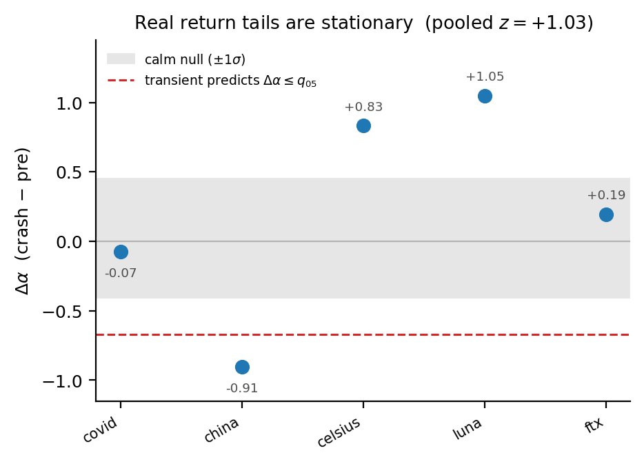

# EcoMD: A Differentiable Generative Market Simulator, and a Burn-In Pitfall in Scoring It

*NeurIPS Workshop on Generative AI in Finance (non-archival, ≤4pp). **This Markdown is the source
draft**; `main.tex` is generated from it at submission (regenerate via pandoc — do not hand-edit the
stale `.tex`). Figures in `figures/`.*

## Abstract

Generative simulators of financial markets are used for scenario generation and stress testing, and
are evaluated by how well their rollouts reproduce stylized facts such as heavy-tailed returns and
volatility clustering. We present **EcoMD**, a *differentiable* particle simulator whose
differentiability enables gradient-based calibration and a *controllable shock interface* for scenario
generation, and we report a **measurement pitfall in how such generators are evaluated**. Standard
practice scores the full rollout without discarding an initial warm-up; we show this misreads a startup
*equilibration transient* as a stationary fat-tail match, inflating the apparent tail fidelity (the
Hill tail index rises from 3.9 to 6.6 once warm-up is discarded; the steady state is light-tailed). We
give the corrected protocol. Using the shock interface, EcoMD generates *coherent-liquidation* stress
scenarios with a distinctive, controllable order-flow signature — order-flow-imbalance memory jumps from
0.02 to ~1.0 at the shock with a monotonic dose-response, generalizing across assets and relaxing quickly, whereas exogenous price gaps are inert. Finally, we bound the fidelity: the model's heavy
tails are *transient*, while real one-minute crypto crash tails are *stationary* (pre-registered null
test over five episodes). EcoMD is a useful controllable generator, but its tail realism must be
validated against real stationarity before use.

## 1. Introduction

Generative models of markets — agent-based simulators, neural stochastic differential equations, and
GANs over price paths — are increasingly used for scenario generation, stress testing, and data
augmentation. Their quality is judged almost universally by *stylized-fact matching*: a rollout is
scored on whether its returns reproduce empirical regularities such as the heavy (inverse-cubic) tail
and volatility clustering [Cont 2001; Gabaix et al. 2003]. The *scoring procedure itself*, however, is
rarely audited: whether a high stylized-fact score certifies a *stationary* property of the generator
or an artifact of how the rollout is measured is seldom checked. This motivates two practical
questions: is the evaluation rigorous, and how *controllable* are the generated scenarios — which
interventions produce which market regimes?

We study both through **EcoMD**, a differentiable particle simulator in which agents evolve under
overdamped Langevin dynamics with learned pairwise potentials, and prices form from aggregate excess
demand. Differentiable agent-based models are not new [Bouchaud & Cont 1998; Dyer et al. 2023; Chopra
et al. 2023]; we use EcoMD's differentiability for a controllable shock interface and report three
findings about generating and evaluating market scenarios, the first of which is largely model-agnostic:

- **An evaluation pitfall and its fix** (§3): warm-up-inclusive rollout scoring inflates fat-tail
  fidelity by reading an equilibration transient as a stationary law.
- **Controllability** (§4): a coherent-liquidation shock drives a distinctive, dose-responsive,
  relaxing order-flow scenario; an exogenous price gap is inert.
- **Fidelity bounds** (§5): generated tails are transient while real crash tails are
  stationary — a scenario-realism caveat, established with a pre-registered test.

## 2. EcoMD: a differentiable generative simulator

EcoMD evolves *N* agents *sᵢ ∈ ℝᵈ* by overdamped Langevin dynamics, *ṡᵢ = −∇U({s}) + √(2T) ξᵢ*, with a
learned interaction potential *U* (an equivariant message-passing form in the spirit of MACE [Batatia
et al. 2022]) and temperature *T*. The log-price increment is driven by aggregate excess demand,
*Δpₜ = β·EDₜ + σηₜ* with *EDₜ = κ Σᵢ Δsᵢ,₀*, i.e. the net signed agent flow. The model is trained to
match a panel of stylized facts and is fully differentiable, which buys two things a non-differentiable
agent-based simulator [Byrd et al. 2020, ABIDES] does not have: gradient-based calibration, and a *shock interface* for controllable interventions (§4). The rest of the paper concerns how to evaluate
and steer this generator.

**Figure 1.** **EcoMD as a differentiable, controllable generator.** **(a)** agents under a learned
Langevin force form the excess demand and hence the price; **(b)** a scheduled shock interface drives
controllable scenarios, read out through exact internal observables; **(c)** the three findings below.
*(Schematic.)*

## 3. The evaluation pitfall

**Setup.** Rollout-based generators are scored by computing stylized facts on a generated series of
length *T* and comparing to empirical targets. The fat-tail fact is the Hill tail index *α* of returns
[Hill 1975]: *α ≈ 3* is the empirical inverse-cubic regime, lower is heavier. The standard recipe
computes *α* on the *entire* rollout.

**The artifact.** A freshly initialized rollout is out of equilibrium; it relaxes to its steady state
over an initial transient. During that transient the aggregate flow is heavy-tailed, so a
warm-up-inclusive Hill estimate reports a heavy tail — and the scorer reads this as a successful match
to the empirical cube law. But it is a startup artifact. Discarding the first ~50 steps moves the estimate toward the light steady state: on EcoMD, the baseline Hill index rises from 3.87 to
6.55, and a concave-impact variant tuned to "match" the cube law rises from 5.05 to 9.26 (Table 1;
Figure 2). The steady state is *light*-tailed (*α ≈ 4.7* for excess demand); the apparent fat-tail
match was burn-in inflation. **The artifact is rewarded, not caught:** the
warm-up-inclusive (heavier) reading sits closer to the empirical cube-law target than the true light
steady state, so a stylized-fact scorer registers a *better* match — the practitioner sees success, not
a bug. Its low cross-seed variance reinforces the illusion of a robust law, which is why the pitfall
survives standard practice.

**Table 1.** Hill tail index with vs. without a warm-up discard (EcoMD, *T*=8000). Higher = lighter.

| model | no discard | discard 50 | Δ |
|---|---|---|---|
| baseline | 3.87 | 6.55 | +2.68 |
| concave-impact (tuned to "solve") | 5.05 | 9.26 | +4.21 |

**The fix.** We recommend a simple protocol: (i) compute each stylized fact over a sliding window and
plot it against warm-up-discard length *W*; (ii) discard up to the plateau *W\** where the estimate
stabilizes; (iii) report the score at *W\** *with* the sensitivity curve, and flag any fact that shifts
by more than a set tolerance over [0,*W\**] as transient-contaminated. This is a few-line change to any
rollout-scoring pipeline, yet it changes qualitative conclusions: under it, EcoMD's earlier "cube-law
reproduction" is withdrawn. We recommend it as default hygiene for rollout-based market generators.

**Figure 2.** The warm-up-scoring pitfall: Hill tail index vs. warm-up-discard length — the heavy
"cube-law" match at the left edge (full-rollout scoring) vanishes once the equilibration transient is
dropped; the steady state is light-tailed.

## 4. Controllable stress scenarios

The shock interface injects a scheduled intervention mid-rollout, turning EcoMD into a controllable
scenario generator. We contrast two interventions.

**Coherent liquidation** (a panic / forced-selling analogue) displaces a fraction of agents' latent
positions in a common direction. This drives a *relaxing* stress scenario: the heavy transient
tail re-appears (*α* for excess demand drops from 4.7 to ~0.5 — below one, a driven-state pathology
rather than a realistic stationary tail — and recovers, the relaxation time growing with shock
magnitude), with a graded, sigmoid dose-response. It also leaves a distinctive, **controllable
order-flow signature**, which we characterize quantitatively (Figure 3):

- *Magnitude.* The lag-1 autocorrelation of order-flow imbalance (OFI) jumps from ~0.02 to ~1.0 at the
  shock — order flow becomes transiently coherent and persistent — and relaxes back, with the imbalance
  magnitude and its extreme-coordination saturation bursting and decaying in step.
- *Dose-response.* The OFI-memory burst is a **monotonic sigmoid** in shock magnitude (onset
  ~0.1–0.2σ, saturating to perfect persistence ~1.0 by ~1σ) — a more sensitive control knob than the
  return tail.
- *Generality.* The signature reproduces across **four of five assets** (equities, NASDAQ, gold,
  crypto); the low-volatility FX pair requires a larger shock, its onset tracking the asset's intrinsic
  volatility.
- *Timescale.* The OFI-memory burst is a **short impulse** (relaxation τ ≈ 22 steps), ~10× faster than
  the return-tail relaxation (τ ≈ 236) — order flow coordinates near-instantaneously while the tail
  relaxes slowly.

The initial coherence is partly imposed by the intervention; the non-trivial, emergent content is its
*finite-time relaxation*, its *graded dose-response*, and the contrast with the inert price gap.
We also checked a sign-level entropy-production proxy on the joint (return, OFI) process: it was **flat**,
so the signature is order-flow *persistence/coherence*, not sign-level irreversibility (a persistent
process can be time-reversible) — the controllable knob is coherence, not entropy production.

**Exogenous price gap.** Injecting an exogenous return into the price (a news-shock analogue) is, by
contrast, *inert*: across magnitudes up to 12σ the excess-demand tail stays light (*α ≈ 4.6*), the
return tail only nudges (~7.7 → 6.0, still far from heavy), and the order-flow imbalance is
statistically identical to the unshocked control. A price gap does not propagate into a coordinated
order-flow response in this model.

The practical takeaway is that *controllability is intervention-specific*: the lever that produces
realistic stress is coordinated participant behavior, not a price shock. The coherent-liquidation
order-flow signature — a dose-responsive memory burst — is also a concrete, falsifiable
prediction to test against real crash order-flow data, a natural place to look since the non-trivial
dynamical structure of markets resides in order flow, which carries long memory while returns stay
near-efficient [Lillo & Farmer 2004; Cont, Kukanov & Stoikov 2014; Tóth et al. 2011].

**Figure 3.** The coherent-liquidation order-flow signature. **(a)** OFI memory bursts (≈0.02 → ≈1.0)
and relaxes quickly (*τ_OFI ≈ 20*) under coherent liquidation, while an exogenous price gap and control
stay flat. **(b)** a monotonic sigmoid dose-response — a controllable knob. **(c)** two timescales:
the OFI burst relaxes ≈10× faster than the tail. **(d)** the sign-level entropy-production proxy is flat
across assets — the controllable signature is coherence, not irreversibility.

## 5. Fidelity bounds

A generator is only as useful as its fidelity is understood. EcoMD's heavy tails are a *driven
transient*; are real market tails the same? We test this directly. On five real one-minute crypto crash
episodes (COVID-2020, the May-2021 selloff, the June-2022 deleveraging, the Terra/Luna collapse, and
FTX), we pre-registered a statistic *Δα = α(crash) − α(pre)* on volatility-standardized returns and
compared it to a null distribution built from a long calm window (Figure 4). If crashes drove a
heavier tail, *Δα* would be strongly negative. Instead the pooled effect is *z = +1.03* (slightly
*lighter*, opposite to the prediction); only one of five episodes shows a significant heavier tail,
within the false-positive rate for five tests. We find no evidence of a crash-driven heavy tail; with
five episodes the test has limited power, but the result is consistent with a *stationary*,
approximately cube-law return tail in calm and crash alike [Gabaix et al. 2003; Plerou et al. 1999;
Tóth et al. 2011]. This uses the five episodes available with free intraday data
(crypto); a broader equity test awaits paid high-frequency data, but the result is robust to volatility
standardization and already matches the established stationarity of the return tail.

Hence EcoMD generates a heavy tail that is a *non-equilibrium* response, not the real *stationary* heavy
tail. For scenario generation this is an important caveat: the simulator reproduces fat tails only
transiently and under coordinated driving, so its generated tails should not be treated as realistic
stationary risk without external validation. It also localizes what the model class is missing — a
stationary heavy-tail mechanism — which we leave to future work.

**Figure 4.** The real-data fidelity test: per-episode and pooled *Δα = α(crash) − α(pre)* on
volatility-standardized one-minute returns against the calm-window null (±1σ band; dashed line = the
*q₅* a transient would predict). Real crash tails do not heavy-up; pooled *z* = +1.03.

## 6. Discussion

Three takeaways for generative AI in finance. (i) *Evaluate with warm-up hygiene*: rollout-based
fat-tail scores are inflated by startup transients; discard warm-up and report sensitivity. (ii)
*Controllability is intervention-specific*: coordinated participant behavior, not exogenous price moves,
drives realistic stress in this generator, via a dose-responsive order-flow-coherence burst.
(iii) *Tail fidelity is transient*: validate generated tails against real stationarity before relying
on them. EcoMD is a useful, controllable, differentiable scenario generator; these results are the
conditions under which its output can be trusted.

**Limitations.** We demonstrate the pitfall in EcoMD; we conjecture it affects any rollout-scored
generator initialized away from its stationary distribution — neural SDEs and agent-based models alike —
and recommend the warm-up audit whenever rollouts are scored, but verifying its prevalence across model
families is future work. The fidelity test is limited to free intraday (crypto) data.

## References
Cont 2001; Gabaix, Gopikrishnan, Plerou & Stanley 2003; Plerou et al. 1999; Bouchaud & Cont 1998; Dyer
et al. 2023; Chopra et al. 2023; Byrd et al. 2020 (ABIDES); Batatia et al. 2022 (MACE); Hill 1975; Lillo
& Farmer 2004; Cont, Kukanov & Stoikov 2014; Tóth et al. 2011; Maskawa 2025. *(full entries in
`references.bib`)*
