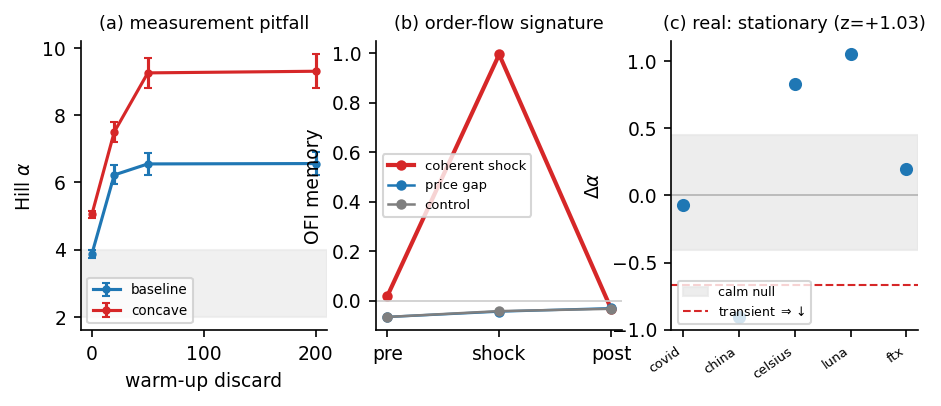

# Heavy Tails as a Non-Equilibrium Transient in a Differentiable Particle Market Simulator

*NeurIPS Workshop on Machine Learning and the Physical Sciences (ML4PS, non-archival, ≤4pp). Markdown
working draft — the submission artifact is `main.tex`; figures in `figures/`.*

## Abstract

Fat-tailed returns are usually treated as a *stationary* property — the inverse-cubic tail [Gabaix et
al. 2003; Plerou et al. 1999]. Using **EcoMD**, a differentiable Langevin particle simulator of a
market, we find the opposite. The **steady state is light-tailed** (Hill index *α ≈ 4.7*), and heavy,
cube-law-and-beyond tails (*α → 0.5*) appear *only* when the system is driven out of equilibrium — at
initialization or by a controlled shock — and **relax on a finite timescale** (*τ ≈ 240* steps). This
makes warm-up-inclusive rollout scoring *misread the equilibration transient as a stationary law*. The
transient requires *coherent displacement of agent latent states*: it is inert to an exogenous price
shock (in both the return tail and order-flow imbalance), and it leaves a sharp order-flow signature — a
memory burst from 0.02 to ~1.0 with a clean monotonic dose-response, generalizing across assets and
relaxing ~10× faster than the tail. On real one-minute crypto crashes, by contrast, the return tail is
*stationary* across calm and crash (a pre-registered null test over five episodes). The simulator's
heavy tail is thus a non-equilibrium phenomenon *of the model* — localizing a missing stationary
heavy-tail mechanism in this class of simulators — rather than a stationary market law.

## 1. Introduction

The heavy tail of financial returns — the inverse-cubic law, *P(|r|>x) ~ x⁻ᵅ* with *α ≈ 3* — is one of
the most robust "stylized facts" in quantitative finance [Cont 2001; Gabaix et al. 2003; Plerou et al.
1999], usually treated as a *stationary* property to be explained by an equilibrium mechanism [Gabaix
et al. 2003]. A dissenting tradition reads it instead as *dynamics-generated* — a finite-variance
process under a fluctuating volatility clock [Clark 1973], or apparent power laws from multi-timescale
stochastic volatility [LeBaron 2001]. Separating these views observationally is hard, because one
cannot intervene on a real market and watch its tail relax. Mechanistic, particle-based simulators can:
in a driven many-body system whose observable is the price, "steady state" and "relaxation" are
precise, and we can ask whether the heavy tail is a stationary equilibrium property or a
*non-equilibrium transient* — and whether the standard way of measuring it tells the two apart.

We study this in **EcoMD**, a differentiable simulator in which agents are particles evolving under
overdamped Langevin dynamics with learned interaction potentials, and the price forms from aggregate
excess demand. Langevin and differentiable agent-based market models are not new [Bouchaud & Cont 1998;
Dyer et al. 2024; Chopra et al. 2023]; our contribution is a non-equilibrium characterization and a
measurement correction:

- Heavy tails are a **driven non-equilibrium transient** (light steady state; shock drives *α → 0.5*;
  relaxation *τ ≈ 240*), with a sigmoid dose-response over five assets (§3).
- A **non-equilibrium measurement pitfall**: warm-up-inclusive scoring confounds the equilibration
  transient with a stationary tail (§4).
- **Mechanistic specificity and an order-flow signature**: only coherent latent displacement drives the
  transient (price shocks are inert), with a sharp, dose-responsive order-flow signature (§5); and real
  return tails are *stationary* (§6).

## 2. EcoMD: a Langevin particle market

Agents *sᵢ ∈ ℝᵈ* follow overdamped Langevin dynamics *ṡᵢ = −∇U({s}) + √(2T) ξᵢ*, with a learned
equivariant interaction potential *U* (a message-passing form in the spirit of MACE [Batatia et al.
2022]) and temperature *T*. The log-price increment is *Δpₜ = β·EDₜ + σηₜ*, where the (pre-impact)
excess demand *EDₜ = κ Σᵢ Δsᵢ,₀* is the net signed agent flow; its Hill tail index *α_ED* [Hill 1975]
is the order-flow tail and, through the impact map, controls the return tail. The model is trained to
reproduce a panel of stylized facts. Crucially, it is fully differentiable and supports *controlled
interventions* — a scheduled shock that drives the system out of its steady state — which we use as the
non-equilibrium probe. We stress that because EcoMD *is* a driven overdamped Langevin many-body system,
the terms "steady state," "relaxation time," and "driven transient" below are precise statements about
this dynamical system, not analogies for real markets; the real-market question is treated separately
and honestly in §6.

## 3. Heavy tails are a driven transient

In the unperturbed steady state the order-flow tail is *light*: *α_ED ≈ 4.7*, flat across the rollout
(Figure 1, left, grey). We then apply a controlled *coherent displacement* (a `state_kick`: a fraction
of agents are displaced together) at *t = 3000*. The tail **craters to *α_ED ≈ 0.5*** — heavier than the
cube law — and then **relaxes back to ≈4.7 within ~10³ steps**. The depth matches the *t = 0*
equilibration template, i.e. the initial burn-in *is* this same transient. An exponential fit of the
recovery limb gives a relaxation time *τ ≈ 240* steps for the saturated regime (vs. *τ ≈ 20* for the
faster cold-start). The effect generalizes across five assets (equities, gold, crypto, FX) with a
**sigmoid dose-response** in the shock magnitude (onset ~0.1–0.2σ, saturating at a floor *α ≈ 0.5*;
Figure 1, right). The heavy tail is therefore a property of the *driven*, not the steady, state. Little
of this is imposed by the perturbation: the steady state being *light* (the opposite of real markets,
and not built in), the finite relaxation time, the graded sigmoid dose-response, and the
mechanism-specificity of §5 are all emergent properties of the trained dynamics.

**Figure 1.** (left) order-flow tail *α_ED(t)*: control stays light
(≈4.7); a coherent shock at *t=3000* craters it to ≈0.5 and it relaxes back (*τ≈240*); the *t=0*
burn-in dip is the same transient. (right) sigmoid dose-response: post-shock minimum *α_ED* vs. shock
magnitude.

## 4. A non-equilibrium measurement pitfall

Because a fresh rollout is out of equilibrium, it carries this heavy transient during its initial
relaxation. Standard stylized-fact scoring computes the Hill index on the *full* rollout, with no
warm-up discard — so it reads the equilibration transient as a stationary heavy tail. Discarding the
first ~50 steps moves the estimate sharply toward the light steady state: the baseline Hill index rises
3.87 → 6.55, and a concave-impact variant previously reported to "match" the cube law rises 5.05 → 9.26
(Figure 2a). The low cross-seed variance makes the artifact look like a robust law. The correction is to
score after a warm-up discard and report a warm-up-sensitivity curve; under it, the earlier "cube-law
reproduction" is withdrawn. This is a stationarity-hygiene point for measuring tails in any driven
simulator.

## 5. Mechanism and order-flow signature

What drives the transient? Only *coherent latent displacement*. An exogenous price shock (injecting a
return into the price — a news-shock analogue) is **inert**: across magnitudes up to 12σ the order-flow
tail stays light (*α_ED ≈ 4.6*), the return tail only nudges (~7.7 → 6.0, still far from heavy), and the
order-flow imbalance is statistically identical to the unshocked control.

Under the coherent shock, order flow shows a clean, quantitatively characterized signature (Figure 2b):

- the lag-1 autocorrelation of order-flow imbalance (OFI) jumps from ~0.02 to ~1.0 at the shock — flow
  becomes transiently coherent and persistent — and relaxes back, with |imbalance| and its
  extreme-coordination saturation bursting in step;
- the OFI-memory burst has a **clean monotonic sigmoid dose-response** (onset ~0.1–0.2σ → ~1.0 by ~1σ),
  a sharper observable than the tail;
- it **generalizes across four of five assets** (the low-vol FX pair is sub-threshold at the tested
  shock, its onset tracking intrinsic volatility);
- it relaxes on a **sharp timescale *τ_OFI ≈ 22* steps — ~10× faster than the return-tail *τ_ED ≈ 236***.
  The system thus has *two* non-equilibrium timescales: a near-instantaneous order-flow coherence
  impulse and a slower tail relaxation.

**On the thermodynamic reading (honest).** We computed a sign-level entropy-production proxy on the
joint *(Δp, OFI)* process — the Kullback–Leibler divergence between forward and time-reversed
pair-transition statistics — and it was **flat** (no burst at the shock). So the signature is order-flow
*persistence/coherence*, not sign-level *irreversibility*: a strongly persistent (AR-like) process can
still be time-reversible, and entropy production need not accompany the memory burst. A finer-grained
entropy-production estimate — connecting to fluctuation-theorem studies of market cascades [Maskawa
2025] and non-equilibrium stochastic thermodynamics [Seifert 2012] — is a concrete next step we do not
claim to have established here.

## 6. The real-data boundary

Is the same transient present in *real* markets? We test it directly. On five real one-minute crypto
crash episodes (COVID-2020, the May-2021 selloff, the June-2022 deleveraging, Terra/Luna, FTX), we
pre-registered the statistic *Δα = α(crash) − α(pre)* on volatility-standardized returns and compared it
to a null distribution from a long calm window. The driven-transient hypothesis predicts *Δα ≪ 0* (a
heavier tail at the crash). Instead the pooled effect is *z = +1.03* (slightly *lighter*); only one of
five episodes is a significant heavier-tail hit, within the false-positive rate for five tests (Figure
2c). Real return tails are **stationary** — approximately cube-law in calm and crash alike, consistent
with the inverse-cubic universality [Gabaix et al. 2003; Tóth et al.]. The simulator's transient heavy
tail is therefore a non-equilibrium property *of the model*: because EcoMD has no stationary heavy-tail
source — a structural property, not a training shortfall — it can produce heavy tails only transiently,
and the light steady state is itself the finding. This localizes the missing ingredient — a stationary
heavy-tail mechanism (e.g. a heterogeneous, heavy order-flow source) — for this class of simulators.

**Figure 2.** (a) Hill index vs. warm-up discard (the measurement
pitfall); (b) OFI memory bursts (0.02 → ~1.0) and relaxes under coherent shock, flat under a price gap;
(c) real-crash *Δα* against the calm null — real return tails do not heavy-up.

## 7. Discussion

We have shown, in a differentiable Langevin market simulator, that heavy tails are a *driven
non-equilibrium transient* rather than a stationary law: a light steady state, a shock-driven heavy tail
that relaxes with a finite *τ*, a sigmoid dose-response, and a sharp, dose-responsive order-flow
coherence signature with its own (faster) timescale — together with the measurement caveat that
warm-up-inclusive scoring confounds this transient with stationarity. The honest boundary is that *real*
return tails are stationary, so the phenomenon is a property of this model class and pinpoints what it
lacks.

**Limitations.** The dynamical results are from a single simulator; we conjecture the warm-up
measurement pitfall affects any driven market simulator initialized off its steady state, but verifying
this across model families is future work. The real-data test is limited to free intraday (crypto)
data; the decisive follow-up is an order-flow-level test on paid limit-order-book data, where the
coherence signature above (sharp OFI-memory burst, dose-responsive) is the quantity to look for.

## References
Cont 2001; Gabaix et al. 2003; Plerou et al. 1999; Bouchaud & Cont 1998; Dyer et al. 2024; Chopra et al.
2023; Batatia et al. 2022 (MACE); Hill 1975; Tóth et al.; Maskawa 2025; Seifert 2012. *(full entries in
`references.bib`)*
