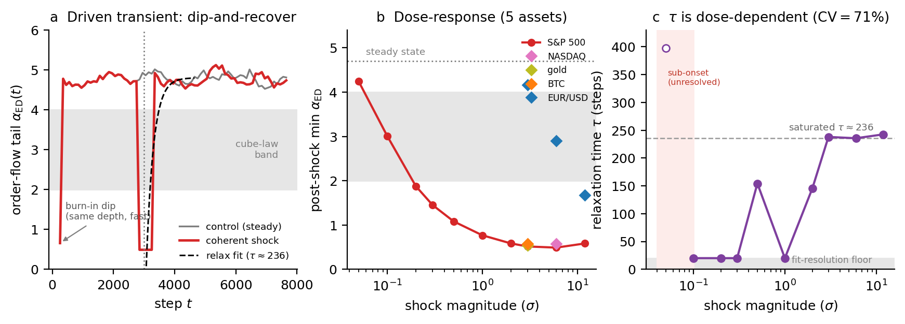
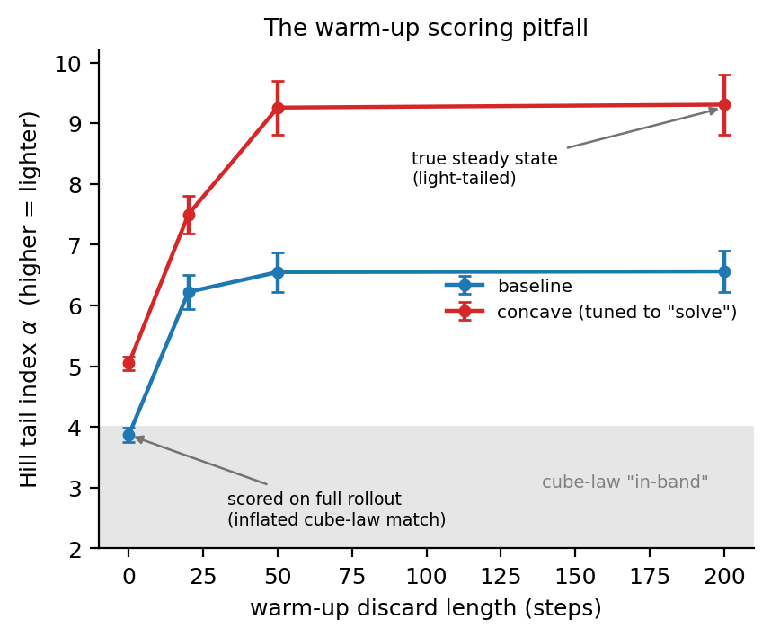

# Heavy Tails as a Non-Equilibrium Transient in a Differentiable Particle Market Simulator

*NeurIPS Workshop on Machine Learning and the Physical Sciences (ML4PS, non-archival, ≤4pp). **This
Markdown is the source draft**; `main.tex` is generated from it at submission (regenerate via pandoc —
do not hand-edit the stale `.tex`). Figures in `figures/`.*

## Abstract

Fat-tailed returns are usually treated as a *stationary* property — the inverse-cubic tail [Gabaix et
al. 2003; Plerou et al. 1999]. Using **EcoMD**, a differentiable Langevin particle simulator of a
market, we find the opposite. The **steady state is light-tailed** (Hill index *α ≈ 4.7*), and heavy,
cube-law-and-beyond tails (*α → 0.5*) appear *only* when the system is driven out of equilibrium — at
initialization or by a controlled shock — and **relax on a finite, dose-dependent timescale** (*τ* up
to ≈236 steps). This
makes warm-up-inclusive rollout scoring *misread the equilibration transient as a stationary law*. The
transient requires *coherent displacement of agent latent states*: it is inert to an exogenous price
shock (in both the return tail and order-flow imbalance), and it leaves an order-flow signature — an
imbalance spike (|ρ| ~0.006 → ~0.68 at the shock) and a memory/persistence burst with a monotonic
dose-response, generalizing across assets and relaxing ~10× faster than the tail. On real one-minute crypto crashes, by contrast, the return tail does
*not* heavy-up (a pre-registered null test over five episodes): it is already heavy in calm and is not
driven heavier by crashes. The simulator's heavy tail is thus a non-equilibrium phenomenon *of the
model* — localizing a missing stationary heavy-tail mechanism in this class of simulators — rather than a
stationary market law.

## 1. Introduction

The heavy tail of financial returns — the inverse-cubic law, *P(|r|>x) ~ x⁻ᵅ* with *α ≈ 3* — is one of
the most robust "stylized facts" in quantitative finance [Cont 2001; Gabaix et al. 2003; Plerou et al.
1999], usually treated as a *stationary* property to be explained by an equilibrium mechanism [Gabaix
et al. 2003]. A dissenting tradition reads it instead as *dynamics-generated* — a finite-variance
process under a fluctuating volatility clock [Clark 1973], or apparent power laws from multi-timescale
stochastic volatility [LeBaron 2001]. Separating these views observationally is hard, because one
cannot intervene on a real market and watch its tail relax. Mechanistic, particle-based simulators can:
in a driven many-body system whose observable is the price, "steady state" and "relaxation" are
precise, and we can ask whether the heavy tail is a stationary equilibrium property or a
*non-equilibrium transient* — and whether the standard way of measuring it tells the two apart.

We study this in **EcoMD**, a differentiable simulator in which agents are particles evolving under
overdamped Langevin dynamics with learned interaction potentials, and the price forms from aggregate
excess demand. Langevin and differentiable agent-based market models are not new [Bouchaud & Cont 1998;
Dyer et al. 2023; Chopra et al. 2023]; our contribution is a non-equilibrium characterization and a
measurement correction:

- Heavy tails are a **driven non-equilibrium transient** (light steady state; shock drives *α → 0.5*;
  relaxation *τ ≈ 236* at saturation), with a sigmoid dose-response over five assets (§3).
- A **non-equilibrium measurement pitfall**: warm-up-inclusive scoring confounds the equilibration
  transient with a stationary tail (§4).
- **Mechanistic specificity and an order-flow signature**: only coherent latent displacement drives the
  transient (price shocks are inert), with a dose-responsive order-flow signature (§5); and real
  return tails do *not* heavy-up at crashes (§6).

## 2. EcoMD: a Langevin particle market

Agents *sᵢ ∈ ℝᵈ* follow overdamped Langevin dynamics *ṡᵢ = −∇U({s}) + √(2T) ξᵢ*, with a learned
equivariant interaction potential *U* (a message-passing form in the spirit of MACE [Batatia et al.
2022]) and temperature *T*. The log-price increment is *Δpₜ = β·EDₜ + σηₜ*, where the (pre-impact)
excess demand *EDₜ = κ Σᵢ Δsᵢ,₀* is the net signed agent flow; its Hill tail index *α_ED* [Hill 1975]
is the order-flow tail and, through the impact map, controls the return tail. The model is trained to
reproduce a panel of stylized facts. It is also fully differentiable and supports *controlled
interventions* — a scheduled shock that drives the system out of its steady state — which we use as the
non-equilibrium probe. We stress that because EcoMD *is* a driven overdamped Langevin many-body system,
the terms "steady state," "relaxation time," and "driven transient" below are precise statements about
this dynamical system, not analogies for real markets; the real-market question is treated separately in §6.

**Figure 1.** **EcoMD as a controlled-experiment platform.** **(a)** agents under a learned Langevin
force form the excess demand *ED* and hence the price; **(b)** a scheduled shock drives the system out
of its steady state and we watch it relax through three exact internal observables; **(c)** the
resulting controlled results. *(Schematic.)*

## 3. Heavy tails are a driven transient

In the unperturbed steady state the order-flow tail is *light*: *α_ED ≈ 4.7*, flat across the rollout
(Figure 2a, grey). We then apply a controlled *coherent displacement* (a `state_kick`: a fraction of
agents are displaced together) at *t = 3000*. The tail index **craters to *α_ED ≈ 0.5*** — below one, a
regime with no finite mean and far heavier than the cube law, which we read as a strongly driven
non-equilibrium state rather than a realistic stationary tail (≈0.5 is the estimator's saturation floor)
— and then **relaxes back to ≈4.7**. The relaxation is *dose-dependent*: fast near onset (*τ ≈ 20*
steps, at the fit-resolution floor) and lengthening to *τ ≈ 236* steps under saturating shocks
(Figure 2c; mean 134 ± 95 across revived doses, CV ≈ 71% — no single *τ*). The *t = 0* cold-start
transient has the same depth but relaxes fast, so the initial burn-in is the same *kind* of transient at
the fast, low-dose end. The effect generalizes across five calibrated assets spanning four classes (two
equity indices — S&P 500 and NASDAQ — a metal, a crypto and an FX pair) with a **sigmoid dose-response**
in shock magnitude (onset ~0.1–0.2σ, the heavy end pinned at the estimator-censored *α ≈ 0.5* floor;
Figure 2b), the threshold tracking intrinsic volatility. A floor-free check confirms the heaviness: under
the shock the dip-window excess kurtosis of the order flow jumps to ≈120–150 (from ≈1 in steady state;
≈13 for the sub-threshold FX pair), independent of the Hill estimator. The heavy tail is therefore a property of the
*driven*, not the steady, state. Little of this is imposed by the perturbation: the steady state being
*light* (the opposite of real markets, and not built in), the finite, dose-dependent relaxation, the
graded sigmoid dose-response, and the mechanism-specificity of §5 are all emergent properties of the
trained dynamics.

**Figure 2.** **(a)** order-flow tail *α_ED(t)*: control stays light (≈4.7); a coherent shock at
*t=3000* craters it to the ≈0.5 floor and it relaxes back; the *t=0* burn-in dip has the same depth but
relaxes fast. **(b)** sigmoid dose-response (5 assets): post-shock minimum *α_ED* vs. shock magnitude,
the threshold tracking volatility (FX needs the largest shock). **(c)** the relaxation *τ* is
dose-dependent (CV ≈ 71%) — floored near onset, ≈236 at saturation.

## 4. A non-equilibrium measurement pitfall

Because a fresh rollout is out of equilibrium, it carries this heavy transient during its initial
relaxation. Standard stylized-fact scoring computes the Hill index on the *full* rollout, with no
warm-up discard — so it reads the equilibration transient as a stationary heavy tail. Discarding the
first ~50 steps moves the estimate toward the light steady state: the baseline Hill index rises
3.87 → 6.55, and a concave-impact variant previously reported to "match" the cube law rises 5.05 → 9.26
(Figure 3). The low cross-seed variance makes the artifact look like a robust law. The correction is to
score after a warm-up discard and report a warm-up-sensitivity curve; under it, the earlier "cube-law
reproduction" is withdrawn. This is a stationarity-hygiene point for measuring tails in any driven
simulator.

**Figure 3.** Hill tail index vs. warm-up-discard length: the heavy "cube-law" match at the left edge
(full-rollout scoring) vanishes once the equilibration transient is dropped; the steady state is
light-tailed.

## 5. Mechanism and order-flow signature

The transient is driven only by coherent latent displacement. An exogenous price shock (injecting a
return into the price, a news-shock analogue) is inert: across magnitudes up to 12σ the order-flow
tail stays light (*α_ED ≈ 4.6*), the return tail only nudges (~7.7 → 6.0, still far from heavy), and the
order-flow imbalance is statistically identical to the unshocked control.

Under the coherent shock, order flow shows a well-defined signature (Figure 4).
Because the kick displaces a fraction of agents in a common direction, the *at-shock* coherence is in
part imposed by construction; the non-trivial, emergent content is the finite-time relaxation, the
dose-response, and the contrast with the inert price gap:

- the order-flow imbalance |ρ| spikes at the shock (~0.006 → ~0.68; causal, no window lag) and relaxes;
  its lag-1 autocorrelation ("memory"/persistence) is likewise elevated and relaxes back;
- the OFI-memory burst has a **monotonic sigmoid dose-response** (onset ~0.1–0.2σ → ~1.0 by ~1σ),
  a more sensitive observable than the tail;
- it **generalizes robustly across the four non-FX assets** (|ρ| spike ≈0.66–0.70); the low-vol FX
  pair's order-flow readout is anomalously weak (≈0.07) and seed-unstable in this model (the same
  checkpoint gives ≈0.6 in a fresh rollout), so we report a four-asset signature;
- it relaxes on a **timescale *τ_OFI ≈ 20* steps (plotted asset; 22 ± 2 across assets) — ~10× faster
  than the return-tail *τ_ED ≈ 236***. The system thus has *two* non-equilibrium timescales: a
  near-instantaneous order-flow coherence impulse and a slower tail relaxation.

**On the thermodynamic reading.** We computed a sign-level entropy-production proxy on the
joint *(Δp, OFI)* process — the Kullback–Leibler divergence between forward and time-reversed
pair-transition statistics — and it was **flat** (no burst at the shock). So the signature is order-flow
*persistence/coherence*, not sign-level *irreversibility*: a strongly persistent (AR-like) process can
still be time-reversible, and entropy production need not accompany the memory burst. To probe
irreversibility beyond this sign-level proxy we additionally computed a stronger, amplitude-sensitive
model-free estimator — the directed-horizontal-visibility-graph (DHVG) time asymmetry [Lacasa et al.
2012; Flanagan & Lacasa 2016] — on the same transient. It is **also flat for the coherent shock**
(Δ_DHVG ≈ 0.01 across all five assets, within control-window variation); only the one-sided exogenous
price gap shows a small bump. A second, independent estimator therefore corroborates that the signature
is coherence, not sign-level irreversibility. We claim no thermodynamic-irreversibility result beyond
this; "non-equilibrium" here is the dynamical-systems sense (driven, transient, relaxing, light steady
state) made precise in §2. A finer-grained fluctuation-theorem treatment [Maskawa 2025; Seifert 2012] is
future work.

**Figure 4.** **(a)** the order-flow imbalance |ρ| spikes at the shock (≈0.006 → ≈0.68; causal, no window
lag) and relaxes, while an exogenous price gap and control stay flat. **(b)** the persistence ("memory")
has a monotonic sigmoid dose-response. **(c)** two timescales: OFI memory relaxes ≈10× faster than the
tail. **(d)** the sign-level entropy-production proxy is flat across all five assets, and a stronger
model-free DHVG estimator (overlay, Δ≈0.01) is also flat for the coherent shock — coherence, not
irreversibility.

## 6. The real-data boundary

Is the same transient present in *real* markets? We test it directly. On five real one-minute crypto
crash episodes (COVID-2020, China-2021, Luna-2022, Celsius-2022, FTX-2022), we
pre-registered the statistic *Δα = α(crash) − α(pre)* on volatility-standardized returns and compared it
to a null distribution from a long calm window. The driven-transient hypothesis predicts *Δα ≪ 0* (a
heavier tail at the crash). Instead the pooled effect is *z = +1.03* (slightly *lighter*); only one of
five episodes is a significant heavier-tail hit (China-2021) and two (Celsius-2022, Luna-2022) are
significantly *lighter* — the directions disagree, so the net is no systematic heavy-up (Figure 5). The
prediction *Δα ≪ 0* is falsified in real returns; with five episodes the test has limited power, but
what it establishes is the contrast that matters — the real tail is *already* heavy in calm (α ≈ 3) and
is not driven heavier by crashes [Gabaix et al. 2003; Tóth et al. 2011]. The simulator's transient heavy
tail is therefore a non-equilibrium property *of the model*: because EcoMD has no stationary heavy-tail
source — a structural property, not a training shortfall — it can produce heavy tails only transiently,
and the light steady state is itself the finding. This localizes the missing ingredient — a stationary
heavy-tail mechanism (e.g. a heterogeneous, heavy order-flow source) — for this class of simulators.

**Figure 5.** Real-crash *Δα = α(crash) − α(pre)* on volatility-standardized one-minute returns for five
episodes, against the calm-window null (±1σ band; dashed line = the *q₅* the transient predicts). No
crash-driven heavy-up; pooled *z* = +1.03.

## 7. Discussion

We have shown, in a differentiable Langevin market simulator, that heavy tails are a *driven
non-equilibrium transient* rather than a stationary law: a light steady state, a shock-driven heavy tail
that relaxes with a finite *τ*, a sigmoid dose-response, and a dose-responsive order-flow
coherence signature with its own (faster) timescale — together with the measurement caveat that
warm-up-inclusive scoring confounds this transient with stationarity. The boundary is that *real*
return tails do *not* heavy-up at crashes (they are already heavy in calm), so the phenomenon is a
property of this model class and pinpoints what it lacks.

**Limitations.** The dynamical results are from a single simulator; we conjecture the warm-up
measurement pitfall affects any driven market simulator initialized off its steady state, but verifying
this across model families is future work. The real-data test is limited to free intraday (crypto)
data; the decisive follow-up is an order-flow-level test on paid limit-order-book data, where the
coherence signature above (the OFI-memory burst, dose-responsive) is the quantity to look for.

## References
Cont 2001; Gabaix et al. 2003; Plerou et al. 1999; Bouchaud & Cont 1998; Dyer et al. 2023; Chopra et al.
2023; Batatia et al. 2022 (MACE); Hill 1975; Tóth et al. 2011; Clark 1973; LeBaron 2001; Lacasa et al.
2012; Flanagan & Lacasa 2016; Maskawa 2025; Seifert 2012. *(full entries in
`references.bib`)*
