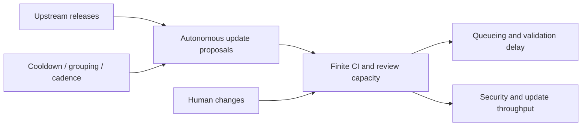

# Verification liquidity after an agent safety throttle

**Date:** 2026-08-21  
**Branch:** `dependabot-cooldown-verification-liquidity-2026-08-21`  
**Status:** P0 and formal outcome-blind D-1 passed; GREEN to freeze D0, outcomes still sealed
**Intervention:** GitHub's default three-day Dependabot version-update cooldown, effective 2026-07-14

## Decision in one paragraph

The next candidate is not “Dependabot creates too many pull requests.” That claim is already occupied. The
candidate is a wider systems question: **when autonomous agents make proposals cheap but validation remains
scarce, does an agent-side safety throttle redistribute verification load and thereby change the service received
by unrelated human work?** GitHub's 2026-07-14 default cooldown is a real, platform-wide mechanism change with
an explicit opt-out, a known untreated update class, public configurations and public validation traces. A first
outcome-blind audit found ample event support. This authorizes a formal D-1 schema/rate qualification on free
metadata, not a causal claim, model, GPU run or NMI/NCS paper claim.

## Why this is a larger story

Agentic systems can expand proposal supply much faster than the human and computational systems that check those
proposals. The scarce object is therefore **verification liquidity**: the immediately available capacity to
evaluate a new action without delaying other actions. Dependency-update bots are a clean first deployed system
because proposals, validation jobs, schedules and policy settings are logged. The intended safety control delays
fresh releases; the unresolved scientific question is whether it also smooths, shifts or synchronizes downstream
validation demand.

The proposed mechanism is:

This is a queueing externality, not evidence that software repositories are financial markets and not a rescue of
EcoMD. EcoMD stays outside the project unless an independently established empirical mechanism later motivates a
minimal transferable model.

## P0 novelty audit

### Occupied claims

- Dependabot adoption, technical lag, acceptance and configuration preferences have been studied.
- Bot-authored pull requests are known to wait longer than human pull requests.
- Automated dependency changes account for substantial CI work, including waste on unused dependencies.
- GitHub itself recommends grouping and slower cadence to reduce PR, review and CI load.
- Generic queueing, admission control and job scheduling are mature fields.

### Residual claim

The residual is **causal spillover onto unrelated human validation after a deployed agent-safety policy change**,
with runner-pool overlap as a mechanism test. The nearest work measures the bot PR itself, aggregate CI waste or
maintainer fatigue; it does not establish whether changing autonomous arrival timing changes the queueing service
received by human work.

This residual remains AMBER. A literature search through 2026-08-21 found no direct evaluation of the July 2026
default or of its human-job spillover, but absence from search is not proof of novelty. Before D1, the bibliography
must be expanded through backward/forward citation search and an ICSE/MSR/FSE title-and-abstract audit.

## Field intervention and treatment definition

GitHub announced on 2026-07-14 that version-update candidates must have been available in their registry for at
least three days unless a repository overrides the cooldown. Security updates remain immediate. The feature itself
was configurable from 2025-07-01; the 2026 intervention changed the behavior of omitted cooldown settings from zero
to three days.

Repository treatment classes are determined from `.github/dependabot.yml` at
`2026-07-13T23:59:59Z`, never from the current file alone:

1. **default-treated:** active version updates and no explicit cooldown;
2. **opt-out:** explicit effective `default-days: 0`;
3. **already-cooled:** an explicit positive cooldown before the intervention;
4. **no-Dependabot control:** no historical config at the cutoff;
5. **ambiguous:** malformed, dynamically generated or unrecoverable configuration; excluded from causal analysis.

The primary intervention is intention-to-treat for class 1. Opt-out and already-cooled repositories are valuable
controls only if D-1 finds adequate support. Security-update classification is not primary because public PR
metadata does not expose a sufficiently reliable type flag; it can enter only after a blinded manual validation.

## Estimands and measurements

### Mechanical compliance

- change in Dependabot proposal count and inter-arrival clustering;
- release-to-PR age for ecosystems with independently verifiable registry timestamps;
- change in bot-triggered root validation-job demand.

### Primary externality

For a human-triggered workflow run, define initial validation wait as

\[
Q = \min_j t^{\mathrm{start}}_j - t^{\mathrm{created}}_{\mathrm{run}},
\]

using the earliest non-null job start. Taking the first job avoids counting intentional downstream `needs:`
dependencies as runner queueing. The primary estimand is the differential post-intervention change in `Q` for
default-treated repositories as a function of frozen pre-period bot load, relative to matched repositories with no
Dependabot. Repository, UTC-day and local hour-of-week effects are included; uncertainty is clustered by
repository and calendar day.

### Mechanism tests

- Within repositories with identifiable runner labels, compare human jobs sharing a bot-used pool with jobs on
  disjoint pools.
- Test event-study pre-trends and placebo intervention dates.
- Condition on pre-period human and bot workload, workflow mix, repository age and activity; never match on
  post-intervention outcomes.
- Treat platform incidents and workflow/config changes as exclusion epochs fixed before outcomes are opened.

PR first-response and merge latency are secondary human-attention outcomes. They cannot replace the primary job
queue measurement because existing bot-versus-human review studies already occupy that space.

## D-1: outcome-blind support calibration

The frozen machine-readable contract is
`configs/agent_markets/github_dependabot_cooldown_dminus1_v1.yaml`.

### Stable frame

At the acquisition timestamp, enumerate the first ten 100-result pages returned by GitHub repository search for
non-fork, non-archived repositories with more than 1,000 stars and creation before 2026-01-01, sorted by stars.
Persist repository IDs, names, query, page boundaries and response hashes. This is a transparent high-visibility
population, not a random sample of GitHub. A later GH Archive pre-intervention frame is required for population
generalization.

### Fields allowed at D-1

- repository and event IDs;
- creation timestamps used only for rates and clustering;
- actor class, event type, workflow path, head SHA and PR link identifiers;
- historical configuration text and commit epoch;
- runner labels and the presence or absence of required timestamps;
- pagination, missingness, API version, ETag and rate-limit metadata.

The collector must discard before persistence all timing outcomes, conclusions, review responses, merge status,
durations, release ages and security outcomes. It may retain only missingness flags for sealed fields.

### D-1 route gates

- at least 800 unique frame repositories;
- at least 100 default-treated repositories with a recoverable cutoff configuration and active Actions;
- at least 50 high-support treated repositories with 20 or more pre-event Dependabot PRs;
- at least 1,000 pre-event Dependabot PRs and 200 within-repository clusters separated by 24 hours;
- at least 100 eligible no-Dependabot controls with pre-event human PRs and Actions;
- historical configuration recovery at least 90% among repositories ever observed with Dependabot;
- workflow-run access at least 90% and required queue-field presence at least 95% in the schema probe;
- no persisted forbidden value and a deterministic rerun hash for all derived summaries.

Failure stops this route before queue outcomes. Gates are not relaxed by increasing the date window, lowering star
thresholds, switching to current configuration, or substituting PR merge time for missing Actions data.

### Exploratory calibration already spent

Before this freeze, a top-100 frame using `stars:>1000`, recent push activity and current configuration found
34/100 Dependabot+Actions repositories. In 2026-06-01 through 2026-07-31 they contained 1,493 Dependabot PRs;
16 repositories had at least 20 each. Timestamp-only sampling gave a conservative 195 clusters at a 24-hour gap.
An eight-repository schema probe found public Actions runs and PR/head-SHA links, and a small job-label probe found
both GitHub-hosted and custom/self-hosted pools. No `run_started_at`, job start/completion, conclusion, review or
merge outcome was inspected. These figures calibrated D-1 gates only; they are not paper evidence.

## After D-1

### Formal D-1 result (2026-08-21)

The clean run from implementation commit `bf23db8d3` passed all eleven frozen gates: 1,000 frame repositories,
226 default-treated repositories with Actions, 72 high-support treated repositories, 447 eligible controls,
9,280 pre-event bot PRs and 2,499 24-hour arrival clusters. Historical-config recovery was 97.44%; workflow access
and required queue-field presence were both 100% in the frozen probe. An independent recursive scan of all 1,003
raw/checkpoint files found no forbidden outcome key. The formal decision is **GREEN to freeze D0**, not evidence
of an effect. Full immutable accounting is in
`papers/proposal/dependabot_cooldown_verification_liquidity_dminus1_result_2026-08-21.md`.

The frame contains no explicit zero-day opt-out. D0 therefore cannot use opt-out as its primary control. It must
freeze a match from the 447 no-Dependabot controls and reserve the 63 already-cooled repositories as a negative
control before opening outcomes.

### D0 freeze status (2026-08-21)

The outcome-blind candidate ledger now freezes 72 high-support default-treated repositories, 447 eligible
no-Dependabot controls and the 33 high-support members of the already-cooled negative-control cohort. The D0
contract fixes symmetric 28-day primary windows, a three-day rollout blackout, a `push`-only primary human-run
definition, deterministic per-repository-day run sampling, pre-period-only 1:3 matching, intentional workflow-wait
exclusions, official incident sensitivity and support gates before acquisition. Prospective outcomes from
2026-08-22 through 2026-10-16 remain embargoed until 2026-10-17 UTC. Full freeze:
`papers/proposal/dependabot_cooldown_verification_liquidity_d0_freeze_2026-08-21.md`.
Before any D0 API call, contract v2 superseded v1 solely to define prequalification, deterministic maximal-match
subset selection and schema denominators; candidate IDs, windows, estimand, forbidden fields and gates did not
change. The first deterministic 11-repository smoke later failed closed after completing identity checkpoints and
before producing any result: the external GitHub Status key `started_at` collided with the generic sample-outcome
guard. Contract v3 renames only that external incident field pair; all scientific content remains unchanged. V3 is
the execution contract.

1. **D0:** freeze the eligible repository IDs, exact pre/post windows, matching and minimum effective clusters;
   verify treatment/config and root-job mapping while outcomes stay sealed.
2. **D1-retrospective:** open the pre-registered queue outcomes once, report the event study including nulls and
   failed pre-trends, and publish a frozen raw/derived manifest.
3. **D1-prospective:** reserve 2026-08-22 onward as an untouched replication interval; freeze its end date and
   estimator after D-1 power calculations, before any prospective outcome access.
4. **D2-policy:** only if an externality survives, compare fixed cooldown/grouping/cadence policies with a
   congestion-aware admission rule under replay. A claimed improvement must jointly report security exposure,
   human validation delay, update lag and compute cost.
5. **Transfer:** test Renovate or independently authored coding-agent PRs. GitHub repositories alone are not an
   independent second system.

## Venue boundary

| Evidence obtained | Honest ceiling |
|---|---|
| Descriptive Dependabot arrival or queue correlations | MSR/ICSE-SEIP-style specialist result |
| Credible July-14 causal effect plus prospective GitHub replication | strong software/agent-systems paper |
| General verification-externality mechanism, prospective policy value and transfer to coding agents | NMI candidate |
| New admission/scheduling method with a nontrivial guarantee and a second independent computational domain | NCS candidate |

A single GitHub event study is not an NCS Article. NCS requires an irreducible computational result—for example,
a policy with a finite-capacity delay/security-regret guarantee under bursty agent arrivals—and prospective
validation in a second system. Classical queueing formulas alone do not meet that requirement.

## Data, compute and cost

| Stage | Free data | CPU/storage | GPU |
|---|---|---|---|
| P0/D-1 | GitHub REST/GraphQL, config history, optional sampled GH Archive hours | Mac, <20 core-h, <5 GB | forbidden |
| D0/D1 | immutable run/job/PR metadata and registry release timestamps | 20–100 core-h, 5–50 GB; CPU may use V100 hosts | forbidden |
| D2 replay | derived arrival/service traces | 100–1,000 core-h, <0.5 TB | optional only after D1 |
| NMI/NCS transfer | second platform/domain plus prospective interval | gate-scaled non-H20 CPU/GPU pool | benchmark V100 first |

No paid data, H20, EcoMD training, V100 or RTX 2060 job is authorized by this plan. The two V100 hosts may run CPU
collection after the Mac smoke test; GPU memory should remain idle until a learned policy is scientifically earned.

## Main risks

1. `created_at` to earliest job start is not pure runner wait if GitHub performs hidden orchestration first.
2. GitHub-hosted capacity is shared beyond an observed repository; only runner-label overlap and controls can
   separate local from platform congestion.
3. The default may have rolled out around, rather than exactly at, the announcement timestamp.
4. Current star-ranked sampling is transparent but not historically random.
5. Workflow runs can be deleted by maintainers, creating non-random missingness.
6. Cooldown may change which version is selected without changing proposal count; registry mapping is therefore
   required for compliance.
7. A null spillover can still coexist with large aggregate CI cost. It closes this claim rather than disproving
   prior work.

## Immediate execution order

1. **Completed:** commit/push the D-1 plan and contract, implement the fail-closed collector and run the formal
   fixed frame from a clean pushed SHA.
2. **Completed:** archive request hashes, allowed records, manifest and the 11/11-gate GREEN result.
3. **Completed:** commit/push the D0 scientific contract and exact candidate ledger before formal D0 access.
4. **Current:** commit the outcome-seal field-name amendment and resume the D0 smoke from its identity checkpoints.
5. Commit/push the verified collector, then run D0 from a clean pushed SHA; freeze exact D1 repository/run IDs only
   if its gates pass.

## Verified starting references

- GitHub, [default package cooldown announcement](https://github.blog/changelog/2026-07-14-dependabot-version-updates-introduce-default-package-cooldown/).
- GitHub, [Dependabot PR creation and cooldown options](https://docs.github.com/en/code-security/tutorials/secure-your-dependencies/optimizing-pr-creation-version-updates).
- GitHub, [workflow-run REST schema](https://docs.github.com/en/rest/actions/workflow-runs?apiVersion=2022-11-28).
- GitHub, [workflow-job REST schema](https://docs.github.com/en/rest/actions/workflow-jobs?apiVersion=2022-11-28).
- He et al., [Automating Dependency Updates in Practice](https://arxiv.org/abs/2206.07230).
- Wyrich et al., [Bots Don't Mind Waiting, Do They?](https://arxiv.org/abs/2103.03591).
- Kula et al., [Dependency-Induced Waste in Continuous Integration](https://rebels.cs.uwaterloo.ca/confpaper/2024/07/16/dependency-induced-waste-in-continuous-integration.html).
- GH Archive, [public GitHub event archives](https://www.gharchive.org/).
