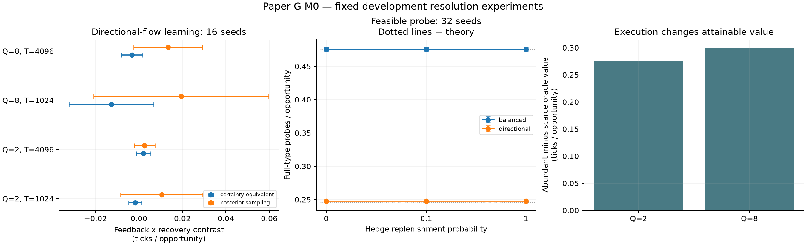

# Paper G M0: execution, inventory and information

**Decision: the current M0 formulation does not justify an independent innovative
Paper G. Close this formulation and retain the exact benchmark.** Execution
availability changes attainable wealth, but a legal customer-only policy acquires
fully informative samples at a rate independent of external replenishment. The
model belongs to an established finite-control learning class. This investigation
has produced no distinct learning theorem or matching obstruction beyond those
parents. Further seed expansion cannot supply the missing proposition.

This is a scoped research allocation decision, not a mathematical impossibility
theorem about publishing any inventory-constrained market-making result. In
particular, the construction below does **not** prove that optimal regret, the value
of feedback, or every learning constant is independent of replenishment.

## Model and prospective questions

M0 has a fixed mark of 100, funded long-only inventory q in {0,...,Q}, and two
separate unit-depth hedge sides. Bid quotes are off/98/99; ask quotes off/101/102.
An executable hedge buys at 101 or sells at 99 and consumes the corresponding
external depth. Empty hedge sides refill independently with probability rho.
Customer trades do not consume the separate hedge venue's depth.

One iid customer arrives per opportunity. With probability nu the customer buys,
with willingness 102 with probability theta_b and 101 otherwise; a seller's cost
is 98 with probability theta_s and 99 otherwise. Actual feedback contains the
request side, fill/nonfill and resulting physical state; willingness remains
private. The reveal arm additionally supplies willingness **after** the action.
Inventory and available depth constrain both learners and their reference policy.
The objective is terminal marked wealth, not liquidation proceeds.

The [prospective contract](ecomd_paper_g_resolution_contract_2026-09-08.md) and
[configuration](../../configs/paper_g/resolution_v2.yaml) fixed these questions
before this campaign's outcomes:

1. Does external replenishment change the known-law feasible optimum?
2. Can actual-feedback information acquisition remain feasible without replenishment?
3. If the directional-flow optimum differs by more than 0.01 ticks/opportunity,
   measure feedback-by-replenishment interactions for both existing learners,
   both capacities and horizons, retaining every cell.

The two laws are balanced (nu,theta_b,theta_s)=(0.5,0.55,0.55) and directional
(0.8,0.75,0.25). The conditional learning campaign uses the latter, Q=2/8,
T=1024/4096, rho=0.1/1, both feedback arms and 16 fresh development roots per
configuration. The two learners are posterior-mean control with the fixed
exploration schedule and posterior-sampling control. Neither is asserted minimax
optimal. Paper E/F outcomes and reserved confirmation seeds are unused.

## Execution has economic value

Finite-horizon dynamic programming enumerates the legal state/action kernel. At
T=4096 and initial state (q,d_bid,d_ask)=(1,1,1), directional-flow values are:

| Q | Scarce recovery, rho=0.1 | Abundant recovery, rho=1 | Hedges forbidden | Abundant minus scarce / T |
|---|---:|---:|---:|---:|
| 2 | 2559.097270 | 3686.725000 | 2269.695858 | 0.275300 |
| 8 | 2865.284776 | 4095.403598 | 2458.351946 | 0.300322 |

Values are expected marked-wealth increments in ticks. The corresponding expected
hedge counts are 376.385/1842.938 at Q=2 and 409.232/1638.748 at Q=8. The frozen
learning gate therefore passes in both capacities. Full enumerations, including
the balanced law, remain in [audit.json](../../experiments/paper_g/resolution_20260908_v2/audit/audit.json).
Economic relevance of the constraint is established within M0; it alone does not
identify a new information-theoretic obstruction.

## A feasible information probe

**Proposition (elementary construction; no novelty claim).** For Q>=2, q0=1 and
0<nu<1, M0 admits a funded, actual-feedback policy that acquires iid full customer
types with a finite mean inter-probe cycle independent of rho, including rho=0
with both hedge sides initially empty.

Never hedge. At q=1 post bid 98 and ask 102. Request side and fill/nonfill identify
that customer's binary type: a buy fill/nonfill means 102/101, and a sell
fill/nonfill means 98/99. If the resulting inventory is 0, post only bid 99 until
a seller restores q=1. If it is 2, post only ask 101 until a buyer restores q=1.
Then probe again. All transitions are actual customer executions; inventory stays
between 0 and 2, and the policy uses no artificial reset.

**Proof.** A probe exits downward with probability nu*theta_b. Restoring inventory
then takes a geometric seller-arrival wait with mean 1/(1-nu). It exits upward
with probability (1-nu)*theta_s; restoration takes mean 1/nu. Otherwise the probe
already ends at q=1. Thus, including the probe itself,

\[
\mathbb E[L]
=1+\frac{\nu\theta_b}{1-\nu}+\frac{(1-\nu)\theta_s}{\nu}
\leq 1+\frac{1}{\min(\nu,1-\nu)}.
\]

The decision to probe precedes the current independent customer draw. Successive
probe types therefore have the original iid law. External depth never enters the
action or customer transition, giving the stated independence of rho. The renewal
rate is 1/E[L]. This proves information access; it does not bound the probing
policy's regret against the profit-maximizing feasible oracle. The arrival bound
is not uniform as nu approaches 0 or 1. Binary willingness, the stated feedback,
available recovery quotes and the fixed-mark setting are substantive assumptions.

The pre-outcome predictions were E[L]=2.1 and 4.0625. The experiment uses Q=2,
empty initial hedge depth, rho=0/0.1/1 and 32 roots per law at T=4096:

| Law | Predicted probes/opportunity | Observed mean | Descriptive 95% interval | Completed-cycle mean |
|---|---:|---:|---:|---:|
| Balanced | 0.476190 | 0.475433 | [0.472027, 0.478840] | 2.103220 |
| Directional | 0.246154 | 0.247505 | [0.245530, 0.249481] | 4.039421 |

All three rho arms have identical inventory, action, side and fill histories under
paired customer innovations, for every root and both laws. The 192 trajectories
are not 192 independent replications: there are 32 independent roots per law,
paired across three rho values. Each law/rho group has 22 right-censored terminal
cycles; rates use every opportunity and the completed-cycle column omits those
unfinished durations. There are no observed inventory/accounting violations.

## Learning results and their limits

Define per-opportunity reference shortfall R=(known-law optimal expected wealth
increment minus realized learner wealth increment)/T. For each paired seed,

`interaction = (R_actual - R_reveal)_rho=0.1 - (R_actual - R_reveal)_rho=1`.

Positive values mean a larger actual-feedback penalty under scarce recovery for
that particular learner. The finite-horizon reference is computed separately for
each legal environment. The reference cancels algebraically within each
actual-minus-reveal comparison, while remaining necessary for individual R values.

| Q | T | Learner | Interaction mean | Descriptive 95% interval |
|---|---:|---|---:|---:|
| 2 | 1024 | Posterior mean + exploration | -0.001709 | [-0.004728, 0.001310] |
| 2 | 1024 | Posterior sampling | 0.010498 | [-0.008405, 0.029401] |
| 2 | 4096 | Posterior mean + exploration | 0.002151 | [-0.001209, 0.005512] |
| 2 | 4096 | Posterior sampling | 0.002625 | [-0.002101, 0.007350] |
| 8 | 1024 | Posterior mean + exploration | -0.012634 | [-0.032138, 0.006869] |
| 8 | 1024 | Posterior sampling | 0.019470 | [-0.020789, 0.059729] |
| 8 | 4096 | Posterior mean + exploration | -0.003174 | [-0.008047, 0.001699] |
| 8 | 4096 | Posterior sampling | 0.013397 | [-0.002381, 0.029175] |

These are t intervals across 16 development roots, without multiplicity correction
or an equivalence test. All include zero. That observation proves neither zero
interaction nor negligible effects and does not close a minimax question. A
nonzero algorithm-specific interaction would also not establish an independent
new theorem. All 32 constituent cells are retained in
[learning_cells.csv](../../experiments/paper_g/resolution_20260908_v2/learning_cells.csv).

## Parent theories and the missing contribution

M0's state is the observed (q,d_bid,d_ask); bounded rewards and legal actions depend
on this state and an unknown stationary three-parameter customer law. Unobserved
iid willingness does not introduce an unobserved persistent state. For 0<rho<1,
two-sided customer arrivals allow inventory restoration while replenishment and
legal hedges connect the depth states. At rho=1 use the reachable full-depth
class. This is a finite communicating MDP learning problem with state-dependent
legal actions. Reward rescaling puts it within the bounded-reward convention.

[Jaksch, Ortner and Auer (JMLR 2010)](https://www.jmlr.org/papers/v11/jaksch10a.html)
already provide generic regret guarantees for unknown finite communicating MDPs.
Their average-reward benchmark and our finite-horizon optimal policy are different;
converting the benchmark requires the appropriate bias-span term. No guarantee
from that paper is assigned to the two heuristic learners measured here, nor is
its diameter dependence asserted uniform in rho.

Adjacent structured problems are also established.
[Agrawal and Jia (Operations Research 2022)](https://pubsonline.informs.org/doi/10.1287/opre.2022.2263)
study learning inventory control with censored demand, lost sales and positive
lead times, with regret against the best base-stock policy. That is a different
comparator and market, but rules out treating the conjunction of inventory,
censoring and recovery delays as new by itself.
[Bernasconi et al. (ICLR 2024)](https://arxiv.org/abs/2306.08470) study replenishable
resources in online learning; no exact reduction of M0 to their theorem is claimed.
[Cesa-Bianchi et al. (COLT 2025)](https://proceedings.mlr.press/v291/cesa-bianchi25a.html)
and [Maran and Restelli (COLT 2026)](https://proceedings.mlr.press/v336/maran26a.html)
provide direct market-making learning/feedback neighbors. The latter's publication
status is verified against PMLR 336, pages 4969–4998. Its observation rule differs
from M0; it occupies the broad value-of-observation claim, not this exact theorem.

**The scientific stopping reason is the missing irreducible proposition, supported
by the finite-control representation and the customer-recovery construction.**
It is not a p-value decision, a claim that constraints never affect profits, or a
proof that no sharper bound could ever be obtained for M0. A sharper optimal-regret
dependence on Q, arrival imbalance or recovery could be meaningful if derived
and distinguished from these parents; none has been established in this work.

## Completed work, reuse and reopening

This campaign completed 512 learning trajectories (1,310,720 opportunities), 192
probe trajectories (786,432 opportunities) and eight exact oracle audit cells:
704 trajectories and 2,097,152 opportunities altogether. Four single-thread CPU
workers on the existing V100 server completed learning in 214.686 seconds;
summed learning-job CPU time was 855.481 seconds. Oracle audit and probes took
4.417 and 7.547 seconds respectively. These measurements exclude planning, code,
setup, tests, transfer and analysis. GPU use was zero. Maximum reported learning
worker RSS was 39.668 MiB. The small state/action space explains the low cost;
these timings do not forecast a richer simulator or a confirmation campaign.

The [result directory](../../experiments/paper_g/resolution_20260908_v2/) retains
all trajectories, exact per-phase receipts, source bundle and descriptive analysis
snapshot. The 12-file source/config/contract bundle is pinned by SHA256
`b34e174d9a1ed5f7d756d4cbd0fc6ccd6ceb40bebadc671c9347d80f95494769`,
over Git base `297c36551fdfb25af564bc575f11ea27f95280bf`; the new source was
uncommitted at execution. The analysis script was written after these outcomes
and is identified separately in `verification_receipt.json`. All measurements
remain development evidence, with no confirmatory or real-market claim.

Retain the event model, exact oracle, permitted-feedback learners, customer-only
probe and paired experiment harness as reusable assets. Stop M0 confirmation,
neural extensions and accelerator scaling for the closed novelty formulation.
Reopening requires a specified, independently motivated market mechanism that
invalidates the probe while retaining the same lawful feasible comparator, or a
proved sharper learning proposition beyond the identified parents. Increasing
seeds or renaming the current conjunction does not meet that condition.
