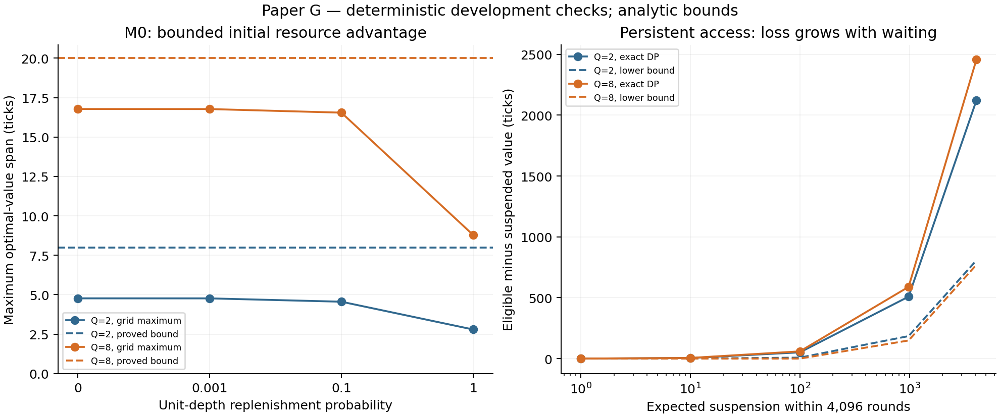

# Paper G re-entry: executable imitation and persistent market access

**The restart produced a stronger theorem and a concrete native boundary.** In the
fixed-price M0 market, executable imitation bounds the cost of differing initial
inventory/depth independently of both the horizon and replenishment rate. Adding
a persistent right to use a hedge venue breaks that bound, even while all ordinary
customer recovery orders remain legal. These are useful theory assets. They do
not yet establish a distinct publishable learning result.

The earlier M0 novelty decision remains historical and closed. This is a separately
PI-authorized theorem follow-up with a frozen computational contract, not a
relabelled confirmation campaign, new full discovery cycle, or qualified re-entry
card. The unresolved research question is now precise: **when does loss of ongoing
market access create a learning cost beyond the loss a known-law dealer would
already suffer?** State-value loss alone cannot answer it.

## 1. A stronger M0 theorem

Retain exactly the M0 grammar, fixed mark 100, hedge execution cost one tick,
customer spread earnings in {1,2}, funded inventory 0<=q<=Q and independent refill
innovations. Let s=(q,d_bid,d_ask), and define

\[
d(s,s')=|q-q'|+|d_{bid}-d'_{bid}|+|d_{ask}-d'_{ask}|.
\]

**Theorem 1 (executable imitation).** For any finite horizon T, customer-law
parameters in their full probability ranges, and rho in [0,1],

\[
|V_T(s)-V_T(s')|\le 2d(s,s'),\qquad
\operatorname{span}(V_T)\le 2(Q+2).
\]

V is the known-law optimal expected marked-wealth increment with the same legal
action constraints. The theorem concerns different initial states **under the same
law and rho**. It does not bound the value difference between abundant and scarce
replenishment environments by 2(Q+2).

**Proof.** Couple a virtual account with an actual account using the same customer
type and refill draws. At each round the actual account copies the virtual hedge
if feasible, otherwise omits it. It copies each virtual quote unless its own
post-hedge inventory makes that quote infeasible. This always gives a legal action.

Let D be the distance above, and compare the operations in execution order.

1. If both accounts hedge, the inventory difference is unchanged and consuming
   the same depth side cannot increase its difference.
2. If only the virtual account hedges because actual depth is absent, one depth
   mismatch disappears and inventory distance can increase by at most one.
   If the omission is caused by the actual inventory boundary, virtual inventory
   moves toward actual inventory; at most one new depth mismatch is created.
   In either case D does not increase, and virtual reward minus actual reward is -1.
3. If the virtual customer trade is feasible in both accounts, both earn the same
   spread and their inventory difference stays fixed. If the actual account must
   omit it at a boundary, virtual inventory moves toward actual inventory by one;
   the omitted spread is at most two ticks.
4. A shared refill draw can only erase a depth mismatch.

Consequently the following inequality holds **for every allowed event**, not just
in expectation:

\[
r_t^{virtual}-r_t^{actual}\le 2(D_t-D_{t+1}).
\]

Telescoping bounds cumulative imitation loss by 2D_0. The virtual process follows
its known-law optimal Markov policy. Actual-feedback admissibility needs care:
the actual account is not handed hidden willingness or refill bits. After observing
its own transition, it conditionally samples a compatible joint innovation using
the known model and its internally maintained virtual state. This reconstructs
the joint law of the coupling using private randomization and past observations.
No future draw is used. Thus it is an admissible known-law comparison policy;
optimal actual control can do at least as well. Interchanging the states proves
the absolute-value bound. This construction is not an unknown-law learner.

The same certificate bounds discounted imitation loss, since
sum(gamma^t*(D_t-D_{t+1}))<=D_0. In a communicating M0 class, discounted relative
values have a subsequential optimal-bias limit with the same bound. At rho=1 use
the reachable full-depth class, whose span bound is 2Q. At rho=0 do not assert
communication of the entire depth state space.

**Learning consequence, explicitly a parent corollary.** For rho>0, after reward
rescaling and the usual legal-action encoding, existing span-based RL can use
this known uniform bias-span bound. For example, SCAL gives a leading bound of
order Õ((Q+2)*sqrt(Gamma*S*A*T)), with S<=4(Q+1), A<=27 and at most Gamma<=12
possible successor states. The finite-horizon optimal comparator differs from
the average-reward one by at most a bias-span term. This supplies a regret upper
bound with no inverse-rho factor; it neither proves an optimal Q dependence nor
gives a new algorithm. SCAL was not implemented in this audit.
[Fruit et al., ICML 2018](https://proceedings.mlr.press/v80/fruit18a.html)

## 2. A native mechanism that breaks the uniform value bound

An executable unit of hedge depth is consumed once. An eligibility state can
instead govern an unlimited sequence of future hedge opportunities. To isolate
that difference, define the following observed access contract:

- **Suspended:** external hedge actions are unavailable; every original customer
  quote remains legal subject to inventory.
- At the end of each suspended round, an independent Bernoulli(lambda) restores
  access. This timing leaves the current round suspended.
- **Eligible:** both hedge sides are full at the start of every subsequent round;
  eligibility then persists. Cash, asset accounting and retail prices remain M0's.

Suspension and reinstatement are real market-native controls: CME documents
account-level order-entry suspension independently of preset credit/product limits.
This justifies distinguishing access from numerical capacity. It does **not**
validate our geometric recovery clock, absorbing eligibility state or retail/hedge
segmentation as an empirical description of CME.
[CME Account Credit Controls](https://www.cmegroup.com/tools-information/webhelp/account-manager-service/Content/suspend-allow-execution-firm-order-entry.html)

**Theorem 2 (persistent-access boundary).** Set Q>=2, nu=0.8 and both willingness
probabilities equal to one. Let W_T^E(q) and W_T^S(q) be eligible and suspended
optimal values at the same inventory. Then

\[
W_T^E(q)-W_T^S(q)\ge 0.2G_T(\lambda)-6Q,
\quad G_T(\lambda)=\frac{1-(1-\lambda)^T}{\lambda},
\quad G_T(0)=T.
\]

**Proof.** In the eligible subsystem a feasible policy restores q=1 by one hedge
and then posts 98/102. Every customer fills. Apart from initial restoration, this
earns one tick per round, so its optimal average gain g is at least one. The
subsystem has optimal bias span at most 2Q by Theorem 1. Hence its horizon-h
values lie between gh-2Q and gh+2Q, uniformly in initial inventory.

During n suspended rounds let B_n count customer sellers from whom the dealer
actually buys, and S_n count customer buyers to whom it sells. Conservation gives
S_n<=B_n+Q, so reward<=2(B_n+S_n)<=4*N_n^seller+2Q. For the independent truncated
restoration wait tau=min(Geom(lambda),T), expected seller arrivals equal 0.2E[tau].
Thus the pre-restoration expected reward is at most 0.8E[tau]+2Q, regardless of the
adaptive quote policy. Bound each post-restoration continuation by
g(T-tau)+2Q, and bound the eligible initial value below by gT-2Q. Subtraction
gives (g-0.8)E[tau]-6Q>=0.2G_T(lambda)-6Q.

For small positive lambda, the long-horizon gap therefore grows at least as
0.2/lambda-O(Q). At lambda=0 it can grow linearly in T. The universal M0
inventory/depth bound cannot extend to this larger access state.

The original customer-only information probe still works while suspended. That
is an essential control: Theorem 2 establishes a **continuation-value** obstruction
without artificially removing the customer's recovery actions. It does not prove
that information acquisition becomes impossible or that learning regret must
grow with 1/lambda. A known-law oracle also suffers suspension losses.

## 3. Simulator-transfer corollary and its limits

This analytic corollary was derived after the v3 freeze; no transfer experiment
is claimed among the v3 checks below. Let mu and mu_hat be the distributions on
the four customer types. Consider two otherwise identical M0 models with refill
rates rho and rho_hat. Put

\[
\eta=6\operatorname{TV}(\mu,\widehat\mu)+4|\rho-\widehat\rho|.
\]

**Corollary.** Their optimal values differ by at most T*eta. Deploying a
finite-horizon optimal policy of the estimated model in the true model loses at
most 2T*eta relative to the true finite-horizon optimum. The constants contain
neither Q nor an inverse replenishment rate.

To see this, apply either model's optimal continuation value to a fixed legal
action. Changing only the customer type changes immediate spread reward by at
most two and next inventory by at most two. Theorem 1 bounds the latter's value
change by four. The range of this Bellman integrand across types is therefore at
most six, giving the 6*TV term. Changing rho under common uniform refill draws
changes each of at most two depth bits with probability |rho-rho_hat|. Each bit
changes continuation value by at most two, giving the second term. Optimal
Bellman induction yields the value bound. Telescoping the estimated-optimal
Bellman residual along the true deployed trajectory yields the other T*eta term.
This argument never assumes that the true value of an arbitrary fixed policy is
Lipschitz. It uses the estimated model's **optimal** continuation values instead.

This is a structured simulation-lemma specialization, not a generic new theory of
model-based RL. Wasserstein/Lipschitz model-error propagation is established;
the asset here is the executable event certificate giving explicit M0 constants.
[Asadi, Misra and Littman, ICML 2018](https://proceedings.mlr.press/v80/asadi18a.html)

Changing eligibility-restoration laws is outside this corollary: the associated
continuation values need not have the M0 depth-bit Lipschitz constant. Likewise,
endogenous customer arrivals, price changes, queue priority, price impact, fees
with a different sign structure, binding cash constraints or different terminal
liquidation rules require a new certificate. They are not covered by assertion.

### A learning bound despite the large access-value gap

There is a further analytic consequence for the access model. Assume its exogenous
restoration law lambda is known and only the stationary customer-type distribution
is unknown. Let nu lie in [delta,1-delta], delta>0. Start at q=1, Q>=2. Then an
actual-feedback explore-then-plan learner has expected finite-horizon regret

\[
\mathbb E[R_T]\le 15C_\delta n+6\sqrt{3}\,T/\sqrt n,
\qquad C_\delta=1+1/\delta,
\]

for any positive integer n, uniformly in lambda in [0,1]. In particular the choice
n=ceil((T/C_delta)^(2/3)) gives O(C_delta^(1/3)*T^(2/3)+C_delta), with no inverse
restoration-rate factor. This is an **upper bound**, not a matching minimax rate.
It does not exclude lambda dependence in a sharper square-root-rate bound or a
transition between different finite-horizon rates.

**Construction and proof.** Complete n cycles of the legal customer-only probe
described in the earlier resolution, or stop at horizon T. Each completed cycle
starts and ends at q=1 and supplies one full customer type. Its expected duration
is at most C_delta, independently of access, so the untruncated expected exploration
duration is at most C_delta*n. Fit the empirical distribution of the four types.
If time remains, solve the corresponding access-model DP using known lambda and
deploy its optimal policy for the remaining horizon.

Couple two accounts starting with the **same access mode**. They share every access
restoration draw, so executable imitation still bounds their value difference by
two times inventory distance. Access mode can create a large difference between
states, but it is the same exogenous process across the compared actions/policies.
For any two current legal actions, conditional on the next access mode, the
next inventories differ by at most four and the immediate rewards by at most
three. The one-round optimal Bellman gap is consequently at most eleven; fifteen
is a conservative bound used above. Exploration therefore costs at most
15*C_delta*n in expectation, even if it ends by truncation at T.

The customer-law part of the transfer corollary also survives when the next access
mode is held fixed and averaged with its common, known law. Planning with the
empirical type distribution thus costs at most 12*T*TV(mu,mu_hat). The n probe
types are iid; for a four-category empirical distribution,
E[TV(mu,mu_hat)]<=sqrt(3)/(2*sqrt(n)). Truncation does not require conditioning this
inequality on successful completion: the exploited error is multiplied by the
completion indicator and bounded by the unconditional error of the first n probe
types in the underlying infinite stream. These later samples are an analysis
device, never input to a learner that has stopped. Combining the two costs gives
the displayed bound.

This result separates an access-value gap of order 1/lambda from a learning upper
bound uniform in lambda. It identifies a substantive limitation of the proposed
mechanism: **known exogenous access loss alone is insufficient to establish an
unbounded mandatory learning penalty at every sublinear rate**. The particular
learner has not been benchmarked here; this theorem was derived after the v3
freeze and is not represented as one of its computational checks.

## 4. Prospective deterministic verification

The [frozen contract](ecomd_paper_g_reentry_theorem_contract_2026-09-08.md) and
[config](../../configs/paper_g/theorem_reentry_v3.yaml) specify all computational
checks. These are finite deterministic development checks, not independent
empirical confirmation of the uniform theorem.

- The pathwise event inequality and nonincreasing distance pass all **101,376**
  cases: 20,736 for Q=2 and 80,640 for Q=4. The two counts enumerate all ordered
  state pairs, legal virtual actions, customer types and refill events. There are
  41,472 tight cases, including trivial coincident-state cases; tight-case counts
  do not establish optimality of the global constant.
- **96 exact M0 DP cells** check every adjacent-state inequality at every horizon
  through 4096. Maximum adjacent value difference is 1.989501 at Q=2 and
  1.999999999777 at Q=8, against a bound of two. Maximum full-state spans are
  4.769029 and 16.777778, against bounds of eight and twenty.
- **Ten access-gate DP cells**, reported at four horizons each, satisfy Theorem 2.
  All parameters and reported horizons are retained. At q0=1 and T=4096:

| Restoration probability | Expected truncated suspension | Q=2 optimal access gap | Q=8 optimal access gap |
|---:|---:|---:|---:|
| 1 | 1 | 0.000000 | 0.000000 |
| 0.1 | 10 | 4.612500 | 5.355150 |
| 0.01 | 100 | 51.225488 | 59.334027 |
| 0.001 | 983.394966 | 508.903459 | 589.345885 |
| 0 | 4096 | 2121.349297 | 2456.458618 |

These gaps are differences between expected optimal marked-wealth increments in
the stated synthetic contract, not realized trader profits or learning regrets.
The lambda=1 first-round gap is zero for this initial inventory because no hedge
is needed in that first round; restoration timing is still after the round.

All calculations took **21.367 seconds on one V100-server CPU process**, with no
GPU. The [result bundle](../../experiments/paper_g/theorem_reentry_20260908_v3/)
contains exact source and result hashes. The source bundle SHA256 is
`67c6142f540c498750899989f7633eb09e284a7b476864208d4fceb4f785c8bc`,
over base Git `297c36551fdfb25af564bc575f11ea27f95280bf` plus the 15 pinned
uncommitted files. The source SHA alone, not the moving workspace, identifies the run.

## 5. Collision audit and disposition

| Closest primary work | What is already established | Precise boundary for this audit |
|---|---|---|
| [Abernethy–Kale, NeurIPS 2013](https://proceedings.neurips.cc/paper_files/paper/2013/file/995e1fda4a2b5f55ef0df50868bf2a8f-Paper.pdf) | Stateful market-making expert learning with bounded switching cost | The current certificate clips unavailable unit hedges; broad bounded-cost inventory imitation is already occupied. |
| [Xue–Du–Xu, AAAI 2025](https://ojs.aaai.org/index.php/AAAI/article/view/35492) | Hard/soft inventory-aware online market making | Reference classes and inventory adjustment differ; adding hard inventory is not a contribution. |
| [Fruit et al., ICML 2018](https://proceedings.mlr.press/v80/fruit18a.html) | Regret controlled by optimal bias span rather than diameter | The RL consequence is a direct parent corollary, not a new learning algorithm. |
| [Asadi et al., ICML 2018](https://proceedings.mlr.press/v80/asadi18a.html) | Lipschitz/Wasserstein control of model and value errors | The transfer proof follows an established argument after supplying the market certificate. |
| [Agrawal–Jia, OR 2022](https://pubsonline.informs.org/doi/10.1287/opre.2022.2263) | Censored-demand inventory learning with lead time and bias control | Best-base-stock comparator and demand dynamics differ from M0. |
| [Jiang–Jiang–Shen, AISTATS 2026](https://proceedings.mlr.press/v300/jiang26a.html) | Censored network-inventory learning using Lipschitz long-run costs, with upper/lower regret bounds | The primary abstract confirms this strong neighbor; exact proof-level overlap remains unaudited and must not be dismissed. |
| [CME Account Credit Controls](https://www.cmegroup.com/tools-information/webhelp/account-manager-service/Content/suspend-allow-execution-firm-order-entry.html) | Access suspension/reinstatement distinct from preset trading limits | Establishes native grammar only; it does not validate our stochastic access dynamics or provide an outcome dataset. |

Two other proposed escapes do not currently remove the blocker. Merely introducing
a hidden persistent customer regime supplies a POMDP unless a specific observation
boundary is proved; adding a risk constraint supplies a constrained/safe-control
problem unless a native information/feasibility result survives. These were
parent checks, not separate promoted candidates.

**Disposition: retain the proved certificate and access counterexample as partial
capability; do not declare a qualified independent Paper G yet.** The exact
M0-to-access boundary is sharper than the previous feasible-probe statement, but
both bounded-cost imitation and bias/Lipschitz reasoning have strong parents.
No full F3 review, machine card, forecast or Nature-scale activation was performed.

The next scientifically decisive proposition is a sharp separation of **unavoidable
access loss** from **learning loss** under the same access process and information
feed. The uniform T^(2/3) upper bound above already limits what the known exogenous
gate can imply. Remaining possibilities are its sharper minimax rate, or an unknown
restoration law affected by the dealer's actions; the latter is unimplemented and
unqualified. A useful theorem would need a lower-bound pair with different optimal
decisions, indistinguishable admissible observations until a precisely quantified
learning cost is paid, and a matching upper bound or a proof that such a penalty
does not exist. Customer-only probing must remain legal. A large value gap, a
1/lambda recovery clock, or another neural benchmark cannot substitute for that
argument. Wider candidate harvesting and compute scaling are not justified by
the current results.
