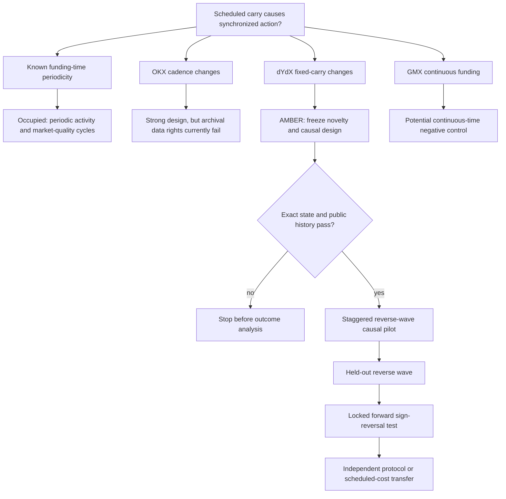

# Intervention-first candidate map: scheduled funding carry — 2026-08-19

## Decision

The first candidate to survive the post-dispatch search is a public, on-chain change in the fixed component of
perpetual-futures funding on dYdX. The settlement clock remained hourly while governance changed
`default_funding_ppm`. This separates the economic dose from the calendar clock and supports a stronger question
than whether trading is periodic around funding times:

> Does a fixed cost of carrying a position across a known boundary causally synchronize position exit and
> re-entry, and can the induced flow pulse reveal the distribution of traders' switching frictions?

This is **AMBER**, not yet an NCS project. It authorizes a result-blind T0 novelty/identification gate and, if T0
passes, a metadata-only D0. It does not authorize a positive paper claim, GPU work or an EcoMD rescue.

## Why this intervention is unusually useful

dYdX governance proposal 220 changed the default funding component from 0 to 100 ppm per eight hours
(0.125 basis points per hour) on 3 March 2025. Proposals 314--318 changed it back to zero in staggered waves on
14--19 November 2025. The public governance payloads contain the full market parameter vector, so proposed
states can be compared field by field rather than inferred from an announcement title.

A conservative audit yields:

- ten markets with a traceable `0 -> 100 -> 0` path and unchanged non-funding fields at each funding update;
- 28 markets in the November waves with a traceable `100 -> 0` update and no other changed field;
- five markets excluded because an immediately preceding full parameter state has not yet been independently
  reconstructed; and
- FARTCOIN excluded because proposal 318 did change margin type and liquidity tier together with funding, with
  proposal 319 repairing those fields later.

The voting-end timestamps are provisional activation anchors. D0 must recover the first executing block and
compare chain state at `h-1` and `h`; governance text alone is not accepted as proof of a clean intervention.

## Candidate topology



## Frozen intervention inventory

### Paired core markets

The ten paired markets are `ONDO-USD`, `ENA-USD`, `TAO-USD`, `XMR-USD`, `MNT-USD`, `POPCAT-USD`,
`BEAM-USD`, `ZEN-USD`, `PAXG-USD` and `DRIFT-USD`.

Their zero state is explicitly recorded in proposal 148; proposal 220 records the same ticker, market id,
atomic resolution, liquidity tier and isolated-market type with only `default_funding_ppm` changed to 100.
Before the November reversal, later governance proposals record cross-margin/liquidity-tier upgrades while
retaining funding at 100. Proposals 314--317 then record the same latest non-funding fields with funding set to
zero. The intervening margin upgrade means equal-magnitude reversibility is not assumed; only the direction of
the funding-induced pulse is required to reverse.

### Clean November cohort

The wider result-blind cohort is frozen as:

| Proposal | Provisional voting end (UTC) | Eligible markets |
|---|---|---|
| 314 | 2025-11-14 12:07:36.473482691 | 2Z, ASTER, ATH, BEAM, BERA, DRIFT |
| 315 | 2025-11-16 16:31:53.693887575 | EIGEN, ENA, HYPE, KAITO, MNT, MORPHO, MOVE, ONDO |
| 316 | 2025-11-16 16:32:57.953575588 | PAXG, PENGU, POL, POPCAT, SPX, S, SYRUP |
| 317 | 2025-11-19 06:19:54.525009385 | TAO, TRUMP, USUAL, XMR, ZEC, ZEN |
| 318 | 2025-11-19 06:25:18.243741551 | ZORA |

Proposals 314--316 form the development waves. Proposal 317 is a locked six-market confirmation wave. ZORA is
a secondary single-market check and cannot rescue a failed confirmation.

`AVNT`, `CRO`, `PUMP`, `WLFI` and `XPL` are excluded until a pre-execution full state is independently recovered.
FARTCOIN is permanently excluded from the clean intervention because the proposal-318 payload bundled funding,
liquidity-tier and market-type changes.

## Mechanism and non-trivial prediction

Let a long position of notional `w_j` face a known positive funding payment `r w_j` at the next boundary and a
round-trip exit/re-entry cost `c_j w_j`. In the simplest threshold model the position is closed across the
boundary when `r > c_j`. The funding-clock dipole therefore obeys

```text
A(r_2) - A(r_1)
  = E[w 1{r_1 < c <= r_2}] / E[w] >= 0,     r_2 > r_1,
```

under a stable friction distribution and absent binding constraints. This is a model implication, not yet a
new theorem. It motivates a signed response rather than an unsigned volume spike:

- raising fixed positive carry predicts more taker selling immediately before the hourly boundary and more
  taker buying immediately after it;
- removing the fixed carry predicts attenuation of that sell/buy dipole;
- pseudo-boundaries at minutes 15, 30 and 45 should not move in the same way; and
- the response should be stronger when the realized total funding exposure is positive and large relative to
  pre-event turnover costs.

The primary claim is killed if only trade count, volatility or absolute volume rises at minute 00. Funding-time
periodicity and market-quality cycles are already documented. The irreducible claim must concern the causal
response to fee dose at a fixed clock.

## Nearest-work boundary

| Work or cluster | What is already known | What remains potentially distinct |
|---|---|---|
| Ruan and Streltsov, funding-time market quality | intracycle market-quality and informed-trading patterns around scheduled funding | no on-chain fixed-carry discontinuity or signed dose response |
| periodicity and quarter-hour effects in crypto | calendar-aligned activity and volatility are pervasive | pseudo-clock controls are mandatory; periodicity alone is ineligible |
| Ackerer, Hugonnier and Jermann, perpetual pricing | no-arbitrage pricing and convergence intensity for perpetual futures | does not identify behavioral synchronization from an exogenous fee component |
| He et al., *Designing funding rates for perpetual futures* | mechanism-design properties of funding formulas | does not estimate a governance-induced microstructure response |
| Ahmed and Bhuyan (2026), *Separating Event Intensity from Fixed Funding Carry* | separates mean-reversion intensity and fixed carry across venues; signed means do not identify fixed input | no governance discontinuity, signed boundary dipole or switching-friction inversion |

The allowed one-sentence empirical claim is therefore:

> At an unchanged hourly settlement clock, an on-chain change in fixed funding carry causes a directionally
> predicted pre-boundary exit/post-boundary re-entry flow dipole, revealing a threshold distribution of
> position-switching frictions.

Every weaker version is forbidden, including “funding affects trading,” “activity is high at funding time” and
“dYdX funding rates mean-revert.”

## Data routes and rights

The public dYdX Indexer exposes unauthenticated historical candles, trades and funding. One-minute candles carry
OHLC, volume, trade count, starting open interest and order-book midpoints; trades carry taker side, price, size,
timestamp and block height; historical funding carries rate, price, effective time and height. Historical L2
snapshots are not exposed, so spread/depth claims are out of scope.

The dYdX chain and Indexer implementation are open-source under AGPLv3, and governance facts can be checked on
independent Cosmos nodes. The current software terms contain jurisdiction and risk restrictions but no OKX-like
personal-use-only market-data clause was found. D0 must still record the applicable terms and provider, publish
code plus content hashes rather than redistribute hosted raw responses, and preserve a raw-chain verification
path for every intervention fact.

The stronger OKX cadence/formula interventions remain a future permissioned route. OKX's current API agreement
restricts market data to personal, non-commercial trading/account purposes and bars publication or
redistribution without written consent, so it cannot be the zero-cost archival foundation. GMX's continuously
accrued funding is retained only as a possible negative control; Hyperliquid's hourly clock without a comparable
parameter discontinuity is not an intervention.

## Venue ladder and stopping point

1. **Specialist result:** clean dYdX causal response with a held-out reverse wave and locked forward-direction
   reversal. This could support a market-microstructure or computational-finance paper.
2. **NMI-level route:** add an independently governed protocol or another scheduled-cost system, retain the
   signed threshold prediction, and show that the inferred friction distribution predicts a new intervention.
3. **NCS-level route:** additionally derive and validate a general identification/inversion method with finite-
   sample guarantees across multiple systems. A dYdX event study, even a clean one, is not NCS.

Initial work is CPU-only. No neural model is required to estimate a staggered event study or signed-flow pulse.
V100 and RTX2060 use remains forbidden until a later method requires learned state estimation and beats the
pre-specified non-neural estimators.

## Primary sources

- [dYdX proposal discussion: set isolated-market default funding](https://dydx.forum/t/drc-update-default-funding-rate-for-isolated-markets/3417)
- [dYdX proposal discussion: reset recently upgraded cross markets](https://dydx.forum/t/fix-set-default-funding-ppm-to-0-for-recently-upgraded-cross-markets/4804)
- [dYdX perpetual parameter schema](https://github.com/dydxprotocol/v4-chain/blob/main/proto/dydxprotocol/perpetuals/perpetual.proto)
- [dYdX Indexer source and API architecture](https://github.com/dydxprotocol/v4-chain/tree/main/indexer)
- [dYdX software terms, updated 12 March 2026](https://dydx.exchange/v4-terms)
- [GMX funding mechanics](https://docs.gmx.io/docs/trading/fees/)
- [OKX API agreement, published 26 March 2026](https://www.okx.com/en-gb/help/okx-api-agreement)

