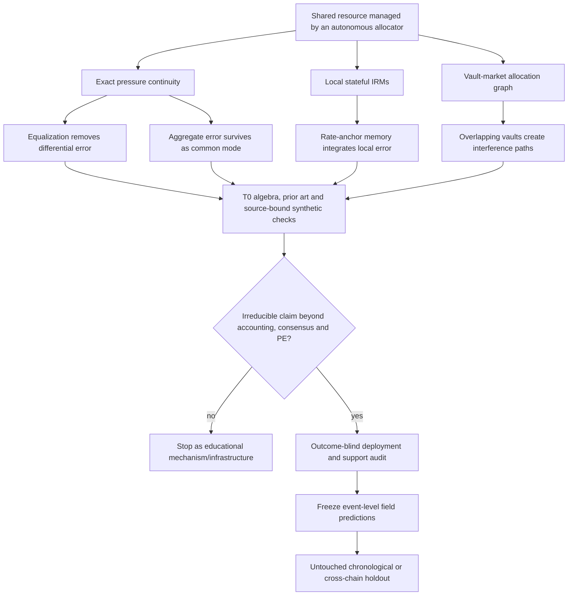

# Morpho controller coupling T0: conserved pressure in agent-managed markets

**Formal status (2026-08-20):** all seven mathematical gates passed from clean pushed commit `7bb63f2d8`;
canonical result SHA-256 `91a4738beff17da6d16972faa1ddcbc844a76643678aec300ec9c6ca0cc3f64e`. This is
a PASS for the encoding only and leaves the route AMBER. The next frozen stage is the deployment-identity D0A in
`morpho_controller_coupling_d0a_freeze_2026-08-20.md`; historical events and market values remain unopened.

## Decision before experiments

This is a fresh **AMBER feasibility route**, not a continuation or repair of the closed Liquity study and not a
reopening of the failed Plan-v4 invariant-gradient method. It asks a larger systems question:

> When an allocation agent moves a conserved resource among markets whose local mechanisms adapt independently,
> does the allocator remove local stress, or merely transport it while suppressing the signals from which the
> local controllers adapt?

Morpho is a useful field system because the two controller layers are explicit and open. Each market's immutable
AdaptiveCurveIRM updates a stateful `rateAtTarget` from utilization error. A vault allocator moves one loan asset
among isolated markets. The official reallocation-bot repository contains both `EquilizeUtilizations` and
`ApyRange` strategies. At audited commit `564eafde188ae81b1439b01da9c356d0964dbb35`, the checked-in production
configuration selects `ApyRange` on Ethereum and Base and binds explicit vault- and market-specific APY bands.

T0 may verify exact identities, map the nearest prior art and run source-bound synthetic checks. It may not yet
read historical market outcomes, choose active vaults from favorable behavior, use EcoMD, or use a GPU.

## Candidate topology



## Exact accounting layer

For market `i`, let `B_i` be borrowed assets, `S_i` supplied assets and `u_* = 0.9` the local IRM target. Define
the unnormalised control pressure

```text
q_i = B_i - u_* S_i = S_i (u_i - u_*),     u_i = B_i / S_i.
```

If an allocator moves `F_ij >= 0` supplied assets from market `i` to market `j` while borrowing is unchanged,

```text
q_i^+ - q_i^- = u_* (sum_j F_ij - sum_j F_ji),
sum_i q_i^+   = sum_i q_i^-.
```

Borrow, repay, external supply and withdrawal are sources or sinks; a pure reallocation is a current. Globally,

```text
Q = sum_i q_i = B_total - u_* S_total.
```

No reallocation can make every local utilization error zero unless `B_total / S_total = u_*`. More precisely,
the supply-weighted mean raw error is fixed at `B_total / S_total - u_*`, so every allocation obeys

```text
max_i |u_i - u_*| >= |B_total / S_total - u_*|.
```

When feasible, equalising all utilizations at `B_total / S_total` attains this minimax lower bound. It therefore
removes differential stress as fairly as possible but cannot remove the common stress imposed by total
borrowing and supply.

The AdaptiveCurveIRM evolves the log target-rate state, away from its hard bounds, as

```text
d log r_i^* / dt = k e(u_i),
e(u) = (u-u_*)/u_*                 for u <= u_*,
       (u-u_*)/(1-u_*)             for u >  u_*.
```

Exact utilization equalisation makes every `e(u_i)` identical. Consequently every pairwise
`log(r_i^*) - log(r_j^*)` is invariant until a bound or a new source/sink event intervenes. On a graph, exact
equalisation within each connected component suppresses its differential adaptive modes and leaves one common
mode per component. This is the candidate **signal-shielding** mechanism.

These statements are algebraic consequences of the deployed definitions. They are useful lemmas and
falsifiable event-level constraints, but T0 must not advertise them as a new theorem.

## What is occupied and what may remain

| Prior-work cluster | Already established | Candidate residual |
|---|---|---|
| adaptive control and persistent excitation | regulation can succeed without parameter convergence; rich excitation is normally needed for identification | field evidence that a deployed supervisory allocator selectively removes the differential signals seen by other live controllers |
| consensus, distributed PI control and resource allocation | conservation, consensus projections, shared constraints and integral windup are classical | exact mapping from allocator transactions to transported IRM pressure on a public vault-market graph |
| Bertucci et al., *Mathematical Finance* 2026 | optimal DeFi IRMs, agent-response calibration, PID convergence/oscillation and utilization--rate-volatility trade-offs | interaction between a stateful per-market IRM and a separate cross-market allocation bot |
| Chitra, *A Curationary Tale* | Morpho-like curation as online pricing/resource allocation; regret and curator competition | no `AdaptiveCurveIRM`, `rateAtTarget`, PID, allocator-current identity or controller-mode analysis in the paper |
| AgileRate and related adaptive DeFi controllers | learned/adaptive rate design, stability and adaptivity--robustness trade-offs | do not study the deployed two-layer allocator--IRM feedback loop |
| Morpho documentation and source | autonomous IRM, public/vault reallocators, APY/equalisation strategies and event schemas | deployment is a scientific substrate, not novelty by itself |

The allowed candidate claim is therefore narrower than “resource constraints create trade-offs” and stronger
than “reallocation changes utilization”:

> In a deployed network of autonomous market controllers, allocation agents transport a conserved control
> pressure and selectively suppress differential adaptation; the allocation graph and policy predict where
> controller memory, saturation and subsequent response are displaced.

This claim fails if the result reduces to the balance identity, generic lack of persistent excitation, ordinary
integral windup, or contemporaneous correlations around allocator transactions.

## T0 executable contract

The deterministic runner is configured by
`configs/empirical_physics/morpho_controller_coupling_t0_v1.yaml`. It uses no market data and checks:

1. pressure continuity and global conservation under random valid allocation flows;
2. the minimax lower bound and its attainment by exact utilization equalisation;
3. annihilation of differential utilization modes under equalisation;
4. invariance of pairwise log target-rate differences under one source-bound IRM adaptation step; and
5. nonzero common-mode adaptation whenever aggregate utilization differs from 90%.

All numerical residuals must be at most the frozen tolerance. These checks can falsify the implementation, but
passing them proves only that the algebra has been encoded correctly. A numerical toy cannot establish novelty.

T0 advances to a metadata-only D0 only if the literature/source audit also finds all of the following:

- no prior paper directly analyzes the coupled deployed allocator--AdaptiveCurveIRM loop;
- at least one consequence is testable prospectively from canonical transactions and cannot be reduced to the
  accounting identity alone;
- bot strategy and allocator identity can be tied to deployments without classifying addresses from favorable
  outcomes; and
- a complete-data route based on canonical receipts plus an independent finalized index is feasible.

## Prospective D0 support gate

D0 must be frozen before querying reallocation histories. It may read only source/version identity, vault and
allocator roles, transaction input selectors, `ReallocateSupply`, `ReallocateWithdraw`, corresponding Morpho
`Supply`/`Withdraw` identities, `BorrowRateUpdate` identities without numerical rate values, canonical headers
and receipts. It may not decode asset amounts, utilization, rates, prices, borrowing, liquidations, yields or
post-action behavior.

A field route requires, on an untouched interval fixed before numerical decoding:

- at least three independently controlled bot/vault clusters, not merely three vaults sharing one EOA;
- at least two chains or two independently implemented allocator policies;
- at least 12 active vault--market edges, 300 complete reallocation transactions and 90 calendar days;
- at least 50 transactions that touch two or more non-idle markets;
- authoritative documentation or on-chain role provenance for every allocator labeled automated; and
- exact receipt-level event identity reproduced by a finalized index on adversarial dense blocks, including
  high log indices.

Any failed item closes the high-impact field route before amounts or outcomes are decoded. An API-derived label,
periodic timing or repeated sender is not enough to call an address a bot.

## Later experiment ladder if D0 passes

1. **D1 reconstruction:** replay exact market/vault state around allocator transactions; verify the pressure
   continuity equation transaction by transaction, quantify rounding, caps, idle flows and incomplete moves.
2. **D2 policy identification:** classify equalisation/APY-band/other policies from a training prefix using
   source-exact simulators; freeze classifiers and thresholds before a chronological test suffix.
3. **D3 mechanism test:** predict differential-mode attenuation, common-mode rate-anchor drift and which graph
   neighbor absorbs pressure after exogenous borrow/supply shocks. Use static-IRM, non-shared-capital, shuffled-
   graph and matched non-bot vault controls.
4. **D4 transfer:** repeat on another allocator implementation or domain with a conserved shared resource and
   local adaptive controllers. Cross-chain copies of identical code are not independent mechanisms.
5. **D5 prospective confirmation:** freeze the model and forecast a future interval or a newly deployed vault.

The event layer remains deterministic and is never replaced by a learned mechanism. Learning is allowed only for
borrower/supplier response or hidden policy classification after exact source-based baselines are frozen.

## Data and compute

| Stage | Free data | CPU/storage | GPU |
|---|---|---|---|
| T0 | pinned official repositories and primary papers; synthetic arrays only | below 50 core-hours, below 1 GB | forbidden |
| D0 | Morpho role/config APIs for discovery; canonical headers, calldata and receipts; finalized SQD identities | below 100 core-hours, below 20 GB | forbidden |
| D1--D3 | exact on-chain state/log replay, public market metadata and a sealed prospective interval | 500--3,000 core-hours, 0.1--1 TB | normally none |
| D4--D5 | second implementation/domain and future holdout | scale from measured throughput | 50--300 V100-equivalent hours only if a frozen learned component beats source-exact/non-neural baselines |

The present two V100 32 GB nodes and RTX 2060 remain idle. Future non-H20 capacity is relevant only after D0 and
only for a justified learned response component; more GPUs cannot repair weak deployment identity or novelty.

## Venue boundary

- A correct identity plus a Morpho case study is a specialist DeFi/control paper, not NMI or NCS.
- An NMI route needs multiple independently operated autonomous systems, a prospective prediction about agent
  interaction, and evidence that the result changes how an agent should observe, coordinate or explore.
- An NCS route needs a general reaction--transport inference framework with controlled error, validation beyond
  DeFi and a nontrivial result not reducible to conservation, consensus or classical adaptive control.

## Primary sources

- [Morpho AdaptiveCurveIRM documentation](https://docs.morpho.org/developers/contracts/irm/)
- [Morpho AdaptiveCurveIRM source](https://github.com/morpho-org/morpho-blue-irm/blob/main/src/adaptive-curve-irm/AdaptiveCurveIrm.sol)
- [Morpho reallocation bot](https://github.com/morpho-org/morpho-blue-reallocation-bot)
- [Morpho Public Allocator documentation](https://docs.morpho.org/developers/borrow/concepts/public-allocator/)
- [Morpho vault/API role documentation](https://docs.morpho.org/developers/api/morpho-vaults/)
- [Bertucci et al., Agents' Behavior and Interest Rate Model Optimization in DeFi Lending](https://doi.org/10.1111/mafi.70002)
- [Chitra, A Curationary Tale](https://arxiv.org/abs/2503.18237)
- [AgileRate](https://arxiv.org/abs/2410.13105)
- [Bai and Sastry, persistency of excitation and parameter convergence](https://doi.org/10.1016/0167-6911(85)90035-0)
