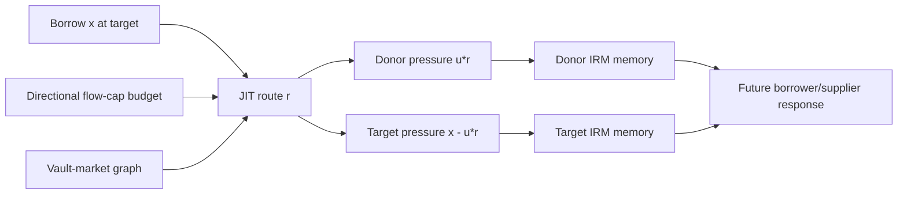

# Morpho Public Allocator T0: routed demand and displaced control signals

## Decision before experiments

This is a new **AMBER feasibility route** on branch
`morpho-public-liquidity-contagion-feasibility-2026-08-20`. It starts after the hidden-bot deployment study failed
D0A and does not alter or rescue that result. The new route uses only the public, code-bound `PublicAllocator`
contract; it never needs to infer which private EOA runs a bot.

The systems question is:

> When a public router assembles a local borrow from liquidity held in other markets, where is the borrow-demand
> signal registered by the network's local adaptive controllers?

The candidate phenomenon is **control-signal displacement**, not the already documented fact that shared
liquidity exists. A just-in-time (JIT) borrow can make the destination look less stressed while making donor
markets look stressed despite no borrowing there. The T0 identities below are lemmas and source audit, not a new
theorem or empirical discovery.

## Source-bound event algebra

For market `i`, define pressure at AdaptiveCurveIRM target `u_* = 0.9` as

```text
q_i = B_i - u_* S_i.
```

Consider one atomic user operation that borrows `x >= 0` from target market `t`. Before the borrow, one or more
Public Allocator calls move total supply `r = sum_i f_i` from donor markets into `t`, where `f_i >= 0`. The exact
changes, before interest/rounding corrections, are

```text
donor i:  Delta q_i = u_* f_i,
target t: Delta q_t = x - u_* r,
network:  sum_i Delta q_i = x.
```

For a genuine liquidity-shortfall fill, freeze `0 <= r <= x`. Every touched market then receives nonnegative
pressure even though borrowing occurs only at the target. The fraction of new network pressure displaced to
donors is

```text
rho_displaced = u_* r / x,       x > 0.
```

If the entire borrow is JIT-funded (`r=x`), donors receive `u_*=90%` of the pressure and the target receives only
`1-u_*=10%`. For partial JIT funding, the displaced fraction scales exactly with `r/x`. This is a balance identity;
the publishable question is whether it creates delayed, graph-predictable AdaptiveCurveIRM memory and borrower
response in the field.

## Flow-cap state is a displacement budget

At official source commit `51f92e57624099c5c3a4c9fdd88ed1ec2b16ac84`, withdrawing `f_i` from donor `i`
updates

```text
(maxIn_i, maxOut_i) -> (maxIn_i + f_i, maxOut_i - f_i),
```

while supplying `r` to target `t` updates

```text
(maxIn_t, maxOut_t) -> (maxIn_t - r, maxOut_t + r).
```

Thus `maxIn_i + maxOut_i` is invariant between curator resets. The cap is not a per-hour rate limit and does not
regenerate with time. Given current vault supply `A_vi`, a single vault's feasible net inflow to target is bounded
by

```text
R_vt = min(maxIn_vt, sum_{i != t} min(maxOut_vi, A_vi)).
```

The bound is attained when enabled-market and MetaMorpho reallocation constraints do not bind beyond the listed
terms. Across independent vault positions, capacities add. This reproduces the contract's liquidity-routing
surface; it must not be advertised as a novel max-flow theorem.

## Candidate topology



## Prior-art and claim boundary

| Prior work / source | Already established | Candidate residual |
|---|---|---|
| Morpho and Contango documentation | Public Allocator aggregates isolated liquidity; donor liquidity removal can increase donor borrow rates | exact event-level pressure partition and delayed AdaptiveCurveIRM memory conditional on routed fraction |
| Chitra, *A Curationary Tale* | curator allocation, variable-rate path dependence and online-learning/regret model | no Public Allocator, flow-cap state, JIT atomic borrow or spatial controller-signal decomposition |
| Zbandut & Goldstein, *Institutionalizing risk curation* | shared liquidity stress, curator overlap networks and contagion potential; explicitly notes this channel is not generically novel | contract-level vault--market transport and prospective event response rather than daily TVL overlap |
| 2026 Resolv incident analyses | industry accounts already claim Public Allocator amplified a stale-oracle loss | incident cannot be the novelty claim or a clean holdout; at most externally disclosed retrospective validation |
| financial-network contagion, max-flow/min-cut and reaction--transport theory | generic capacity cuts, flow conservation and shock propagation | source-exact measurement of how a live router spatially mislocalizes demand seen by adaptive controllers |

The only eligible candidate claim is:

> Code-bound JIT routing displaces a predictable fraction of local demand pressure onto graph-neighbor markets;
> this displacement predicts subsequent controller-memory and participant response after conditioning on the
> source transaction and current cap state.

The claim fails if results reduce to the contemporaneous balance identity, the already documented donor-rate
increase, generic shared-liquidity risk, or one known exploit narrative.

## T0 executable contract

Before market data, a deterministic source-bound runner will test:

1. pure routing pressure continuity and network conservation;
2. exact JIT pressure partition for partial and full fills;
3. nonnegative touched-market pressure for `0 <= r <= x`;
4. the `u_*` full-JIT donor fraction;
5. per-market `maxIn + maxOut` invariance across valid reallocations;
6. exact one-vault feasible-target-inflow bound under the stated assumptions; and
7. additive capacity across independent vault positions.

Passing proves only correct encoding. T0 remains AMBER unless the literature audit leaves a falsifiable delayed
field consequence not implied by the identity.

## Prospective field ladder

No history is authorized by this plan alone. If T0 passes, freeze D0 before event retrieval:

1. **D0 transport/support:** pin Public Allocator deployments and source versions; qualify receipt-level
   `PublicWithdrawal`, `PublicReallocateTo`, Morpho `Supply`, `Withdraw`, `Borrow` and `BorrowRateUpdate` identities
   against an independent finalized index. Require at least two chains, 300 atomic JIT-borrow transactions, 90
   days, 12 donor--target edges and adversarial dense-block checks.
2. **D1 exact reconstruction:** decode calldata and replay per-vault flow-cap state, supplied assets, borrow and
   rounding transaction by transaction. The continuity equations are mandatory integrity checks, not outcomes.
3. **D2 field mechanism:** on a chronological training prefix, freeze matched pure-borrow controls and predict
   donor/target rate-memory changes, time to next interaction, repay/refinance response and graph spillovers. Test
   on an untouched suffix and a second chain.
4. **D3 stress validation:** treat the publicly discussed March 2026 Resolv episode as a contaminated retrospective
   case, never as tuning data or a clean holdout. A real confirmation requires a future sealed interval or an
   unseen independently chosen system.
5. **D4 transfer:** validate the reaction--transport inference on another code-bound resource router with local
   adaptive controllers. Cross-chain copies of the same contract are not independent mechanisms.

No event is called JIT merely because reallocation and borrow occur near each other. The same transaction must
contain source-exact Public Allocator calls and a compatible Morpho borrow, with exact loan asset and market
identity. Standalone curator reallocations are controls, not treated JIT events.

## Data and compute

| Stage | Free data | CPU / storage | GPU |
|---|---|---|---|
| T0 | pinned contract/IRM sources; synthetic arrays | below 10 core-hours, below 1 GB | forbidden |
| D0 | canonical headers, calldata and receipts; finalized independent event identities | below 100 core-hours, below 20 GB | forbidden |
| D1--D2 | exact on-chain state/call replay on at least Ethereum and Base | 500--3,000 core-hours, 0.1--1 TB | normally none |
| D3--D4 | sealed future interval and independent router system | scale from measured throughput | 50--200 V100-equivalent hours only for a preregistered learned response model |

The current two V100 32 GB nodes and RTX 2060 remain idle. CPU work may later run on those hosts, but no remote
job is justified before D0. No H20 is assumed.

## Venue boundary

- A Morpho-only accounting/result paper is specialist DeFi, security or financial-network work.
- An NMI route needs prospective evidence that code-bound economic agents create a measurable externality and a
  design intervention that changes agent routing or observation.
- An NCS route additionally needs a general reaction--transport inference method with controlled error and a
  second, genuinely independent adaptive-resource system.

## Pinned primary sources

- Public Allocator repository commit `51f92e57624099c5c3a4c9fdd88ed1ec2b16ac84`;
- `src/PublicAllocator.sol` SHA-256 `b29c14540863b77666a997293752de3601945c32df5d5e27eed4ecc587ea8062`;
- `src/interfaces/IPublicAllocator.sol` SHA-256
  `bc62bac8dbd1e71c35b5bba0e1ffb17c59da20ef7e46eb9844dff9362d87bb52`;
- `src/libraries/EventsLib.sol` SHA-256
  `4dd3057389e99eaefb39326221b5b95a9fe7eb1904bd98eb9ecf3dae99661e90`;
- [Morpho Public Allocator documentation](https://docs.morpho.org/developers/borrow/concepts/public-allocator/);
- [Morpho interest-rate documentation](https://docs.morpho.org/build/borrow/concepts/interest-rates/);
- [Contango Public Allocator explanation](https://docs.contango.xyz/resources/faq);
- [A Curationary Tale](https://arxiv.org/abs/2503.18237);
- [Institutionalizing risk curation in decentralized credit](https://arxiv.org/abs/2512.11976).
