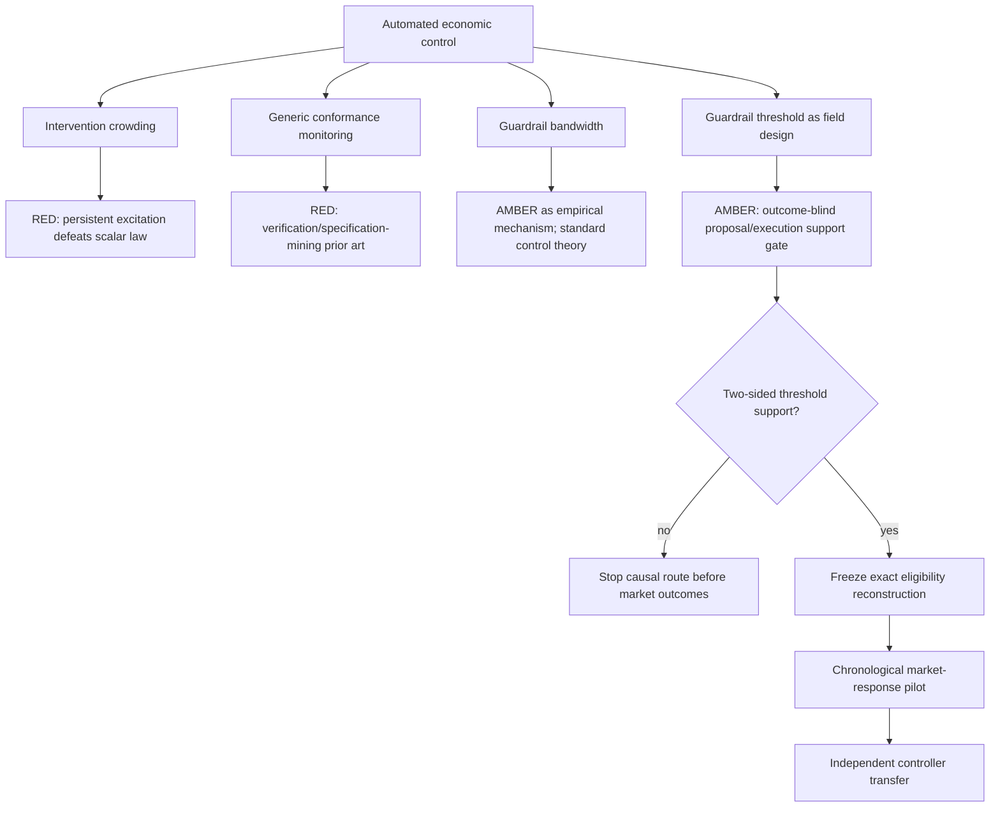

# Post-Aave problem map: guardrailed automated economic control — 2026-08-20

## Decision

The Aave rate-step causal route stopped at D1B, before outcomes. Two tempting generalizations from that failure
also stop here:

1. **Intervention crowding is not an identification law.** A scalar such as intervention rate times mixing time
   is neither necessary nor sufficient for identification. Fast, persistently exciting inputs can identify a
   system; sparse but confounded inputs may not.
2. **Generic controller conformance is not a new NCS method.** Runtime verification, smart-contract
   specification mining, data-driven safety verification and controller-conformance bounds already cover the
   broad problem.

One narrower field question remains **AMBER**:

> Can deterministic safety guardrails around a deployed automated economic controller create usable threshold
> variation for identifying the effect of the controller's actions, and when do those same guardrails make the
> intended response infeasible or too slow?

This authorizes only a result-blind, policy-log D0 on Aave. It does not authorize market outcomes, a paper claim,
GPU work or an EcoMD model.

## Why this is a larger story

The Economic World Model blueprint separates agent decisions, constraint validation, mechanism execution,
institutional evolution and real-world alignment. Aave now exposes a real instance of that stack: an off-chain
risk process publishes a typed proposed action, an on-chain hub and parameter-specific agent validate it, and an
exact smart-contract mechanism mutates the lending market. Morpho, Euler and Sky expose independently designed
adaptive or reactive controllers with different execution semantics.

The research opportunity is not to call every controller an AI agent. Most are deterministic, and Aave's
off-chain policy is only partially public. The opportunity is to study a class of **automated economic
controllers** whose proposed and executed actions can sometimes be separated in a live system. This is a
necessary empirical substrate for future agentic economies and economic world models.

## Candidate topology



## Mathematical boundary

Let `q_k` be the controller's proposed action, `h_k` the complete pre-action policy state, and `g(q_k,h_k)` a
deterministic guardrail score whose sign determines admissibility. The executed action can be written as

```text
Z_k = 1{g(q_k, h_k) <= 0},
A_k = Z_k q_k + (1 - Z_k) A_{k-1}.
```

If proposals have continuous density on both sides of `g=0`, the proposer cannot precisely sort around the
boundary, no other action changes discontinuously there, and downstream interference is controlled, `Z_k` can
serve as a local instrument for execution. None of those assumptions follows from blockchain transparency. An
off-chain proposer that knows the guardrail may clip every proposal to the allowed range, creating bunching and
destroying the design. D0 tests this support condition before any market response is read.

The guardrail also imposes an actuation envelope. With maximum allowed change `Delta` and minimum interval
`delta`, its long-run slew rate cannot exceed `Delta / delta`. This is a useful physical constraint, but not a
new theorem: actuator saturation, rate-constrained control, anti-windup and input-constrained barrier methods
already study the same structure. A publishable contribution would need a frozen cross-system field discovery
or a genuinely new partial-identification result, not a renamed ratio.

When calibration or desired actions are hidden, compliant executed actions alone cannot identify the policy:
multiple latent policies can map through the same non-injective guardrail to the same execution trace. This
explains why conformance from state changes alone is insufficient, but it is also too elementary to be the main
claim.

## Nearest-work boundary

| Work or system | What is already established | Consequence for this project |
|---|---|---|
| classical open/closed-loop system identification | identification depends on informative data and persistent excitation, not intervention spacing alone | no universal `frequency x mixing-time` identification number |
| continuous-time causal inference and marked point-process methods | repeated time-varying treatments and confounding already have formal estimands and identification conditions | event density alone is not a causal-method contribution |
| smart-contract specification mining ([Guth et al., 2018](https://arxiv.org/abs/1807.07822); [Liu et al., 2024](https://arxiv.org/abs/2403.13279)) | execution traces can be compiled into automata and invariants | generic trace-to-spec tooling is occupied |
| data-driven formal verification ([Zhang et al., AISTATS 2024](https://proceedings.mlr.press/v238/zhang24i.html)) | unknown stochastic systems can be checked against temporal specifications with probabilistic guarantees | a learned conformance monitor is not automatically new |
| [Auto.gov](https://arxiv.org/abs/2302.09551) | an Aave-like RL governance agent, gradual action constraints and real-data testing already exist in simulation | automated DeFi governance and bounded actions are not first-of-kind claims |
| [AgileRate](https://arxiv.org/abs/2410.13105) and AFT 2024 adaptive lending | adaptive interest-rate control, convergence and adaptivity--robustness trade-offs are already studied | controller design or simulation-only superiority is occupied |
| [Aave Risk Agents](https://github.com/aave-dao/aave-risk-agents) | a live proposal--validation--execution architecture records typed oracle proposals and injected actions | provides a field data contract, not novelty by itself |
| [Aave WETH Slope2 retro](https://governance.aave.com/t/retro-weth-utilization-spike-and-slope2-risk-oracle-performance/24101) | the public record already debates hidden calibration, discrete guardrails and delayed stress response | reproducing this one episode is ineligible |
| [Economic World Models blueprint](https://arxiv.org/abs/2608.06020) | agents, validators, mechanisms, evolving institutions and real alignment should be separate runtime layers | motivates the systems decomposition, but does not supply identification |

## Candidate ranking after prior-art falsification

| Rank | Candidate | Status | Binding reason |
|---:|---|---|---|
| 1 | guardrail threshold variation in deployed automated economic control | **AMBER; D0 only** | potentially clean proposed-versus-executed action split; two-sided support unknown |
| 2 | safety--responsiveness frontier across live lending controllers | **AMBER/RED** | real field question, but rate-limited control and adaptivity--robustness theory are established |
| 3 | source-grounded controller conformance benchmark | **RED as main claim** | specification mining and runtime verification dominate; useful infrastructure only |
| 4 | intervention-frequency/mixing-time law | **RED** | explicit persistent-excitation and confounding counterexamples |

## Claim and venue ladder

1. **Infrastructure:** versioned proposal, validation and execution ledgers. Useful and releasable, but not a
   scientific claim.
2. **Specialist systems/finance:** a credible within-Aave threshold design showing how a guardrail changes a
   defined market response, with manipulation and interference tests.
3. **Nature Machine Intelligence route:** the same pre-registered mechanism transfers to at least three
   independently implemented controllers or two domains, predicts a held-out future stress response, and changes
   a safety-policy decision. The contribution must concern deployed autonomous decision systems, not crypto
   returns alone.
4. **Nature Computational Science route:** additionally introduce an irreducible method for dynamic,
   state-dependent threshold actions with partial observability and interference, with a theorem or finite-sample
   guarantee and non-finance validation. No such method has survived the current audit, so NCS remains locked.

## Data gates

| Gate | Data | Frozen purpose | Status |
|---|---|---|---|
| D0 | Aave official source/address commits; AgentHub configuration, Risk Oracle proposal and injection events only | determine whether proposals and executions provide support for a guardrail design | **authorized after a separate freeze** |
| D1 | historical policy state required to compute exact validation scores; still no market behavior | reconstruct every eligible, blocked, expired and overwritten action | locked until D0 passes |
| D2 | utilization, rate, supply/borrow and transaction response around pre-specified thresholds | chronological causal pilot | locked until D1 passes |
| D3 | Morpho, Euler, Sky or another independently implemented controller | transfer and mechanism contrast | locked until D2 passes |
| D4 | future actions/events after model and thresholds are frozen | prospective confirmation | mandatory for NMI; locked |

All chain data are public, but each derived dataset still needs source, timestamp, licence/status, block hashes and
preprocessing digests. D0 must not query balances, utilization, rates, prices, positions, liquidations or user
actions.

## Compute gates

| Stage | CPU/storage | GPU | Rule |
|---|---|---|---|
| D0 | below 20 core-hours and 2 GB | forbidden | event/configuration support only |
| D1 | below 100 core-hours and 20 GB | forbidden | exact replay and validation classification |
| D2 | 100--1,000 core-hours and 0.1--1 TB | normally none | causal/event analysis; non-neural baselines first |
| D3--D4 | scale only from measured throughput | 20--200 V100-equivalent hours only if a frozen learned component beats non-neural baselines | transfer and prospective prediction |

The two V100 32 GB workers and RTX 2060 remain intentionally idle for this candidate. The current uncertainty is
whether usable treatment variation exists, not model capacity. Future expansion may use additional non-H20
workers only after the scientific gates pass.

## Immediate action

Freeze `aave_agent_guardrail_d0_v1` before reading any Risk Oracle proposal value or matching it to execution.
The route stops before market outcomes unless the action ledger contains enough proposed actions, non-executed or
delayed actions, multiple markets/types, and genuine support around at least one deterministic guardrail boundary.
