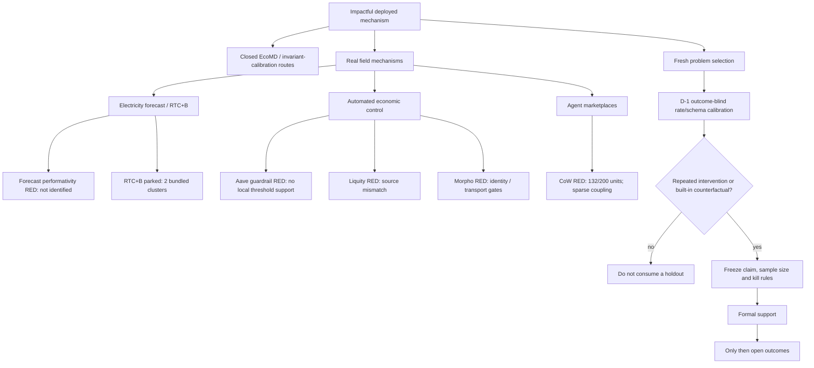

# Post-CoW problem map — 2026-08-21

## Current decision

CoW remains closed after its formal RED result, and ERCOT RTC+B remains parked. A fresh AMBER route was selected
after this map was written: GitHub's 2026-07-14 default Dependabot cooldown supplies a real, platform-wide safety
intervention for testing **verification liquidity**—whether autonomous proposal timing changes the validation
service received by unrelated human work. The broad bot-burden claim is occupied; only the causal spillover and
runner-pool mechanism remain candidates. P0 and exploratory outcome-blind support passed, and the formal D-1 is
frozen in `papers/proposal/dependabot_cooldown_verification_liquidity_plan_2026-08-21.md`. It has not opened queue,
review or merge outcomes and does not yet authorize D0, GPU, EcoMD or an NMI/NCS claim.

The repeated failures now expose a process problem as well as scientific nulls: transport and event-rate
uncertainty have too often been mixed into the first hypothesis-consuming holdout. The next candidate must pass
an outcome-blind support-calibration tier before a scientific window or absolute count is frozen.

## Exploration topology

## Lasting lessons from CoW

1. The official leave-one-solver counterfactual is clean enough to reuse as infrastructure, but clean data do
   not make a large story. The formal sample had only 12 submitted-coupled and two eligible-coupled auctions.
2. Absolute support thresholds need outcome-blind event-rate calibration in the same protocol epoch. A
   nearby-period transport check is not a stable rate estimate.
3. API array order is not semantic identity. Future validators must canonicalize documented unordered fields
   before applying duplicate-payload gates.
4. Participant concentration, high winner criticality and task coupling are three different objects. Observing
   one cannot be used to claim another without a frozen comparison.
5. GPUs are downstream of a real estimand. Two V100s and the RTX 2060 correctly remained unused.

## Mandatory dispatch protocol for the next route

### P0: problem and nearest-work audit

- one sentence specifying the real intervention, hidden state or failure consequence;
- an explicit statement of what would remain new after the nearest five methods and nearest deployed system;
- a venue boundary: specialist result, NMI requirement and additional NCS requirement.

### D-1: outcome-blind support calibration

Allowed fields are timestamps, event identities, schema, missingness, pagination, cluster IDs and source-version
epochs. Outcomes, treatment magnitudes, prices, scores and behavioral responses remain sealed. D-1 estimates
event rate and intracluster dependence, then powers and freezes D0. A candidate with fewer than 20 independent
clusters, no repeated intervention or no exact built-in counterfactual normally stops here.

### D0 and later

- D0 tests exact treatment/control support on a fresh interval.
- D1 opens mechanism variables only after D0 passes.
- D2 uses chronological held-out prediction or a credible intervention, with clusters—not ticks—as independent
  units.
- NMI requires prospective policy value and transfer to an independently implemented agent system.
- NCS additionally requires an irreducible computational method with a guarantee and an independent second
  domain. A descriptive crypto or electricity event study is not enough.

## Candidate requirements, not candidate names

The next search should prioritize systems with all four properties:

1. deployed autonomous decisions and logged alternatives, rejections or counterfactuals;
2. at least tens of independent interventions/sites rather than one global date;
3. free, replayable support metadata sufficient for D-1 before outcome access; and
4. a design lever whose change can be prospectively evaluated.

Until a system meets these requirements, no new branch, remote CPU queue, GPU job or data purchase is justified.
ERCOT remains scientifically interesting but fails property 2 under the currently known test design. GitHub
agent-validation queues have scale but currently lack a clean intervention and face direct prior art. Ethereum
fee controllers, oracle-triggered liquidations and AMM-fee changes remain heavily occupied. A new literature and
data search must therefore precede the next formal experiment.

## Data and compute boundary

| Stage | Data | CPU/storage | GPU |
|---|---|---|---|
| P0 / D-1 | public docs, identities, timestamps, schema only | under 20 core-hours, under 5 GB | forbidden |
| D0 | fresh support interval, still outcome-blind where possible | under 100 core-hours, under 50 GB | forbidden |
| D1--D2 | mechanism variables and chronological outcomes | scale from D-1; 0.1--2 TB plausible | non-neural baselines first |
| NMI/NCS | independent system and prospective interval | expand data/CPU only after gates | expandable non-H20 pool; V100-equivalent accounting |

The current machines are available, but idle compute is not a scientific blocker.
