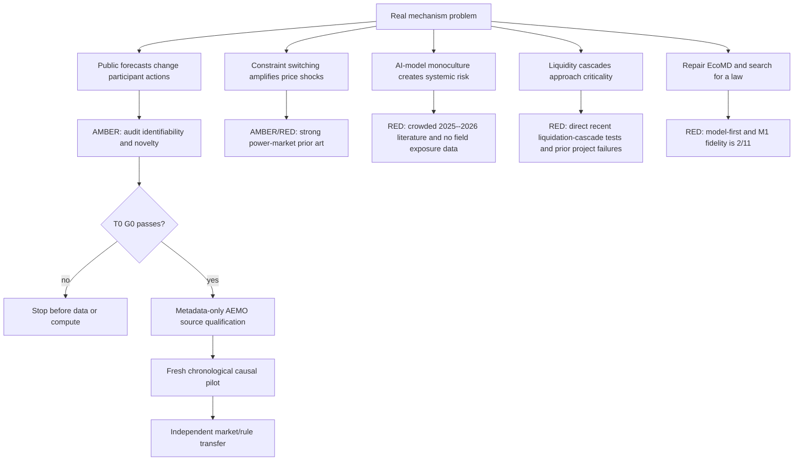

# Problem-first high-impact candidate map — 2026-08-19

> **T0 update (2026-08-19): FAIL.** E0 identification, E1 instrument and E2 constraint-law exits all failed;
> no AEMO/NZEM market rows or compute were unlocked. The retained candidate is now closed, not AMBER. See
> `papers/proposal/performative_dispatch_t0_result_2026-08-19.md`.

## Binding starting point

The original invariant-calibration NCS route, generic simulator-audit route, EcoMD-v1 realism route and the
current real-market thermodynamics route have all failed their frozen first gates. Their infrastructure remains
useful, but their claims cannot be combined into a positive result. The next project must therefore start from
a real mechanism and an irreducible claim, not from an idle GPU, an available model or a physics metaphor.

The archived parallel free-data work is preserved at
`archive/free-open-data-parallel-2026-08-19` (`c553c9db3`). It is not part of this candidate ranking: its simple
LOBSTER controls are dominated by the canonical exp138--140 chain, and its experiment numbers conflict with
the canonical history.

## Candidate topology



## Ranking

| Rank | Candidate | Real mechanism | Main collision | Free-data position | Decision |
|---:|---|---|---|---|---|
| 1 | closed-loop public forecasts in rolling electricity dispatch | a published forecast changes rebids, dispatch constraints and the outcome it is scored against | performative prediction theory and pre-dispatch price-discovery studies already cover the broad idea | unusually strong: AEMO publishes forecasts, bids, dispatch, constraint solutions, interconnector state and timestamps | **AMBER; T0 only** |
| 2 | active-set switching as a source of price extremes | network/ramp constraints change the market-clearing response to renewable and demand shocks | LMPs as piecewise-affine/discontinuous maps, large-deviation price spikes and topology recovery from LMPs are established | AEMO data are excellent | **AMBER/RED; retain as mediator inside rank 1, not a standalone claim** |
| 3 | AI-agent/model monoculture | shared models correlate decisions and liquidity withdrawal | direct 2025--2026 theory, experiments, outage studies and systemic-risk papers; real deployment exposure is mostly unobserved | simulations are cheap but field identification is weak | **RED** |
| 4 | critical liquidation cascades | leverage thresholds and forced selling create feedback | direct 2026 multi-event/on-chain work reports heterogeneous precursors and subcritical within-venue branching | some free data, but event selection is exposed and cross-venue L2 is incomplete | **RED** |
| 5 | EcoMD-first mechanism search | latent particle dynamics generate market observables | starts from an empirically unvalidated simulator; canonical M1 is 2/11 | compute is available but scientifically unauthorized | **RED** |

## Recommended question

The only candidate worth a new first gate is:

> **When a system operator publishes a rolling market forecast, how much of the subsequent forecast revision is
> new physical information, and how much is the market's endogenous response to the forecast itself?**

This is a closed-loop economic-system question. AEMO's pre-dispatch output is not merely a passive estimate:
market participants can rebid before dispatch, while the clearing engine enforces changing network, ramp and
security constraints. A forecast can therefore be numerically “wrong” because it successfully induced a useful
response, or appear accurate despite inducing a harmful response. Classical forecast error alone cannot measure
the value of that public signal.

The broad statement is not novel. Performative prediction already formalizes forecast-induced distribution
shift, and recent work proves that classical proper scores can fail even for conditional performative forecasts
([Boeken, Zoeter and Mooij, 2025](https://arxiv.org/abs/2510.21335)). Electricity-market research already studies
non-binding iterative pre-dispatch price discovery
([Guerci et al., 2023](https://doi.org/10.1016/j.ijindorg.2023.102987)) and strategic Australian rebidding
([Clements et al., 2017](https://doi.org/10.1016/j.eneco.2016.12.011)). Therefore “forecasts affect agents” or
“rebids matter” is forbidden as a contribution.

The possible irreducible gap is narrower: identify the forecast-induced response from public rolling-market
logs when the market-clearing map changes active constraint set, and define a decision-value estimand that is
not equivalent to an existing performative divergence, utility score, standard causal effect or electricity
market counterfactual. T0 must decide whether this gap is real before any market row is downloaded.

## Mechanism and multi-scale design

The proposed system has four explicit layers:

| Scale | State / transition | Learned? | Reason |
|---|---|---:|---|
| physical context | demand, renewable availability, outages and weather information | partially | forecast errors and latent operational state must be estimated |
| public information | rolling P5MIN/pre-dispatch forecasts and revisions | observed | these are the candidate interventions/signals |
| agent response | participant bid/rebid timing and quantity/price-curve changes | **yes** | this is the behavioral mechanism of interest, not a fixed nuisance rule |
| clearing/event layer | bids plus network/ramp/security constraints to prices, dispatch and flows | hybrid | enforce known market identities; learn only unavailable residuals and regime transitions |

This answers the earlier event-layer design issue: an event mechanism should not be frozen merely because it is
fast. Known accounting, clearing and network constraints remain exact; participant response and any unobserved
residual mechanism are learned and tested. A learned black-box event layer without these identities cannot
support counterfactual market-rule claims.

The architecture is conditional on T0 and later data gates:

```text
physical/news state -> published forecast -> learned rebid response
        |                                      |
        +----------> constrained clearing <----+
                           |
                 dispatch, price, flow, reliability
```

EcoMD is not in the primary path. It could only return as a matched simulator baseline after a real causal law
and observation contract exist.

## Claim ladder and venue boundary

1. **Infrastructure only:** a versioned AEMO parser and replay engine. Useful, not a paper claim.
2. **Specialist-market claim:** a credible causal estimate that public forecast availability changes rebidding or
   welfare under defined assumptions. Potential energy-economics/market-design work.
3. **NMI-level claim:** the same feedback mechanism transfers across at least two independently governed rolling
   markets or a clean rule intervention and changes a policy decision; hidden-information alternatives are killed.
4. **NCS-level claim:** in addition, a genuinely new, general computational/identification method with theorem or
   finite-sample guarantee beats nearest performative/causal baselines beyond electricity markets.

An AEMO application of an existing performative score is not NCS. A predictive GNN with lower price error is not
the question. A single outage or famous price spike is not an independent sample.

## Data gates

| Gate | Data | Purpose | Current authorization |
|---|---|---|---|
| T0 | primary literature, rules and schema metadata only | novelty, SCM identifiability, possible instrument | **authorized** |
| D0 | AEMO directory listings and schema/header samples with no price/bid outcome analysis | verify versioning, timestamps, joins, licence and immutable acquisition | locked until T0 PASS |
| D1 | fresh four-to-eight-week AEMO P5MIN, pre-dispatch, bids, dispatch, constraints, interconnector and notice data | chronological development/validation pilot | locked until D0 PASS |
| D2 | a non-overlapping AEMO rule period plus NZEM or another independent rolling market | mechanism and governance transfer | locked until D1 PASS |
| D3 | additional market/operator or collaboration-only confidential participant response data | confirm external validity and welfare channel | locked until D2 PASS |

AEMO's official dispatch documentation states that public reports cover regional prices, demand, generation,
interconnector flows and constraints, and that next-day files include unit dispatch, local price and constraint
solutions ([AEMO Dispatch](https://aemo.com.au/energy-systems/electricity/national-electricity-market-nem/data-nem/market-management-system-mms-data/dispatch)).
`DISPATCHCONSTRAINT` reports RHS, LHS, marginal value and violations every five minutes
([AEMO MMS schema](https://visualisations.aemo.com.au/aemo/nemweb/mmsdatamodelreport/electricity/mms%20data%20model%20report_files/MMS_126.htm)).
This makes the source technically promising; it does not solve causal identification.

## Compute gates

| Stage | CPU/storage | GPU | Decision |
|---|---|---|---|
| T0 | less than 20 core-hours; repository documents only | forbidden | theorem/claim audit |
| D0 | less than 50 core-hours and 20 GB temporary storage | forbidden | source qualification |
| D1 | 100--500 core-hours and 0.1--1 TB raw/derived | normally none | event joins, replay and causal pilot |
| D2 | 2,000--10,000 core-hours and 2--10 TB if multi-market | at most 20--100 V100-equivalent hours after a frozen neural baseline | transfer and uncertainty |
| D3 | scale from measured D2 throughput on heterogeneous non-H20 workers | expand only after scientific gates | confirmatory study |

The two V100s and RTX2060 intentionally have no job from this project now. Compute availability does not relax
T0, and no future plan assumes H20.

## Immediate action

Freeze and execute `performative_dispatch_t0_v1` as a literature/identifiability gate. It must first try to kill
the proposal with an observational-equivalence counterexample and the nearest-method claim matrix. Only a
surviving theorem, estimator or credible quasi-experimental instrument may unlock AEMO source qualification.
