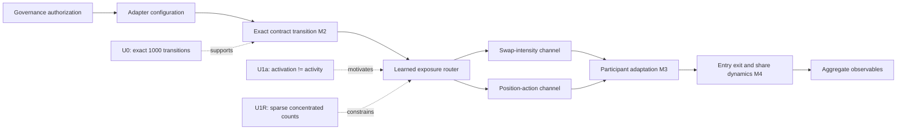

# V14 exposure-routing topology after U1R

**Status:** architectural hypothesis from post-hoc pre-treatment description; not yet a validated method

## Revised multiscale decomposition

The exact event mechanism should remain non-learned when its code, authority and transition are observable. What
must be learned is the state-dependent routing from a technical intervention to economically active units and
channels. This resolves the earlier false choice between a fixed event layer and a fully learned mechanism: keep
the executable rule fixed, but learn exposure incidence and behavioral response separately.

## Mathematical object

For channel-specific event counts `a_i^(c)`, define exposure weights
`p_i^(c) = a_i^(c) / sum_j a_j^(c)`. The router is not merely a binary mask; it must predict both support and mass,
and may differ between swap and position channels. A later response aggregate under this measure is
`sum_i p_i^(c) r_i`, not the uniform contract average.

With `u_i=1/N` and `g_i=N p_i`, the exact identity

`E_p[r] - E_u[r] = Cov_u(g,r)`

locates the aggregation error. The exposure distribution alone does not identify the error's sign because the
response covariance is unopened. Its HHI fixes `Var_u(g)=N HHI-1`, which controls a Cauchy upper bound. This is an
elementary diagnostic identity, not a claimed new theorem.

## Evidence and missing links

| Link | Current evidence | Status |
|---|---|---|
| governance to configuration | exact Proposal 94 execution | observed |
| configuration to contract transition | 1,000 ordered U0 transitions | validated development M2 |
| contract transition to preperiod event incidence | U1a plus complete U1R prefix | observed, post-hoc routing analysis pending |
| incidence to causal response | no valid controls or post-treatment access | blocked |
| public key/NPM owner to beneficiary | incomplete identity ontology | blocked |
| adaptation to entry/exit ecology | no M4 panel | blocked |

## Consequence for source selection

The next M3/M4 domain must expose more than exact rules. Before response access it needs a defensible exposure
denominator, multiple action channels, stable participant identifiers and an untreated/not-yet-treated comparison
with overlap. Uniswap remains useful as the exact-M2 anchor, but U1R forbids treating its current propagation
prefix as the behavioral panel.

NMI would require a method showing that an explicit router improves intervention prediction across systems and
beats simpler activity-weighted baselines. NCS would additionally require the router to transfer across domains,
connect exact mechanisms to validated observations and yield frozen real-data prediction. The current identity
and one Uniswap census satisfy neither bar; they only make the missing operator explicit.

## Exploratory geometry result

The frozen post-hoc computation supports a hurdle-style architectural hypothesis. Only 89/1,000 pools have swaps
and 25/1,000 have position actions, while inverse-HHI effective counts are only 8.28 and 6.69. Even among active
pools, Gini is 0.824 for swaps and 0.639 for position actions. The router should therefore model channel-specific
support and conditional intensity separately.

The channels share 23 active pools, but their normalized weights have total variation 0.415. Position support is
almost nested in swap support (23/25), while swap support is much broader (23/89). A useful design candidate is a
shared latent activity state with channel-specific heads and explicit zero mass, not one universal exposure
vector.

Propagation batch and packed fee strongly partition counts, but both are descriptive and potentially selected:
batch one carries 88.3% of swaps, and the 10.7% `0x44` contract share carries 23.0% of swaps. Treat these as
candidate confounders/routing covariates in a new frame, never as effects in U1R. Full result:
`experiments/v14_uniswap_v3_exposure_routing_exploratory/RESULTS.md`.
