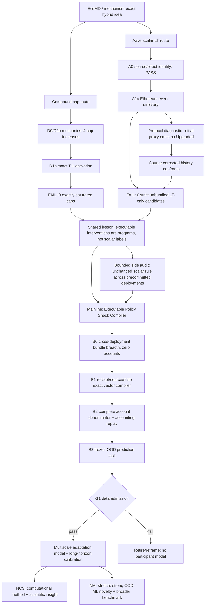

# V14 executable policy-shock research topology

**Status:** the Compound cap and Aave Ethereum scalar-LT causal routes are closed. Vector policy programs are the
new mainline hypothesis; G1 remains closed.

## Evidence state

| Node | Immutable evidence | What it licenses |
|---|---|---|
| Compound D1a | exact source/state, no exact T−1 cap saturation | failure lesson only |
| Aave A0 | exact LT operator and zero routes | event-directory design |
| Aave A1a | 3,119 logs; 18 LT decreases; 0 strict candidates | scalar-route retirement; bundle analysis |
| Bundle structural replay | development-only; no outcomes | vector-compiler protocol design only |
| B0--B3 | not yet run | nothing yet |

## Non-negotiable boundaries

- The two exposed Ethereum bundles are development evidence, never untouched confirmation.
- No scalar isolation threshold is relaxed after A1a.
- No other deployment is opened before a B0 chain/deployment/support manifest is pushed.
- No account or response row is opened before B0/B1/B2 and the frozen B3 design pass.
- No GPU training starts before G1.
- A vector program supports predictive/interventional modeling; it does not identify independent component effects
  without an additional causal design.

## Exploration history retained

The topology preserves both negative results as informative constraints. The pivot is not “bundles happened to be
available”; it follows from two independent failures of scalar treatment construction. Future theory should treat
program compilation, exact instantaneous state transition and learned adaptation as separate objects, and test
whether that separation improves held-out program prediction rather than merely fitting historical responses.
