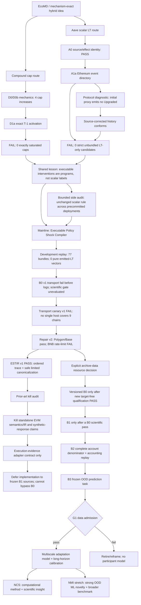

# V14 executable policy-shock research topology

**Status:** the Compound cap and Aave Ethereum scalar-LT causal routes are closed. Vector policy programs are the
new mainline hypothesis; G1 remains closed.

## Evidence state

| Node | Immutable evidence | What it licenses |
|---|---|---|
| Compound D1a | exact source/state, no exact T−1 cap saturation | failure lesson only |
| Aave A0 | exact LT operator and zero routes | event-directory design |
| Aave A1a | 3,119 logs; 18 LT decreases; 0 strict candidates | scalar-route retirement; bundle analysis |
| Bundle structural replay | 77 bundles; 27 known net changes; 5 net LT decreases; 0 pure LT; 1 round trip | vector-compiler protocol design only |
| B0 v1 | fixed 4-train/2-validation/3-test deployments; ≥220 gate | infrastructure failure before a log row; no scientific decision |
| Transport canary v1 | zero address; 4 hosts; 2 existing endpoints/chain | FAIL, host coverage 5/5/6/6 of 9; no target inference |
| Transport repair v2 | Polygon/Base pass at spans 62/7,813; BNB fails on both hosts; zero target rows | FAIL; free-RPC B0 route closed |
| ESTIR v1 | 72,000 generated cases; 10/10 gates; terminal-collision path witness | PASS for fixtures/spec only; no empirical authorization |
| ESTIR prior-art audit | KEVM/EELS/EthIR/Gigahorse/Geth/OpenTracer plus hybrid/operator-learning comparison | kill standalone EVM/IR novelty; retain evidence adapter only |
| Evidence adapter contract | strict provenance/frame/effect/uncertainty schema and 12 future gates | design boundary only; implementation waits for B0 and frozen B1 sources |
| B0 v2 | not yet designed or run | nothing yet |
| B1--B3 | not yet designed/run | nothing yet |

## Non-negotiable boundaries

- The two exposed Ethereum bundles are development evidence, never untouched confirmation.
- The complete 77-bundle replay is also development-only: counts and shapes were explored before freeze and set
  no support threshold.
- No scalar isolation threshold is relaxed after A1a.
- No other deployment is opened before a B0 chain/deployment/support manifest is pushed.
- B0 v1 cannot add deployments, reassign splits or relax its 220-program and per-split breadth gates after new logs
  are opened.
- No account or response row is opened before B0/B1/B2 and the frozen B3 design pass.
- No GPU training starts before G1.
- A vector program supports predictive/interventional modeling; it does not identify independent component effects
  without an additional causal design.

## Exploration history retained

The topology preserves both negative results as informative constraints. The pivot is not “bundles happened to be
available”; it follows from two independent failures of scalar treatment construction. Future theory should treat
program compilation, exact instantaneous state transition and learned adaptation as separate objects, and test
whether that separation improves held-out program prediction rather than merely fitting historical responses.
The ESTIR audit further narrows this statement: compilation infrastructure is not the novelty. Under Bayes log
loss, the maximum value of trace evidence beyond prestate and terminal effects is exactly the conditional mutual
information with the real response. Synthetic labels can set that quantity by construction, so only sealed real
programs can adjudicate the response claim.
