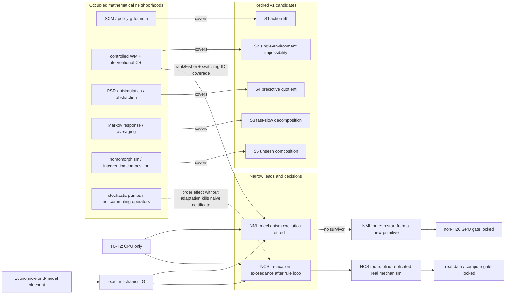

# Theory-exploration topology

**Canonical machine state:** `knowledge_graph.yaml`  
**As of:** 2026-08-12  
**Iteration decision:** NMI `NO_SURVIVOR`, NCS `CONJECTURE_ONLY` — no candidate is ready for human novelty audit

The graph is a research-control artifact, not a claim that graph proximity proves equivalence or novelty. Typed
edges record the present audit judgement and must be revised when equation-level evidence changes. Candidate
histories are append-only; retirement is visible rather than deleted.



## How to read the topology

- Solid `covers` paths are current retirement decisions backed by a primary-source matrix.
- Dashed paths are active kill attacks. They are deliberately shown as threats to the lead, not as supporting
  novelty.
- The NMI and NCS branches share a mechanism-separated model but have different headline objects. NMI needs a
  transferable learning theorem or method. NCS needs a replicated real intervention mechanism.
- The Economic World Model paper motivates the systems decomposition. It does not bridge any candidate across a
  novelty gate.
- Exact exchange mechanics remove one source of model error. They do not identify hidden adaptation, create
  counterfactual support or convert order dependence into a behavioral certificate.

## Current cut through the graph

| Candidate | State | Decisive evidence | Next admissible action |
|---|---|---|---|
| S1 action lift | `RETIRED_PRIOR_ART` | sequential policy factorization and structural re-composition | reopen only with a non-equivalent estimand or weaker-assumption theorem |
| S2 single-environment impossibility | `RETIRED_IDENTIFIABILITY` | standard observational equivalence and intervention-diversity repair | reopen only with a constructive sharp boundary |
| S3 fast/slow split | `RETIRED_PRIOR_ART` | Markov perturbation and singular averaging | retain as an empirical estimand, not theorem novelty |
| S4 predictive quotient | `RETIRED_PRIOR_ART` | PSR, bisimulation and causal abstraction | no new name for predictive equivalence |
| S5 composition | `RETIRED_PRIOR_ART` | soft-intervention composition, homomorphism and effect invariance | require genuinely adaptive sequence mathematics |
| NMI mechanism excitation | `RETIRED_PRIOR_ART` | stacked observability, switching-system identification, active intervention design and event-layer information conservation | do not train; restart NMI search from a distinct primitive |
| NCS relaxation exceedance | `ATTACKING` | raw order effects fail; a frozen Markov contraction envelope gives a stricter null | audit envelope identifiability and identify a defensible real loop |

Experiment 144 made the two kill attacks executable: the complementary-mechanism fixture reduced exactly to
a stacked Gramian, and fixed non-adaptive operators produced a `0.075` swapped-order response. The immutable raw
artifact is recorded in the machine graph with SHA-256 `92351520b073d6674c0629380020599273c2beada29faf06437546a421eddcf8`.

## Validation

Run the graph contract in the project Conda environment:

```bash
conda run -n ecophys python -m ecomd.research.theory_graph \
  research/theory_exploration/knowledge_graph.yaml
```

The validator checks node/edge types, endpoints, append-only candidate-state consistency, mandatory proof and
counterexample links, retirement decisions, venue branches and the prohibition on automated `PASS` states.
