# Theory-exploration topology v12

**Canonical machine state:** `knowledge_graph.yaml`  
**As of:** 2026-08-13
**Current decision:** `V12_THEOREM_ONLY`; the exact/stable three-regime package is proved in its declared setting
but remains `CONJECTURE` at the research-novelty level; no NMI/NCS candidate is admitted and scale-up is locked

The graph is an append-only research-control artifact. It preserves v1/v2, exp144/145 and every retirement, then
adds the v3 state-closure/operator attacks, v4 phenomenon-first audit, v5 annual-rule-feedback gate, v6 exact-
controller identifiability closure and v7 quotient/drift/probe audit. Graph proximity is not evidence of
novelty; each `covers`, `falsified_by` or `retired_by` edge records an equation-level judgement with a source or
exact counterexample. V8 adds direct memory-transplant, economic-agent carry-over, causal-memory-intervention and
contagion coverage plus the standard factorial-interaction reduction. V9 adds order-lifecycle, queue-survival and
resilience coverage, the cancellation-versus-execution sign counterexample and the independent-data boundary. V10
adds coherent-price projection, Kaczmarz and executable-arbitrage coverage; its equivalent-basis counterexample
shows that the proposed local-correction spectrum is not intrinsic to the logical payoff set.
V11 adds inverse-SDE, Fokker--Planck residual, KDS, Jacobi-multiplier and Nambu coverage; its exact circle witness
separates pointwise rank from global uniqueness, while a closed-manifold immersion obstruction survives only as a
narrow conjectural research lead.
V12 adds A-free wave-cone, redundant inverse-PDE, Grushin and projected-immersion coverage. It proves the
solenoidal lower-modulus equivalence, the exact `K<d` ambiguity, generic equal-count exact identification and the
sharp standard-fold conditional modulus, but closes below venue admission because no non-equivalent statistical
method, feasible actuator design or controlled real-system mechanism survives.

```mermaid
flowchart TB
    ROOT["EcoMD separated mechanism + adaptive state"]

    subgraph V1["v1 immutable layer"]
        S15["S1--S5 all retired"]
        NMI1["mechanism excitation retired"]
        NCS1["relaxation exceedance under attack"]
        E144["exp144: stacked rank + fixed order effect"]
        S15 --> NMI1
        E144 -. "negative control" .-> NMI1
        E144 -. "raw order effect fails" .-> NCS1
    end

    ROOT --> V1

    subgraph NMI2["v2 NMI: target-conditioned primitives"]
        T1["T1 target completeness"]
        T2["T2 horizon threshold"]
        T3["T3 complementary targets"]
        T4["T4 target order"]
        MASK["masked-prediction identifiability"]
        CAUSAL["minimal causal/predictive states"]
        BLACK["Blackwell experiment order"]
        PART["task-family partition intersection"]
        MASK -->|covers| T1
        MASK -->|matrix-power attack| T2
        MASK -->|tensor-target coverage| T3
        CAUSAL -->|covers| T1
        PART -->|reduces| T3
        BLACK -->|covers| T4
    end

    subgraph NCS2["v2 NCS: attribution boundary"]
        ENV["prospective relaxation envelope"]
        DYN["dynamic event-study response"]
        DISC["simulator discrepancy / causal-twin limits"]
        SLOW["fixed hidden slow mode"]
        CLOCK["fixed Markov clock"]
        E145["exp145: both non-adaptive witnesses confirmed"]
        REG["registry: 2 development / 0 sealed / 8 reject"]
        ENV -->|rejects only class B| CLASS["model-class incompleteness"]
        DYN -->|identifies treatment path, not label| CLASS
        DISC -->|blocks residual attribution| CLASS
        SLOW --> E145
        CLOCK --> E145
        E145 -->|retires adaptation claim| CLASS
        REG -->|no C1 pair| CLASS
    end

    subgraph V3["v3: closure, memory and long horizon"]
        C1["C1 controlled state closure"]
        C2["C2 semigroup-memory repair"]
        C3["C3 Poisson operator calibration"]
        PSR["PSR + operational Markov + PSR-f"]
        MZ["process recovery + Mori-Zwanzig"]
        POIS["Poisson/Stein + Koopman + invariant loss"]
        XOR["noisy XOR: one-step/stationary alias"]
        PSR -->|covers| C1
        MZ -->|covers| C2
        POIS -->|covers| C3
        XOR -. "missing-state blind spot" .-> C3
    end

    NMI1 --> NMI2
    NCS1 --> NCS2
    NMI2 --> DNMI["NMI_NO_SURVIVOR"]
    NCS2 --> DNCS["NCS_C0_FAIL_IDENTIFICATION"]
    DNMI --> V3
    DNCS --> V3
    V3 --> DV3["V3_NO_SURVIVOR"]

    subgraph V4["v4: phenomenon-first human / algorithm / agent audit"]
        P1["P1 population response spectrum"]
        P2["P2 aggregate-to-micro loss"]
        P3["P3 strategic memory breaks"]
        POP["dynamic markets + institutional response + effect surrogacy"]
        MICRO["same-protocol macro--micro dissociation"]
        RESET["no randomized erase/replay witness"]
        POP -->|covers| P1
        MICRO -->|covers| P2
        RESET -->|no witness| P3
    end

    DV3 --> V4
    V4 --> DV4["V4_NO_SURVIVOR"]

    subgraph V5["v5: annual endogenous market-rule feedback"]
        RULE["RTS 11: ADNT_y -> band/tick_(y+1)"]
        MIX["ADNT_(y+1): about 9 treated months"]
        AMF["AMF: circularity already known"]
        FCA["FCA: one-step effects already known"]
        DATA["ESMA 2017--2025 + sealed FCA 2021--2026"]
        RD["robust multi-cutoff + discrete RD"]
        CAND["repeated next-input discontinuity"]
        RULE --> MIX --> CAND
        AMF -->|narrows novelty| CAND
        FCA -->|mandatory baseline| CAND
        DATA -->|conditional contract| CAND
        RD -->|retires NMI method| CAND
    end

    DV4 --> V5
    V5 --> DV5["Exp148: generated RD FAIL"]
    DV5 --> CPU["9/16 gated cells pass"]
    CPU --> RETIRE["V5_NO_SURVIVOR"]
    RETIRE --> LOCK["real values / workers / GPUs locked"]

    subgraph V6["v6: exact fee controllers + adaptive demand"]
        EXACT["protocol-exact execution/blob controllers"]
        DEMAND["latent adaptive cross-resource demand"]
        G0["Exp149 G0 PASS: 97 cases / 0 mismatch"]
        SCALE["BPO scale oracle: max spread 2.15e-5"]
        BASE["Base: 8 same-chain parameter topologies"]
        BPO3["BPO3 draft: params/time unset"]
        REPL["independent replication missing"]
        ALIAS["Exp151: exact one-regime alias"]
        RANK["BPO rank 2 / generated rank 4"]
        NCS6["NCS: retired identifiability"]
        NMI6["NMI: retired by closed-loop/IV prior art"]
        EXACT --> NCS6
        DEMAND --> NCS6
        EXACT --> G0
        EXACT --> SCALE
        SCALE -. "nontriviality attack" .-> NCS6
        BASE -->|development only| NCS6
        DEMAND --> ALIAS --> RANK
        RANK -->|invariance required| NCS6
        BPO3 -. "blocks" .-> NCS6
        REPL -. "blocks" .-> NCS6
        DEMAND --> NMI6
    end

    RETIRE --> V6
    V6 --> AUDIT["exact mechanics / scale / replication / identification"]
    AUDIT --> CLOSE6["V6_NO_SURVIVOR_IDENTIFIABILITY"]
    CLOSE6 --> LOCK6["chain outcomes / workers / GPUs locked"]

    subgraph V7["v7: quotient + drift set + randomized probes"]
        Q7["C1 controlled-behavior quotient"]
        D7["C2 bounded-drift identified set"]
        P7["C3 paired controller loop"]
        IO7["minimal realization + PSR"]
        SM7["set membership + active design"]
        TR7["fixed probe-tree transducer"]
        IO7 -->|covers| Q7
        SM7 -->|covers| D7
        TR7 -->|falsifies adaptation label| P7
    end

    CLOSE6 --> V7
    V7 --> CLOSE7["V7_NO_SURVIVOR"]
    CLOSE7 --> LOCK7["outcomes / workers / GPUs locked"]

    subgraph V8["v8: explicit causal memory transplant"]
        M8["randomized donor memory capsule"]
        FACT8["standard source x capsule interaction"]
        TRANS8["memory transplant + causal perturbation"]
        SHACHI8["economic cross-environment carry-over"]
        CONT8["temporal / network contagion"]
        TRANS8 -->|covers method| M8
        SHACHI8 -->|covers economic carry-over| M8
        CONT8 -->|covers propagation| M8
        FACT8 -->|reduces estimand| M8
    end

    CLOSE7 --> V8
    V8 --> CLOSE8["V8_NO_SURVIVOR_PRIOR_ART"]
    CLOSE8 --> LOCK8["model inference / outcomes / workers / GPUs locked"]

    subgraph V9["v9: age-structured liquidity resilience"]
        GAP9["raw vs survival-weighted recovery gap"]
        PATH9["path-dependent queue survival"]
        LIFE9["fleeting/static + lifecycle filters"]
        RISK9["competing cancellation / execution risk"]
        FLOW9["depth, flow and cancellation resilience"]
        DATA9["one-day/hour data: no independent witness"]
        PATH9 -->|covers state motivation| GAP9
        LIFE9 -->|covers durability objects| GAP9
        RISK9 -->|no fixed sign| GAP9
        FLOW9 -->|mandatory oracle| GAP9
        DATA9 -->|blocks confirmation| GAP9
    end

    CLOSE8 --> V9
    V9 --> CLOSE9["V9_NO_SURVIVOR_SCOPE_AND_PRIOR_ART"]
    CLOSE9 --> LOCK9["targets / experiments / workers / GPUs locked"]

    subgraph V10["v10: prediction-market logical coherence"]
        SPEC10["topology-governed recovery spectrum"]
        PROJ10["coherent projection + Kaczmarz"]
        BASIS10["same coherent set, unequal row spectra"]
        ARB10["misalignment + arbitrage duration/depth"]
        GRAPH10["certified simplex rank one; rich graph semantic"]
        PROJ10 -->|covers method| SPEC10
        BASIS10 -->|non-intrinsic| SPEC10
        ARB10 -->|covers phenomenon| SPEC10
        GRAPH10 -->|blocks theorem witness| SPEC10
    end

    CLOSE9 --> V10
    V10 --> CLOSE10["V10_NO_SURVIVOR_NONINTRINSIC_AND_PRIOR_ART"]
    CLOSE10 --> LOCK10["feeds / experiments / workers / GPUs locked"]

    subgraph V11["v11: multi-stationary drift tomography"]
        FP11["stationary FP subtraction"]
        CURR11["weighted ambiguity-current intersection"]
        METHOD11["DyNoSeD + KDS cover estimator"]
        IMM11["density-ratio immersion obstruction"]
        CIRCLE11["circle: global unique despite rank defects"]
        EXP152["Exp152: identity + exact obstructions"]
        FP11 -->|elementary| CURR11
        METHOD11 -->|retires method| CURR11
        EXP152 -->|constrains| IMM11
        CIRCLE11 -->|blocks global count claim| IMM11
    end

    CLOSE10 --> V11
    V11 --> CLOSE11["V11_CONJECTURE_ONLY"]
    CLOSE11 --> LOCK11["Exp153 / outcomes / workers / GPUs locked"]

    subgraph V12["v12: solenoidal excitation gap"]
        COERC12["gamma(R)>0 iff R immersion"]
        SUB12["K<d: explicit solenoidal ambiguity"]
        EQUAL12["K=d: generic exact, never stable"]
        FOLD12["2D fold: sharp conditional modulus"]
        NEIGH12["A-free + inverse PDE + Grushin + lifting"]
        COERC12 --> EQUAL12
        SUB12 --> EQUAL12
        FOLD12 --> EQUAL12
        NEIGH12 -->|blocks method admission| FOLD12
    end

    CLOSE11 --> V12
    V12 --> CLOSE12["V12_THEOREM_ONLY"]
    CLOSE12 --> LOCK12["Exp154 / data / workers / GPUs locked"]
```



## Exact reductions retained

For task family `F`, define parameter equivalence by equality of every optimal predictor. Then

\[
\sim_{\mathcal F_1\cup\mathcal F_2}
=\sim_{\mathcal F_1}\cap\sim_{\mathcal F_2}.
\]

This explains complementary targets as ordinary partition refinement. It is not a new theorem.

For any bounded finite path `r_0,...,r_L`, the fixed chain

\[
P(i,i+1)=1\;(i<L),\qquad P(L,L)=1,\qquad f(i)=r_i
\]

satisfies `delta_0 P^ell f=r_ell`. Thus a finite response path, including one outside a stricter baseline envelope,
does not identify adaptation without a state-completeness or structural restriction. Exp145 verifies this exact
construction and the simpler fixed slow-mode exceedance.

For the v3 noisy-XOR warning,

\[
X_{t+1}=X_t\oplus X_{t-1}\oplus E_t,
\qquad E_t\sim\operatorname{Bernoulli}(\varepsilon),
\quad 0<\varepsilon<\tfrac12.
\]

The pair state has a uniform invariant law, so the observed marginal and one-step kernel exactly match an iid
Bernoulli chain. The three-time parity law is nevertheless correct with probability `1-epsilon`, not one-half.
Thus one-step and invariant-measure calibration can both be perfect while the observed multi-time process is
wrong. This elementary counterexample is a scope control, not a new theorem.

For the v7 quotient, let `B(m)` be the full controlled input--output behavior and define `m~m'` by
`B(m)=B(m')`. Every invariant functional factors uniquely as `f=f_bar o B`; this is a set-theoretic identity, not a
new representation theorem.

For `b=S delta+e`, `||e||_2<=rho`, write `r=(I-SS^dagger)b`. When `S` has full column rank, the sharp feasible-set
diameter is

\[
\operatorname{diam}_2(\Theta_\rho)
=\frac{2\sqrt{\rho^2-\lVert r\rVert_2^2}}{\sigma_{min}(S)}.
\]

If `S` is rank deficient, feasible null directions are unbounded without an external constraint. This is ordinary
set-membership geometry and optimal excitation.

Finally, any finite randomized safe-probe tree can be represented by a fixed time-homogeneous transducer whose
hidden state is the reachable history node. Hence randomization identifies controller-path assignment effects
under causal assumptions, but not adaptation versus fixed hidden memory.

For V8, with effects-coded source regime `Z` and intact-versus-scramble capsule arm `C`, the saturated model

\[
\mathbb E[Y\mid Z=z,C=c]=\beta_0+\beta_Zz+\beta_Cc+\beta_{ZC}zc
\]

gives

\[
\tau_{mem}=\mu_{+,+}-\mu_{-,+}-\mu_{+,-}+\mu_{-,-}=4\beta_{ZC}.
\]

This is an economy-cluster factorial interaction. It can identify the assigned compound treatment when randomized
correctly, but it is not a new causal estimand and a semantic sham alone cannot prove a unique semantic carrier.

For V9, if `J_t` is the displayed order set, `q_j` is remaining size and `S_j(h|F_t)` is a prospectively estimated
probability that order `j` remains displayed through horizon `h`, then

\[
D_h(t)=\sum_{j\in J_t}q_jS_j(h\mid\mathcal F_t)
=\mathbb E\!\left[\sum_{j\in J_t}q_j\mathbf 1\{T_j>t+h\}\middle|\mathcal F_t\right].
\]

This is conditional-expectation linearity. It gives expected future standing volume, not a new conservation law
or an automatic commitment measure. Cancellation and displayed execution are competing exits with different
economic meanings, so the proposed age-fragility ordering has no fixed sign without additional assumptions.

For V10, full coherent projection `p -> p^C` removes every logical-normal residual in one step. If instead one
normalized constraint row is selected with probability `pi_i`, the update is randomized Kaczmarz and its expected
contraction is governed by

\[
K=\sum_i\pi_i\frac{a_i a_i^\top}{\lVert a_i\rVert_2^2}.
\]

This spectrum is not a property of the coherent set alone. For the same set `C={0}` in two dimensions, uniform
rows of `A=I_2` give `K=I_2/2`, whereas the invertible row basis

\[
A'=\begin{bmatrix}1&0\\1&1\end{bmatrix}
\quad\Longrightarrow\quad
K'=\begin{bmatrix}3/4&1/4\\1/4&1/4\end{bmatrix}
\]

has eigenvalues `(1+1/sqrt(2))/2` and `(1-1/sqrt(2))/2`. Any empirical rate therefore needs the actual atomic
arbitrage operations and their intensities; market logic alone does not identify it.

For V11, let `delta b=b_tilde-b`, `j=rho_0 delta b` and `r_m=rho_m/rho_0`. Equality of all stationary densities
under the same known interventions is equivalent at the stationary-PDE level to

\[
\nabla\!\cdot j=0,
\qquad
j\!\cdot\!\nabla r_m=0\quad\text{for every }m,
\]

subject to the declared boundary and admissibility conditions. The score-difference matrix is the differential of
`R=(log r_1,...,log r_K)`. Hence uniform pointwise full rank is equivalent to `R` being an immersion. A nonempty
closed `d`-manifold cannot immerse into `R^d`, so `d` ratios never give uniform pointwise inversion. This is not a
global identification lower bound: on `S^1`, one nonconstant ratio has critical points but removes every constant
divergence-free ambiguity current.

V12 replaces that pointwise statement with the solenoidal operator

\[
T_Rj=dR(j),\qquad \operatorname{div}_{\mu}j=0,
\]

and proves

\[
\gamma(R)=\inf_{j\ne0,\,\operatorname{div}_{\mu}j=0}
\frac{\lVert T_Rj\rVert_2}{\lVert j\rVert_2}>0
\quad\Longleftrightarrow\quad R\text{ is an immersion}.
\]

At a critical point, an anisotropic stream function produces an exactly divergence-free unit current with
`||T_R j_epsilon||_2=O(epsilon)`. Closed-form differential-form constructions prove nonidentification for every
`K<d`; standard jet transversality gives generic exact identification for `K=d`, while compactness still forces
`gamma(R)=0`. In the standard two-dimensional fold, an `H^s` radius `L` gives the sharp deterministic modulus
`L^(1/(2s+1)) delta^(2s/(2s+1))`. This is not yet a stationary-sample minimax theorem.

## Current cut through the graph

| Object | State | Decisive evidence | Permitted reuse |
|---|---|---|---|
| v1 S1--S5 | retired | SCM/OPE, CRL, PSR/bisimulation, response/averaging and composition coverage | negative history and baselines |
| v1 NMI mechanism excitation | `RETIRED_PRIOR_ART` | stacked observability, switching ID, active design and event-layer information conservation | none as a method claim |
| v2 NMI T1/T3 | `RETIRED_PRIOR_ART` | masked-prediction task-family theorems, minimal predictive states and partition intersection | task-design background only |
| v2 NMI T2 | `RETIRED_PRIOR_ART` | matrix-power ambiguity; horizon is not monotonically identifying | model-specific diagnostic only |
| v2 NMI T4 | `RETIRED_PRIOR_ART` | Blackwell comparison/garbling | correct terminology and oracle |
| NCS relaxation exceedance | `RETIRED_IDENTIFIABILITY` | exp145 plus discrepancy and causal-twin identification limits | prospective model-checking diagnostic |
| intervention metadata | `NO_DATA_CONTRACT` | 10 cases, no untouched replication | two development cases only |
| v3 C1 state closure | `RETIRED_PRIOR_ART` | controlled PSR, operational Markov condition and PSR-f completion | probe-relative model check only |
| v3 C2 memory repair | `RETIRED_PRIOR_ART` | process-recovery task bound and data-driven Mori--Zwanzig | reduced-dynamics baseline only |
| v3 C3 operator calibration | `RETIRED_PRIOR_ART` | Poisson/Stein identities, long-term Koopman and invariant-measure training | baseline after state closure only |
| v4 P1 population response | `RETIRED_PRIOR_ART` | dynamic human/LLM markets, institutional comparisons and effect-surrogacy work; no signed law/sealed pair | lower-claim benchmark only |
| v4 P2 aggregation loss | `RETIRED_PRIOR_ART` | direct same-protocol macro--micro dissociation | mandatory warning/baseline only |
| v4 P3 strategic memory | `RETIRED_NO_WITNESS` | no randomized erase/replay market dataset with independent replication | none until a true causal break exists |
| v5 NMI threshold-feedback method | `RETIRED_PRIOR_ART` | robust bias-corrected, multi-cutoff and discrete-running-variable RD | estimation oracle only |
| v5 NCS annual feedback | `RETIRED_FEASIBILITY` | Exp148: 9/16 gated cells pass; rounded null over-rejects; all six 5% effect cells miss 80% power | immutable negative result and design lesson only |
| v5 cutoff pool | restricted | 80/2,000 share RTS 28 boundaries; 600/9,000 have low-price zero first stages | cutoff 10 plus price-qualified 600 primary |
| v5 data state | conditional | ESMA reusable; FCA documented API/OGL path; price/corporate actions unfrozen | no instrument pairs yet |
| v6 NCS controller transfer | `RETIRED_IDENTIFIABILITY` | Exp151 exact alias; generated full-rank separation needs unsupported latent invariance; BPO3 and independent replication remain empty | design boundary only |
| v6 NMI closed-loop method | `RETIRED_PRIOR_ART` | closed-loop ID, multi-resource dynamic fees and gas-demand IV cover the composition | mandatory baselines only |
| v6 protocol G0 | `PASS_EXP149` | 97 official cases/107 blocks/86 blob-fee observations, zero mismatch | exact implementation baseline only |
| v6 BPO nontriviality | `REJECTED_AS_SUFFICIENT` | `M/T` fixed at 1.5; `F/T` differs at order 1e-8; exact standardized fee spread <=2.15e-5 | mandatory exact scale oracle |
| v6 Base topology | development only | eight operations share one chain/SystemConfig/administrator and several are bundled | generated/historical attack topology, never replication |
| Exp150 identifiability witness | `VOID_PREMATURE_FORMAL_CELL_EXECUTION` | every formal seed loop was exposed before implementation/freeze | chronology record only; never rerun |
| Exp151 identifiability witness | `IDENTIFIABILITY_WITNESS_CONFIRMED` | BPO rank 2/min singular 0; generated rank 4/min singular 0.012; all gates pass | generated negative control only |
| v7 C1 observable quotient | `RETIRED_PRIOR_ART` | invariant functionals factor through complete input--output behavior; realization and PSR theory cover the object | input--output diagnostic only |
| v7 C2 drift-budget set | `RETIRED_PRIOR_ART` | standard set-membership ellipsoid; width is controlled by excitation and null directions remain unbounded | uncertainty diagnostic only |
| v7 C3 randomized loop | `RETIRED_IDENTIFIABILITY` | fixed history-state transducer reproduces every finite randomized probe-tree law | causal path-effect design only; no adaptation label |
| v8 causal memory transplant | `RETIRED_PRIOR_ART` | direct transplant/causal-perturbation protocols, Shachi economic carry-over, memory contagion and standard factorial reduction | specialist replication design only; no Nature-level method or phenomenon |
| v9 age-structured liquidity | `RETIRED_NO_WITNESS` | path-dependent queue survival, fleeting/static depth, lifecycle filtration, competing hazards and depth/flow resilience occupy the construction; no fixed sign or independent multi-day witness | prospective reconstruction infrastructure for a separately scoped specialist study |
| v10 prediction-market coherence spectrum | `RETIRED_IDENTIFIABILITY` | full correction is coherent projection; local correction is Kaczmarz; equivalent constraint bases have unequal spectra; certified platform graphs are rank-one per event; direct misalignment/arbitrage measurements exist | future platform replication only after a certified nontrivial payoff graph; no topology-only law |
| v11 common-drift tomography/estimator | `RETIRED_PRIOR_ART` | strong FP subtraction is elementary; DyNoSeD/KDS cover local/global estimators, rank and sensitivity; ambiguity geometry composes Liu--Liu/Jacobi/Nambu | exact diagnostic and negative controls only |
| v11 density-ratio immersion | `CONJECTURE` | closed-manifold exact-coframe obstruction is proof-complete, but circle witness blocks a global count claim and no statistical/design consequence exists | human novelty/value audit and global/minimax strengthening only |
| Exp152 exact audit | `IDENTITY_AND_OBSTRUCTIONS_CONFIRMED` | exact full-rank recovery plus torus alias, invisible intervention, unequal diffusion and chart dependence; raw SHA `ee08eb70...` | immutable algebra/obstruction result only |
| v12 exact/stable three-regime theorem | `THEOREM_ONLY`; research candidate `CONJECTURE` | explicit `K<d` ambiguity, generic `K=d` exact identification, zero modulus at every critical point and abstract stability at `imm(M)` | specialist theorem scaffold pending independent human novelty/value audit |
| v12 fold conditional modulus | proved deterministic result; no method admission | sharp exponent `2s/(2s+1)`, but Grushin subellipticity, interpolation and stationary-density derivative estimation occupy the obvious route | comparator for a genuinely new stationary-sample theorem only |
| v12 actuator/real-system bridge | `NO_DATA_CONTRACT` | projected-immersion lifting is classical; no drift-blind feasible actuator or controlled replicated stationary system exists | new topic or actuator-constrained theorem before data |
| Exp154 | `NOT_OPENED` | theorem and prior-art gates closed before preregistration | none; do not run post hoc |

The graph has 365 nodes after the V12 closure. NMI has no admitted non-equivalent method; NCS has no calibrated
replicated scientific mechanism or executable prospective data contract. V12 used source inspection and symbolic
proof work only. Experiment 154 was not preregistered; generated data, real outcomes, remote workers and GPUs
remain locked, and both V100 workers and the RTX2060 remain outside the queue.

## Validation

```bash
conda run -n ecophys python -m ecomd.research.theory_graph \
  research/theory_exploration/knowledge_graph.yaml
conda run -n ecophys python -m ecomd.research.intervention_registry \
  research/theory_exploration/intervention_registry_v2.yaml
```

The validators enforce typed endpoints, candidate histories, attack/retirement edges, metadata-only intervention
cases, zero opened records and the prohibition on automated novelty `PASS` states.
