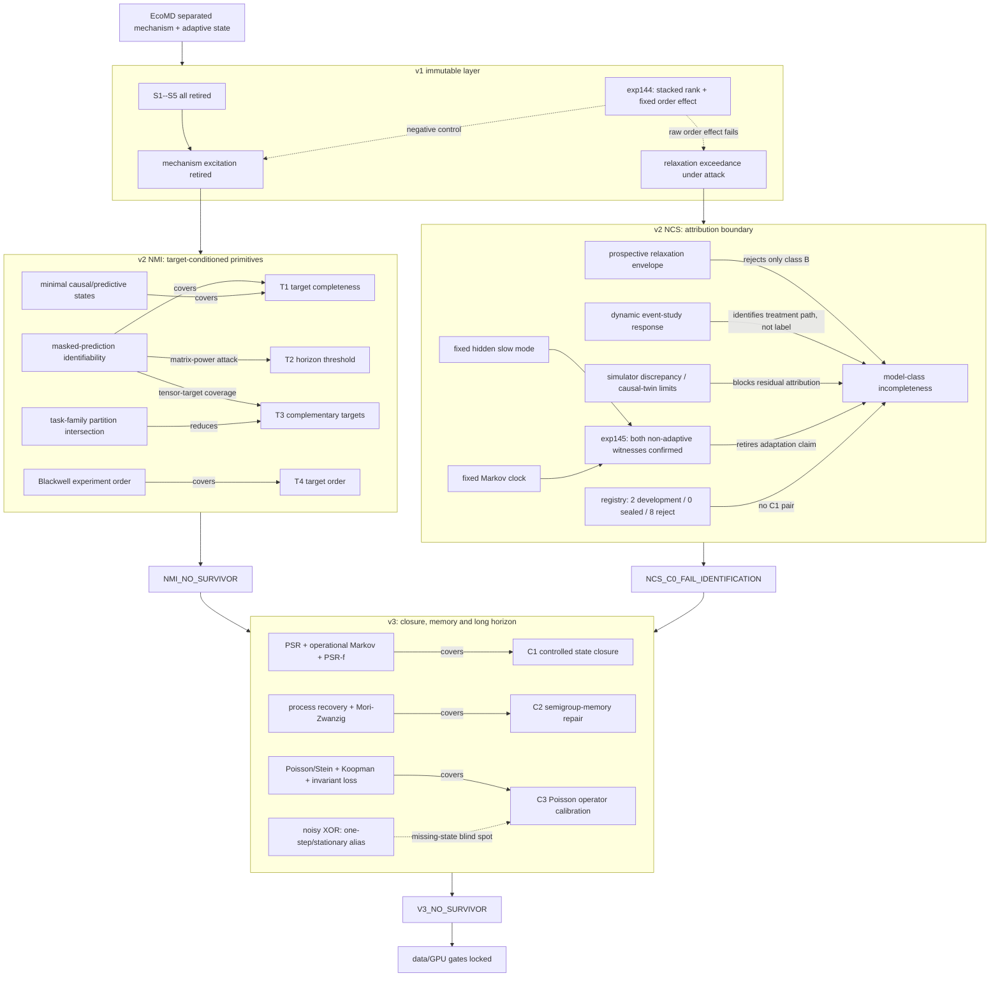

# Theory-exploration topology v3

**Canonical machine state:** `knowledge_graph.yaml`  
**As of:** 2026-08-12  
**Current decision:** `V3_NO_SURVIVOR`

The graph is an append-only research-control artifact. It preserves v1/v2, exp144/145 and every retirement, then
adds the v3 state-closure, memory-repair and operator-calibration attacks. Graph proximity is not evidence of
novelty; each `covers`, `falsified_by` or `retired_by` edge records an equation-level judgement with a source or
exact counterexample.



## Exact reductions retained

For task family `F`, define parameter equivalence by equality of every optimal predictor. Then

\[
\sim_{\mathcal F_1\cup\mathcal F_2}
=\sim_{\mathcal F_1}\cap\sim_{\mathcal F_2}.
\]

This explains complementary targets as ordinary partition refinement. It is not a new theorem.

For any bounded finite path `r_0,...,r_L`, the fixed chain

\[
P(i,i+1)=1\;(i<L),\qquad P(L,L)=1,\qquad f(i)=r_i
\]

satisfies `delta_0 P^ell f=r_ell`. Thus a finite response path, including one outside a stricter baseline envelope,
does not identify adaptation without a state-completeness or structural restriction. Exp145 verifies this exact
construction and the simpler fixed slow-mode exceedance.

For the v3 noisy-XOR warning,

\[
X_{t+1}=X_t\oplus X_{t-1}\oplus E_t,
\qquad E_t\sim\operatorname{Bernoulli}(\varepsilon),
\quad 0<\varepsilon<\tfrac12.
\]

The pair state has a uniform invariant law, so the observed marginal and one-step kernel exactly match an iid
Bernoulli chain. The three-time parity law is nevertheless correct with probability `1-epsilon`, not one-half.
Thus one-step and invariant-measure calibration can both be perfect while the observed multi-time process is
wrong. This elementary counterexample is a scope control, not a new theorem.

## Current cut through the graph

| Object | State | Decisive evidence | Permitted reuse |
|---|---|---|---|
| v1 S1--S5 | retired | SCM/OPE, CRL, PSR/bisimulation, response/averaging and composition coverage | negative history and baselines |
| v1 NMI mechanism excitation | `RETIRED_PRIOR_ART` | stacked observability, switching ID, active design and event-layer information conservation | none as a method claim |
| v2 NMI T1/T3 | `RETIRED_PRIOR_ART` | masked-prediction task-family theorems, minimal predictive states and partition intersection | task-design background only |
| v2 NMI T2 | `RETIRED_PRIOR_ART` | matrix-power ambiguity; horizon is not monotonically identifying | model-specific diagnostic only |
| v2 NMI T4 | `RETIRED_PRIOR_ART` | Blackwell comparison/garbling | correct terminology and oracle |
| NCS relaxation exceedance | `RETIRED_IDENTIFIABILITY` | exp145 plus discrepancy and causal-twin identification limits | prospective model-checking diagnostic |
| intervention metadata | `NO_DATA_CONTRACT` | 10 cases, no untouched replication | two development cases only |
| v3 C1 state closure | `RETIRED_PRIOR_ART` | controlled PSR, operational Markov condition and PSR-f completion | probe-relative model check only |
| v3 C2 memory repair | `RETIRED_PRIOR_ART` | process-recovery task bound and data-driven Mori--Zwanzig | reduced-dynamics baseline only |
| v3 C3 operator calibration | `RETIRED_PRIOR_ART` | Poisson/Stein identities, long-term Koopman and invariant-measure training | baseline after state closure only |

The graph has 135 nodes after v3. Neither branch has a theorem, estimator or real mechanism ready for human novelty
audit. Exp146 was not run. Both V100 workers and the RTX2060 remain outside the queue.

## Validation

```bash
conda run -n ecophys python -m ecomd.research.theory_graph \
  research/theory_exploration/knowledge_graph.yaml
conda run -n ecophys python -m ecomd.research.intervention_registry \
  research/theory_exploration/intervention_registry_v2.yaml
```

The validators enforce typed endpoints, candidate histories, attack/retirement edges, metadata-only intervention
cases, zero opened records and the prohibition on automated novelty `PASS` states.
